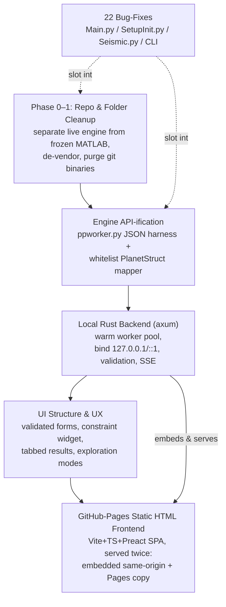
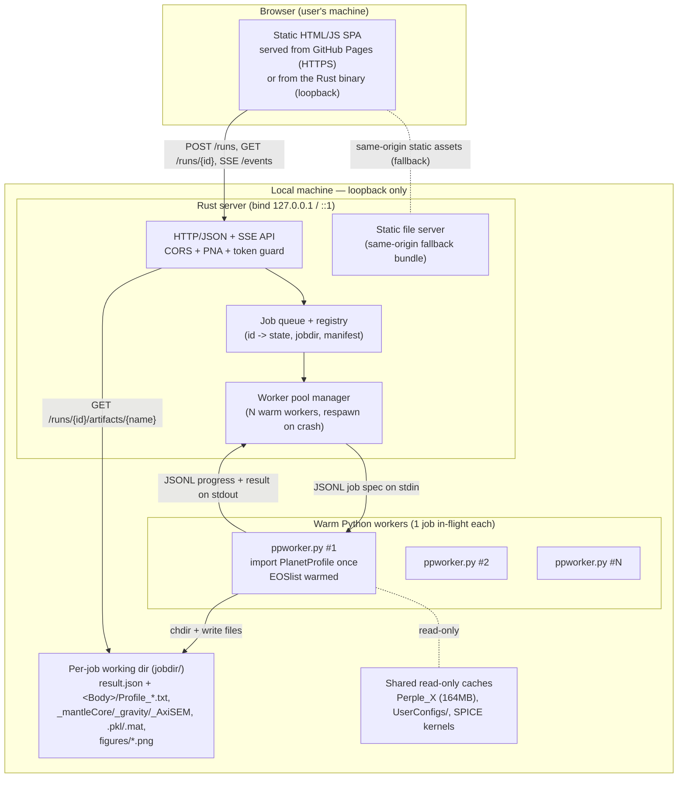
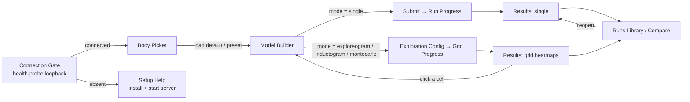
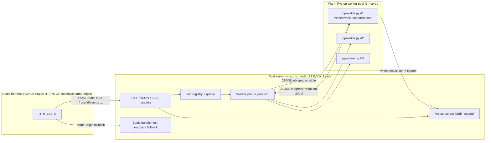
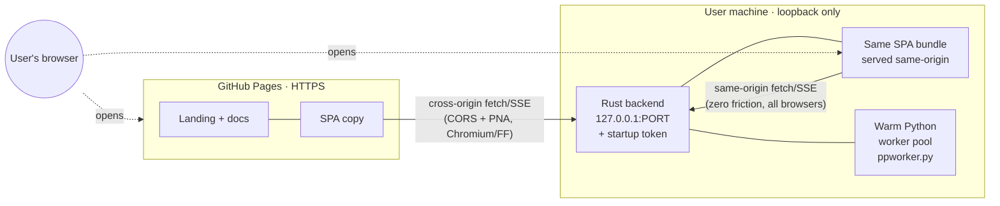

# MoonMelodies — Full Specification & Refactor Plan

MoonMelodies is a fork of the PlanetProfile scientific framework — a compute-heavy Python engine that builds 1D interior-structure models of icy moons and ocean worlds (ice shell → liquid ocean → silicate mantle → iron core) and derives seismic, electrical, magnetic-induction, tidal, and gravity observables. This document is a single cohesive plan for turning that engine into a maintainable, discoverable, reproducible product: it cleans up a 3.4 GB dual-language repository, fixes 22 confirmed bugs, draws a clean JSON API boundary around the unchanged physics, fronts it with a local-only Rust orchestration server backed by a warm pool of Python worker processes, and delivers a static browser UI served both same-origin from the Rust binary and from GitHub Pages. The physics stays in Python by design; Rust and the browser own only orchestration, validation, and delivery. The front matter below frames the reality of the codebase, ties the workstreams together, and sequences them into a dependency-aware roadmap; the detailed sections referenced at the end supply the specifics.

## Reality Check

The premise that "this project uses Streamlit to run" does not hold for this repository. Verified by `grep`/`find` across the tree: there is **no Streamlit, no HTML, no JavaScript, no Rust, and no web layer of any kind** present in the code today. Those searches return nothing.

The only interfaces that currently exist are:

1. **A command-line entry point** — `python PlanetProfileCLI.py <Body>` (equivalently `python -m PlanetProfile.Main <Body>`), with substring-based argument sniffing.
2. **Hand-edited per-body input files** — `PP<Body>.py` modules that construct a `PlanetStruct` object directly in Python, with no schema and no validation.

Outputs are matplotlib figures plus data files (`.txt` profiles, `.pkl` pickles, `.mat`). There is nothing to migrate away from and no existing web contract to preserve.

This is stated as fact, not criticism — and it is an **advantage**. The UI effort is genuinely greenfield. We are not unwinding a Streamlit app or reconciling a legacy frontend; we get to design the API boundary and the browser experience cleanly, on top of an engine we deliberately leave in place.

## Implementation Update — 2026-07-24

This section logs work completed against the plan below, and one correction to the Reality Check.

**Correction — the current UI *is* a Streamlit app.** The Reality Check above is right that *this repository* contains no web layer, but the current production UI does exist: it is a Streamlit multi-page app hosted on the Hugging Face Space `vsteven/planetprofile` (entry `PlanetProfileApp/PlanetProfileApp.py`, pages under `PlanetProfileApp/pages/`). It bundles its own copy of PlanetProfile. So the greenfield framing still holds for *our* frontend/backend, but there is a reference UI to reach parity with — its plot-producing pages are `PlanetProfileOutputs`, `Exploreogram`, `CompareRuns`, and `Inference` (Bayesian).

**Done and committed on `repo-cleanup`:**

- **Phase 0 (Stabilize)** — the three high-severity fixes (`distutils.strtobool` removal, per-run `deepcopy(configParams)`, ALMA seconds-vs-kyr frequency units), the second import-time stdin prompt in `TrajecAnalysis/__init__.py`, numpy pin, and dependency-compat fixes surfaced by running the suite (`matplotlib.cm.get_cmap` → `colormaps`, `np.row_stack` → `np.vstack`). **Validated:** the full `BuildTest` physics ran end-to-end (all bodies + auxiliary-flag tests + inductogram/exploreogram grids — 174 model computations, zero errors) in a provisioned scientific env.
- **Phase 1 (Repo Cleanup)** — strays removed, brand assets to `assets/`, the frozen MATLAB tree consolidated under `legacy-matlab/`, and the 8-area scaffolding created (`backend/ frontend/ data-assets/ tests/ configs/`). The `PlanetProfile/` import package was left untouched (zero package files moved).
- **LaTeX-free plotting** — all figures now render via matplotlib's built-in **mathtext** when no LaTeX is installed (a robust siunitx/mhchem → mathtext converter applied at the `Text.set_text` choke point). This removes the LaTeX prerequisite for headless/server plot generation and covers the Bayesian figures too.
- **Bayesian Inference plot parity** — the current UI's Bayesian plots come from a custom `PlanetProfile.Inference` module (MCMC via pocoMC + simulation-based inference via `sbi`/`torch`) that exists only in the HF Space, not upstream. It has been **ported into MoonMelodies** as `PlanetProfile/Inference/` (a clean additive port — the module imports nothing our engine lacks), behind an optional `[inference]` extra (`torch, sbi, pocomc, TidalPy, corner, seaborn, PyYAML`). **Validated end-to-end:** a real Europa MCMC run (pocoMC, 4,270 posterior samples, r̂ = 1.0) generated **all 10** of the module's figures — corner, k₂ Re/Im scatter, ice-heating comparison, heating-vs-parameters, mass/CMR² diagnostics, CMR² surface, T_b-structure, layers-vs-ocean-depth, and both structure wedges (including the high-fidelity wedge from re-running the full engine at the posterior median).

**Follow-ups this surfaced (fold into the phases below):**

- **Structure-grid caches are download-on-demand.** The inference forward model interpolates precomputed structure-grid `.pkl` caches (10s of MB, Git-LFS in the Space) instead of running full PlanetProfile per sample. Teach `install.py` / the Inference cache-loader to fetch these on demand, the same pattern used for the 164 MB Perple_X tables — do **not** commit them to git.
- **Runtime notes.** `torch` needs `KMP_DUPLICATE_LIB_OK=TRUE` on macOS (OpenMP duplicate-lib); inference must run from a working directory that has no `PlanetProfile/` subdirectory (a cwd-relative cache path otherwise shadows the package as a namespace package).
- **Wiring for the new stack.** The 10 generators are a standalone library with no caller in the module (the Streamlit app drives them ad hoc). The Rust backend should own the orchestration: run the inference job, stream progress, and expose each figure; the frontend requests them. For live/interactive views, prefer **client-side rendering of the returned arrays** (see §4/§6) over server PNGs.
- **Still deferred from Phase 1:** de-vendor MoonMag (BuildTest-gated), the git-history purge of large binaries (destructive — needs a coordinated force-push), and the packaging-identity rebrand to MoonMelodies (coupled to `PPversion.py` + a reinstall).

## Current State in One Page

- **What it is.** A scientific engine, not an application. `PlanetProfile(Planet, Params)` in `PlanetProfile/Main.py` runs a fixed pipeline that propagates a body's layer structure and computes downstream geophysical observables. Runtimes range from minutes to hours; grid-exploration modes fan out across CPU cores.
- **Dual-language.** An actively developed Python package lives in `PlanetProfile/` (≈193 MB), shadowed by a **frozen** legacy MATLAB implementation (top-level `PlanetProfile.m`, `config.m`, per-body `PP<Body>.m`, and duplicated top-level `Thermodynamics/`, `SPICE/`, `Utilities/` trees, ≈2.5 GB). MATLAB is not maintained going forward and is imported by nothing.
- **Two god-structs.** Nearly all state lives in `PlanetProfile/Utilities/defineStructs.py`: `PlanetStruct` (with `Bulk`/`Ocean`/`Sil`/`Core`/`Do`/`Steps`/`Seismic`/`Magnetic`/`Gravity` substructs) and `ParamsStruct`. `Params` is a mutable global.
- **The pipeline.** Input `PP<Body>.py` builds a `PlanetStruct`; `Main.py` orchestrates setup, layer propagation, and the observable modules; results are written to per-body output folders under long encoded filenames.
- **Config system.** `defaultConfig*.py` templates are copied into `UserConfigs/config*.py` on first run and then override defaults (loaded via `GetConfig.py` / `__init__.py`). First import triggers an interactive stdin prompt and a silent ~164 MB Perple_X EOS download.
- **Heavy scientific dependencies with no Rust equivalents.** SeaFreeze, gsw (TEOS-10), Perple_X EOS tables, Reaktoro, PyALMA3, MoonMag, spiceypy (SPICE kernels), hdf5storage, numpy/scipy, matplotlib, and Python `multiprocessing` (spawn context).
- **UX today.** CLI plus raw-Python file editing. The central physical constraint — *exactly two of three of `Tb_K`, `zb_km`, `wOcean_ppt`* — exists only as a code comment and fails deep in the pipeline. There is no input validation, no run manifest, and a confusing `CALC_NEW` reload model.

## How the Workstreams Fit Together

The workstreams form a dependency chain, not a set of parallel tracks. **Folder cleanup comes first** because everything else is easier to reason about — and safer to move — once the live engine is separated from the frozen MATLAB tree and the vendored copies. **Bug-fixes run alongside cleanup and API work**, slotting in wherever they touch a file already being modified: correctness fixes in `Main.py`, `SetupInit.py`, `Seismic.py`, and the CLI harden the engine *before* it is wrapped, so the API boundary is drawn over code that behaves. **API-ification** introduces a thin JSON harness (`ppworker.py`) that builds `PlanetStruct` from declarative JSON via a whitelist mapper — never importing a user `PP` file — giving the engine a stable, validated contract without rewriting physics. **The Rust backend** then orchestrates a warm pool of these workers behind an HTTP/JSON API bound to loopback only. **The UI** consumes that same contract, and the **GitHub-Pages HTML frontend** is the same static bundle shipped twice: embedded in the Rust binary (same-origin, zero-friction) and published to Pages (a shareable convenience that health-probes the local backend).



## Phased Roadmap

Sequencing is strictly dependency-aware: stabilize and reorganize the engine first, then draw the API boundary, then build Rust, then the frontend. Each cleanup phase is independently BuildTest-green.

| Phase | Goal | Key Deliverables | Exit Criteria |
|---|---|---|---|
| **0 — Stabilize** | De-risk the engine before anything moves | Fix the 3 package-breaking / high-severity bugs (`distutils.strtobool` on 3.12+, `Main.py` Params aliasing, ALMA frequency-units error); pin numpy/scipy; seed `UserConfigs/` and Perple_X cache via `install` to kill the import-time stdin prompt | Package imports on Python 3.8–3.12; `BuildTest` green; a single run reproduces prior results |
| **1 — Repo Cleanup** | Shrink and organize the 3.4 GB tree without disturbing the live package | Ordered low-risk migration: strays first → bulk `git mv` of frozen MATLAB → de-vendor MoonMag (only package-touching step, gated on BuildTest) → git-history rewrite to purge 170 large binaries → packaging identity into 8-area target tree | Each step BuildTest-green; `PlanetProfile/` internals (`Default/`, `Test/`, `SPICE/`, `EOStables/`, import name) unmoved |
| **2 — Bug-Fix Sweep** | Clear the remaining confirmed defects | Fix the remaining ~19 bugs (reload filename/glob errors, worker-count and EOS-cache issues, De Morgan inversion, CLI list-vs-scalar comparisons, mutation-by-aliasing) with regression tests | All 22 confirmed bugs closed; new tests guard each; BuildTest + reproducibility hold |
| **3 — API Boundary** | Give the engine a declarative JSON contract | `ppworker.py` thin JSON harness; whitelist JSON→`PlanetStruct` mapper (no `importlib` of user files); jobdir/`os.chdir` isolation; `SKIP_PLOTS` default; result + manifest schema (single / exploreogram / inductogram / montecarlo / reload) | A worker builds a body from JSON and returns `result.json` + manifest matching a CLI run bit-for-bit |
| **4 — Rust Backend** | Local-only orchestration over a warm worker pool | axum server (bind 127.0.0.1/::1 + startup token); worker pool (import-once, one job in-flight); full API (`/health`, `/bodies`, `/schema`, `/runs`, SSE `/events`, `/result`, `/artifacts`, cancel); up-front 422 validation incl. two-of-three rule and EOS-table allowlist | All endpoints pass integration tests; cancel = kill+respawn; concurrency/grid/wall-clock/body-size caps enforced |
| **5 — UI & UX** | Discoverable, validated browser workflow | Seven grouped, unit-labeled form sections; hydrosphere constraint-mode widget; run submission with SSE progress; tabbed results with client-side replot; ExploreOgram / InductOgram / MonteCarlo modes | UI drives a full single-body run and one grid mode end-to-end against the Rust backend |
| **6 — Frontend Delivery** | Ship the SPA and publish | Vite + TS + Preact bundle; uPlot 1D profiles + lazy 2D ogram renderer; embedded same-origin serve from Rust binary; GitHub-Pages copy with loopback health-probe, CORS + Private-Network-Access handling, and graceful Safari fallback | Same bundle works same-origin from `127.0.0.1:PORT` and from the Pages copy; PNGs are opt-in download-only artifacts |

## Risk Register

| Risk | Likelihood | Impact | Mitigation |
|---|---|---|---|
| **Physics-in-Rust proves infeasible** | Certain | High | Do not attempt it. Every EOS/geophysics dependency is native C/C++/Fortran with no Rust equivalent; Rust owns only orchestration, validation, and delivery, and the Python engine stays unchanged behind a JSON harness. |
| **Mixed-content / loopback call blocked by the browser** | Medium | High | HTTP-to-loopback from an HTTPS page is *not* mixed-content-blocked in Chrome/Edge/Firefox (loopback is a potentially-trustworthy secure context), but Safari is stricter and CORS + Private-Network-Access still apply. Guaranteed fallback: Rust also serves the same bundle same-origin at `127.0.0.1:PORT`; the Pages copy is a convenience that degrades gracefully. |
| **Packaging breakage during file moves** | Medium | High | Phase the migration so each step is independently BuildTest-green; keep `PlanetProfile/` internals and the import name fixed (packaging globs, importlib-by-path, `install.py`, and BuildTest hard-depend on them); gate the single package-touching step (de-vendoring MoonMag) on BuildTest. |
| **Python multiprocessing misbehaves under a long-lived server** | Medium | Medium | Do not run the CLI per request. Warm worker pool with one job in-flight per worker (engine is non-reentrant: global mutable `Params` + `EOSlist`); apply overrides onto a pristine deepcopy per job; native crash kills only one worker, and cancel = kill+respawn. Reject PyO3 (a native-dep crash would take down the whole server). |
| **Loss of scientific reproducibility** | Medium | High | Preserve the `PP<Body>` input model and the four run modes; require bit-for-bit reproduction against pre-refactor outputs as an exit criterion for every phase; add regression tests for each bug fix; pin numpy/scipy and EOS-table versions; emit a run manifest so every result is traceable to its inputs. |

## Document Contents

The sections that follow, in order:

- **User Workflow Sanity Check** — the real end-to-end journey today and the footguns the UI must eliminate.
- **Repository & Folder-Structure Cleanup** — categorized inventory, 8-area target tree, and the ordered low-risk migration.
- **Target Architecture & Interface Contract** — the full stack, worker-pool invocation model, API endpoints, and validation rules.
- **UI Structure & UX Design** — information architecture, form sections, constraint widget, results workspace, and exploration modes.
- **Local Rust Backend Specification** — axum server, worker protocol, job registry, SSE, security/CORS, and build-and-run.
- **GitHub-Pages Static HTML Frontend** — the dual-serve SPA, client-side rendering, and browser-security handling.
- **Confirmed Bug Register** — the 22 verified defects with locations, severities, and fixes.


---


## 1. User Workflow Sanity Check

> **Summary.** Walking the real end-to-end journey exposes a workflow that is expert-hostile from the first command: installation depends on a fragile hand-assembled scientific stack (with a README that contradicts pyproject on numpy/scipy versions), a 164 MB silent download, and an interactive stdin prompt fired at package *import* time. Configuring a run means editing raw Python (PP<Body>.py) with no schema and no validation, where the single most important physical constraint — "exactly two of three of Tb_K, zb_km, wOcean_ppt" — lives only in a code comment and fails deep in the pipeline. Execution is CLI-only with substring-sniffing argument parsing, opaque multi-minute-to-multi-hour runtimes, a confusing CALC_NEW reload model, and outputs scattered into per-body folders under enormous encoded filenames with no manifest. The target UI must turn each of these footguns into a validated, discoverable, reproducible browser workflow while preserving the PP<Body> input model, the four run modes, batch exploration, and bit-for-bit scientific reproducibility.

This section walks the *actual* journey a user takes today — not the idealized one — for the two personas who matter: **(A) a new scientist** who wants to model an ocean world, and **(B) a developer** who wants to extend the engine. Each step is annotated with the friction a real person hits, and every friction point is rated. The section closes with the **target workflow** the new UI must enable and the **invariants** any redesign must preserve so we do not break the science.

Severity scale used throughout:

| Level | Meaning |
|---|---|
| **P0 — Blocker** | Stops the user cold; nothing proceeds until solved. |
| **P1 — Critical** | High risk of silent wrong results or large, unrecoverable time loss. |
| **P2 — Major** | Significant friction; a workaround exists but is non-obvious. |
| **P3 — Moderate** | Slows the user down, annoyance, easily mis-stepped. |
| **P4 — Minor** | Polish / discoverability. |

---

### A. Journey of a new scientist user

The intended happy path (README.md:40-61) is five bullet points. The real path has far more failure surface.

#### A1. Install the scientific stack — **P1**
The pip line `python -m pip install PlanetProfile` (README.md:43) hides a stack of heavyweight compiled/native dependencies with no Rust or pure-Python fallback: SeaFreeze, gsw/TEOS-10 (compiled C), Reaktoro (C++), spiceypy (NAIF CSPICE), hdf5storage (libhdf5), PyALMA3, MoonMag, plus numpy/scipy/matplotlib/mpmath. In practice a scientist must hand-assemble a conda environment (README.md:113-121). The instructions are **internally contradictory**: README.md:116 says `conda install numpy=1.26.4 scipy=1.16.3`, while `pyproject.toml:34-47` pins `numpy>=2.0,<3` and `scipy>=1.16.3,<1.17`. A user who follows the README verbatim can build an environment the package refuses to run in.
- **Footgun:** Python is pinned to 3.8–3.11 (3.11 recommended; README.md:44-45 explicitly warns newer Python is untested). A scientist on a modern default interpreter (3.12+) silently installs into an unsupported runtime.

#### A2. Create a working directory and run the installer — **P2**
The engine is entirely **CWD-coupled**: the user must create and `cd` into a working directory (README.md:47-48) before running `python -m PlanetProfile.install`. Nothing enforces this. Running the installer from the wrong directory scatters config and body folders into the wrong place. There is no `--help`, no dry-run, and no confirmation of *where* things will land.

#### A3. The 164 MB Perple_X download can fail silently — **P1**
`PPinstall()` downloads ~164 MB of Perple_X EOS tables from GitHub raw URLs (install.py `DownloadPerplexFiles`). The fetch is wrapped in a **bare except with a hardcoded 7-file fallback list and no checksum**. A partial or failed download yields *missing-table errors at model runtime* — hours later, far from the cause — rather than an install-time failure. The scientist has no way to know their EOS cache is incomplete.

#### A4. Importing the package blocks on an interactive prompt — **P0**
Merely importing PlanetProfile executes `PlanetProfile/__init__.py:74-78`, which — if any of the 8 `UserConfigs/config*.py` files are missing — calls `input(...)` on stdin asking *"Copy from defaults to local dir? y/n"*. On the same import path, `GetConfig.py` furnishes a SPICE leapseconds kernel and **raises `FileNotFoundError` if `SPICE/naif0012.tls` is absent**, and monkeypatches the logging module. Consequences:
- A first-time run inside a notebook, an IDE "Run" button, or any non-interactive context **hangs on stdin** with no visible prompt.
- The order dependency (install must have populated `UserConfigs/`, SPICE kernels, and the Perple_X cache *before* the first import) is invisible and unforgiving.

This is the single largest blocker both for a confused human and for the future backend, which cannot `import PlanetProfile` cleanly without pre-seeding these files.

#### A5. Configure a body by hand-editing Python — **P1**
There is no input form, no schema, no data file. To model Europa the scientist opens `PlanetProfile/Default/Europa/PPEuropa.py` (or a copy) and edits ~60 imperative attribute assignments on a `PlanetStruct` (PPEuropa.py:10-99). Real hazards observed in the canonical file:
- **Configuration by uncommenting.** Alternative silicate EOS choices are commented-out lines the user must know to uncomment (PPEuropa.py:44-58), some paired with a `rhoSilWithCore_kgm3` that must be uncommented *together* or the model is physically inconsistent.
- **No attribute validation.** A typo like `Planet.Ocean.wOcean_ppt` → `Planet.Ocean.wOcean_ptt` silently creates a new attribute and is ignored; the model runs with the default.
- **Executable input = arbitrary code.** The file contains real control flow (`if Planet.Do.Fe_CORE: ... else ...`, PPEuropa.py:55-58). "Submitting a model" literally means `importlib.import_module(...).Planet` (Main.py:185), i.e. executing a Python module.

#### A6. The most important physical rule is undocumented in the UI and fails late — **P1**
The governing constraint — *"Exactly two out of three of `Bulk.Tb_K`, `Bulk.zb_km`, and `Ocean.wOcean_ppt` must be set for every model with surface H2O"* — exists **only as a comment on defineStructs.py:79**. It is not validated up front; violating it produces an opaque failure deep in `SetupInit`/`IceLayers`. The same class of buried rule applies to `Do.NO_H2O` (requires `Bulk.qSurf_Wm2`) and the alternative ice-shell pinning toggles (`Do.ICEIh_THICKNESS`+`zb_approximate_km`, `Do.SPECIFY_ICEI_BOTTOM_PRESSURE`+`PbISet_MPa`, etc.). A scientist gets a deep-stack traceback, not "you set all three of Tb/zb/w — pick two."

#### A7. Run from the CLI — fragile parsing, name corruption — **P2**
Invocation is `python -m PlanetProfile.Main Europa` (or `python PlanetProfileCLI.py Europa`). There is **no argparse, no `--help`, no validation** — argv is parsed by substring sniffing: `'PP' not in argv[1] and '.txt' not in argv[1]` decides "this is a body name" (PlanetProfileCLI.py:16-56), and the identical block is duplicated in `Main.py`. Failure modes:
- Any body or path containing `PP` or `.txt` misroutes.
- `bodyname.capitalize()` (Main.py:75) lowercases interior letters, corrupting multi-word/camelCase names.
- With no argument the tool drops to a bare `input('Please input body name: ')` — the only "help" that exists.

#### A8. Exploration and Monte Carlo modes are hidden — **P2**
Only `DO_INDUCTOGRAM` has a CLI trigger (the `inductogram` command word, ExecOpts Main.py:437). **ExploreOgram, MonteCarlo, and Bayesian Inversion can only be enabled by hand-editing `DO_EXPLOREOGRAM`/`DO_MONTECARLO` in `UserConfigs/configPP.py`.** A scientist has no discoverable way to launch a parameter sweep — the headline capability advertised in README.md:13.

#### A9. Config versioning trap — **P3**
Configuration is spread across 8 version-checked files. Each carries an integer `configVersion` (defaultConfig.py:8 = 23). On a version mismatch the loader emits a `warn(...)` telling the user to delete the file or run `python -m PlanetProfile.reset` (GetConfig.py). **Missing user settings silently fall back to defaults** — so after any package update a scientist can be running with a config that is quietly ignoring the knobs they think they set.

#### A10. Long, opaque runtimes — **P2**
A single model runs SetupInit → IceLayers/OceanLayers (scipy root-finds over melting curves + EOS table interpolation) → InnerLayers (the MoI-matching silicate/core trade, the dominant cost) → Electrical → Seismic → Viscosity → optional Magnetic/Gravity. Order **seconds to minutes** per model; ExploreOgram/InductOgram/MonteCarlo multiply that by `nx*ny` (hundreds to thousands) → **minutes to hours**. The **only** progress signal is `PrintCompletion` log lines to stdout (Main.py:374). There is no progress bar, no ETA surfaced to a UI, and no way to cancel cleanly.

#### A11. CALC_NEW / reload confusion — **P1**
`Params.CALC_NEW` (defaultConfig.py:34, default `True`) silently changes what "run" means:
- `True` → full recompute **and overwrite** the profile `.txt`.
- `False` → **reload** a prior run by *positionally* parsing the profile `.txt` (64 float header fields in fixed order, `Main.py:653-733`), and **raise if the file is missing**.

Compounding it, there are four *independent* recompute flags — `CALC_NEW_INDUCT`, `CALC_NEW_GRAVITY`, `CALC_NEW_REF`, `CALC_NEW_ASYM` (defaultConfig.py:35-38). A scientist can easily believe they re-ran a model while actually reloading stale data, or vice-versa. Because reload is strict positional parsing, **any header reorder silently corrupts the reload** — brittle and unversioned.

#### A12. Output discoverability — **P2**
Outputs land under `<cwd>/<Body>/` with **enormous encoded filenames**: the `saveLabel` (SetupInit.py:547-658) packs composition, salinity, Tb/zb, clathrate/porosity/EOS flags into the filename. Artifacts scatter across `figures/`, `inductionData/`, `seismicData/`, `gravityData/`, `montecarloData/`, plus `_mantleCore.txt`, `_liquidOceanProps.txt`, `_AxiSEM.bm`, `.pkl`, `.mat`. **There is no manifest or index tying a run's inputs to its outputs.** A scientist returning a week later cannot tell which file corresponds to which parameter set without decoding filenames by hand. Rendering the layer table also requires knowing the phase-ID legend (0=ocean, 1–6=ice I–VI, 30=clathrate, 50=silicate, 100/105/110/115=Fe/FeS core; defineStructs.py:3275) — documented nowhere the user will see.

#### A13. Parallel-processing pitfalls — **P2**
`DO_PARALLEL` is on by default. `Main.py` forces the `spawn` start method on all platforms while `SetupInit.py` selects `fork` on non-Windows — an actual **start-method inconsistency** the README itself warns about (README.md:154, advising users to set `Params.DO_PARALLEL = False` when cross-platform issues "crop up"). Each parallel job `deepcopy`s the entire Planet *and* Params (memory-heavy for big grids), and every spawned worker re-pays all import-time side effects and rebuilds the EOS cache. The scientist's recourse today is a config edit they must be told about out-of-band.

**Scientist journey scorecard:** 1 × P0 (import prompt), 5 × P1, 6 × P2, 1 × P3. The blocker and most criticals are all *before the science even starts*.

---

### B. Journey of a developer

The developer path (README.md:63-74) shares A1/A4/A5–A13 and adds its own debt.

#### B1. Clone a 3.4 GB repo — **P1**
The working tree is ~2.6 GB and `.git` alone is **769 MB** because ~170 large binary EOS tables (`*.mat`/`*.tab`) are committed despite being listed in `.gitignore` (force-added or pre-dating the rules), plus 2.4 GB of legacy/derived Perple_X data under `Thermodynamics/Perple_X/`. A first clone is slow and heavy for what should be a modest Python package.

#### B2. Dual-language confusion about the source of truth — **P2**
A frozen MATLAB implementation **shadows the Python package at the repo root**: `PlanetProfile.m`, `config.m`, top-level `Thermodynamics/`, `Utilities/`, `MagneticInduction/`, `SPICE/`, and 21 per-body `PP<Body>.m` dirs — all colliding by name with `PlanetProfile/…`. A new developer cannot tell which `Thermodynamics/` or which `PPEuropa` is live. MoonMag is **vendored inside the package *and* declared as a pip dependency** (imports resolve to the pip copy while an 89-file stale copy sits in the tree), and `gsw_matlab/` duplicates the pip `gsw`. Silent-divergence risk.

#### B3. Developer install + run divergence — **P3**
Developers must run `python -m PlanetProfile.install PPinstall` from the repo root and then invoke via `python PlanetProfileCLI.py Europa` (a *different* entrypoint from the pip user's `python -m PlanetProfile.Main`). Two nearly-identical entrypoints with duplicated argv parsing (PlanetProfileCLI.py:11-58 ≈ Main.py:1990-2032) means fixes must be made in two places.

#### B4. God-files and no clean seam to extend — **P2**
Core logic concentrates in a few files: `Main.py` (2032 lines, 25+ top-level functions mixing CLI parsing, orchestration, file I/O, and multiprocessing), `defineStructs.py` (3372 lines, all state structs **plus** matplotlib/cmasher imported at module top and large plotting-config structs), `LayerPropagators.py` (133 KB), `HydroEOS.py` (~83 KB). You cannot import the data model without importing matplotlib. Physics, plotting, and file I/O are interleaved inside `PlanetProfile()` itself — there is no pure `compute(inputs) -> outputs` function to call.

#### B5. Testing and packaging debt — **P3**
The test harness is `python -m PlanetProfile.BuildTest` over `PlanetProfile/Test/PPTest*.py`; `BuildTest` has to **manually reset the global `EOSlist`** between tests to clear shared state — a tell that the engine is non-reentrant. `pyproject.toml` still identifies the project as `PlanetProfile` v3.1.5 with `vancesteven` URLs (not the MoonMelodies fork) and its `package-data` globs ship the large `*.tab`/`*.mat` data inside the wheel.

**Developer journey scorecard:** 2 × P1, 2 × P2, 2 × P3 on top of everything the scientist hits. The recurring theme is *hidden global state* (`Params`, `EOSlist`) and *no API boundary* to build against.

---

### C. Consolidated friction register

| # | Friction point | Persona | Where | Severity |
|---|---|---|---|---|
| A4 | Interactive `input()` at package import; SPICE raises at import | Both | `__init__.py:74-78`, `GetConfig.py` | **P0** |
| A1 | Heavy native stack; README vs pyproject version conflict; Py 3.8–3.11 only | Scientist | README.md:116 vs pyproject.toml:34-47 | **P1** |
| A3 | 164 MB Perple_X download, bare-except, no checksum, fails at runtime | Both | `install.py` | **P1** |
| A5 | Config = hand-edited executable Python; typos silently ignored | Both | `PPEuropa.py` | **P1** |
| A6 | "Two of three (Tb/zb/w)" + NO_H2O rules only in comments, fail late | Scientist | `defineStructs.py:79` | **P1** |
| A11 | CALC_NEW recompute-vs-reload confusion; strict positional reload | Both | `Main.py:653-733` | **P1** |
| B1 | 3.4 GB repo / 769 MB `.git` from committed binaries | Developer | git history | **P1** |
| A7 | Substring-sniffing CLI, no `--help`, `capitalize()` name corruption | Both | `PlanetProfileCLI.py:16-56` | **P2** |
| A8 | ExploreOgram/MonteCarlo have no launch path except editing config | Scientist | `configPP.py` | **P2** |
| A10 | Long, opaque runtimes; stdout-only progress; no cancel | Scientist | `Main.py:374` | **P2** |
| A12 | Scattered outputs, encoded filenames, no run manifest | Both | `SetupInit.py:547-658` | **P2** |
| A13 | spawn/fork inconsistency; deepcopy overhead; must disable by config | Both | `Main.py` vs `SetupInit.py` | **P2** |
| B2 | MATLAB shadow tree + vendored/duplicated deps blur source of truth | Developer | repo root | **P2** |
| B4 | God-files; matplotlib baked into data model; no pure compute seam | Developer | `Main.py`, `defineStructs.py` | **P2** |
| A2 | CWD-coupling; run installer from correct dir with no guardrail | Both | `install.py` | **P3** |
| A9 | 8 versioned config files; missing settings silently default | Both | `GetConfig.py` | **P3** |
| B3 | Two duplicated entrypoints | Developer | CLI + `Main.py __main__` | **P3** |
| B5 | Non-reentrant globals; stale packaging metadata; data in wheel | Developer | `pyproject.toml`, `BuildTest` | **P3** |

---

### D. Target user workflow the new UI must enable

The redesign is effectively greenfield on the interface side (no web/UI/Rust exists today). The target is a **static HTML/JS frontend on GitHub Pages talking to a local Rust backend** that drives the unmodified Python engine as isolated subprocesses. The workflow it must deliver:

1. **Zero-friction start.** The user opens a page and picks a body from a dropdown populated from the 19 `Default/<Body>/` models. No terminal, no `cd`, no `input()` prompt. The backend has already pre-seeded `UserConfigs/`, SPICE kernels, and the Perple_X cache once, headlessly, so the engine imports cleanly. Install health (EOS cache complete? SPICE present?) is surfaced as a status check, not discovered at runtime.

2. **Declarative, validated parameter forms.** The PP<Body> attribute set becomes a **JSON model spec** rendered as grouped forms (Bulk / Do / Steps / Ocean / Sil / Core / Seismic / Magnetic / Gravity), each field carrying its label, unit, default, and the docstring from `defineStructs.py` as inline help. Crucially:
   - `Ocean.comp` is a dropdown of the valid enum (`Seawater, MgSO4, PureH2O, NH3, NaCl, none, CustomSolution*`) that drives which EOS backend runs.
   - **Client-side validation enforces the constraints that today fail deep in the stack**: exactly two of {`Tb_K`, `zb_km`, `wOcean_ppt`} set; `NO_H2O` ⇒ `qSurf_Wm2` required; ranges checked before submit. The user sees "pick two of three," not a traceback.
   - `Do` toggles reveal/hide the inputs they make meaningful (topology switches), so the form only ever asks for the fields that apply.
   - **No executable input.** A submitted model is JSON mapped onto a `PlanetStruct` by a declarative builder — the server never `importlib`s user code.

3. **First-class run modes.** Single / Compare / ExploreOgram / InductOgram / MonteCarlo are selectable in the UI, with ExploreOgram/InductOgram exposing `xName`/`yName`/`zName` (from their fixed enums), ranges, and grid sizes as form fields — not buried config edits.

4. **Explicit, observable execution.** Submitting enqueues a job; the UI shows queue position, a **progress bar and ETA** (derivable from `Planet.index`/`Params.nModels`, which `PrintCompletion` already computes), live log tail, and a **cancel** button. CALC_NEW stops being a hidden flag and becomes an explicit **"Recompute vs. load cached run"** choice with a clear indication of which cached run would be loaded.

5. **Rich, client-rendered results.** The result payload returns the scalar summary, the ~23 parallel layer arrays, and the gravity/induction blocks (the authoritative output whitelist is `ResultsIO.ExtractBasePlanetData`/`ExtractInductionData`). The frontend renders interactive layer plots and a **wedge diagram with the phase-ID legend built in**, so users are not decoding integers. Matplotlib PDFs/PNGs and the `.txt`/`.pkl`/`.mat` files remain **downloadable artifacts**, not the primary view.

6. **Reproducibility and sharing by construction.** Every run produces a **manifest** binding the exact JSON input, engine/dep versions, RNG seed (for MonteCarlo), and the resulting artifact paths. Model specs are savable/loadable/diffable as JSON presets (against the Default baseline), replacing "edit and hope."

---

### E. Invariants a redesign MUST preserve

These are non-negotiable; violating any of them breaks the science or the community's trust in results.

1. **Bit-for-bit scientific reproducibility.** The Python physics engine (SeaFreeze, gsw, Perple_X tables, Reaktoro, PyALMA3, MoonMag, spiceypy) is the validated, benchmark-backed source of truth and must run **unchanged**. Same inputs + same versions + same seed ⇒ same outputs. The UI/backend may only orchestrate, never re-derive, the physics. Every run must capture enough metadata (inputs, versions, seed) to reproduce it later.

2. **The full PP<Body> input model remains expressible.** Every attribute a scientist can set today in a `PP<Body>.py` must be representable in the JSON spec — the schema mirrors the `PlanetStruct` substructs one-for-one. The 19 shipped Default bodies remain the canonical, citable starting points. Nothing that is tunable today may become un-tunable.

3. **All physical constraints stay enforced.** The "two of three (Tb_K/zb_km/wOcean_ppt)" rule, the four alternative ice-shell pinning modes, `NO_H2O ⇒ qSurf_Wm2`, and the `Ocean.comp` enum → EOS-backend mapping must all be honored — ideally *earlier* (at input time) but never *weaker* than today.

4. **Batch/exploration is first-class.** ExploreOgram, InductOgram, and MonteCarlo must remain fully supported, including their grid specs and the gridded scalar/complex result arrays. These are headline capabilities, not extras.

5. **The four run modes and CALC_NEW semantics survive.** Single/Compare/sweep modes and the recompute-vs-reload distinction must remain available (surfaced clearly rather than removed), so cached-run workflows and the reload path keep working.

6. **Output completeness and interoperability.** Everything currently emitted — the profile `.txt` layer table + scalar header, `_mantleCore.txt`, `_liquidOceanProps.txt`, `_AxiSEM.bm`, `_gravityParameters.txt`, `.pkl`, and `.mat` — must stay obtainable. The `.mat`/MATLAB path in particular must be preserved for users with downstream MATLAB tooling and for the frozen legacy interop.

7. **Scriptable/programmatic entry endures.** `RunPPfile('Europa', 'PPEuropa.py')` and the CLI must keep functioning for reproducible, scripted, headless science and for existing pipelines and CI (`BuildTest`). The UI is an *addition*, not a replacement of the programmable engine.

8. **Reproducible provenance of every figure and number.** Because outputs today have no manifest, the redesign must *add* an inputs→outputs binding without changing the numbers themselves — provenance is an invariant to establish, not a physics behavior to alter.

**Bottom line:** today's workflow front-loads its worst friction (an import-time stdin blocker, a self-contradicting install, schema-less executable configuration, and a physically-critical rule hidden in a comment) before any science happens, then compounds it with opaque runtimes and undiscoverable outputs. The UI's job is to convert each of those footguns into a validated, observable, reproducible browser step — while treating the Python engine, the PP<Body> input surface, the batch modes, and full-fidelity output as inviolable.

---


## 2. Repository & Folder-Structure Cleanup Plan

> **Summary.** MoonMelodies is a 3.4 GB fork whose live Python engine (PlanetProfile/, 193 MB) is buried under a frozen 2.5 GB MATLAB tree, 21 scattered top-level per-body dirs, vendored third-party copies, stray files, and 170 large binaries committed to a 769 MB .git. The plan gives a categorized inventory, a concrete 8-area target tree (python-engine / rust-backend / web-frontend / legacy-matlab / data-assets / docs / tests / configs), and an ordered low-risk migration where each phase is independently BuildTest-green: strays first, then a bulk git mv of MATLAB (imported by nothing, so BuildTest is unaffected by construction), then de-vendoring MoonMag (the only package-touching step, gated on BuildTest), then a separate git-history rewrite to purge binaries, then packaging identity. Critically, PlanetProfile/ internals — Default/, Test/, SPICE/, EOStables/ and the import package name — must NOT move, because packaging globs, importlib-by-path loading, install.py, and BuildTest all hard-depend on that layout.

### 1. Categorized inventory & the specific organizational debt

The repo is 3.4 GB on disk (working tree ~2.6 GB, `.git` 769 MB), 1,402 tracked files, of which **170 are binary `.mat`/`.tab` EOS tables that git is tracking despite `.gitignore` already listing `*.mat`/`*.tab`** (force-added or predating the rules). The live engine is only the 193 MB `PlanetProfile/` package; everything else at the root is legacy, duplicate, stray, or data. Categories:

| Category | What is there | Size / count | Problem |
|---|---|---|---|
| **A. Live Python engine** | `PlanetProfile/` (Main.py, GetConfig.py, `__init__.py`, install.py, reset.py, defaultConfig.py, Default/, Test/, Thermodynamics/, MagneticInduction/, Gravity/, Utilities/, Plotting/, SPICE/, …) | 193 MB | Source of truth. God-files, cwd-coupled I/O — but *layout is load-bearing* and must be preserved (see §4). |
| **B. Legacy MATLAB, root-level** | `PlanetProfile.m` (175 KB), `config.m`, `PPTest.m`; MATLAB source dirs `Thermodynamics/`, `Utilities/`, `MagneticInduction/`, `SPICE/` (top-level) | `Thermodynamics/` alone = **2.5 GB** | Shadows the Python package name-for-name → confusion about source of truth. Verified: **no `.py` file imports the top-level `Thermodynamics/`/`Utilities/`/`MagneticInduction/`** (grep returned nothing), so these are inert to the engine and safe to relocate. |
| **C. Scattered top-level per-body dirs** | 21 dirs `Ariel/ Callisto/ … Europa/ Titan/ Umbriel/`, each holding `PP<Body>.m` (+ `…Vance.m`) plus `figures/ inductionData/ seismicData/` scaffolding that contains only `.gitignore` placeholders | ~16–48 KB each | Duplicate the real per-body inputs in `PlanetProfile/Default/<Body>/PP<Body>.py`; they also collide with the engine's cwd-relative output dirs (`<cwd>/<Body>/`). The `.m` files are legacy; the output scaffolding is regenerated. |
| **D. Vendored third-party (duplicated)** | `PlanetProfile/MagneticInduction/MoonMag/` (89 tracked files) and `Thermodynamics/gsw_matlab/` (7.1 MB) | 89 files / 7.1 MB | `MoonMag>=1.7.5` and `gsw>=3.6.20` are **already pip deps**; imports resolve to the pip copy (`GetConfig.py:12` → `import MoonMag.symmetry_funcs`). The in-tree copies silently diverge. |
| **E. Large data assets in git** | Live: `PlanetProfile/Thermodynamics/EOStables/Perple_X/` (164 MB, incl. 42 MB `Fe-S_3D_EOS.mat`). Legacy/derived: `Thermodynamics/Perple_X/` **2.4 GB** (`output_data/` 1.3 GB + `werami_tables/` 1.1 GB), `NH3aq/` 32 MB, `MgSO4/` 23 MB | ~2.6 GB tracked binaries | Root cause of the 769 MB `.git`. Live tables are already download-on-install (`install.py:DownloadPerplexFiles`) and excluded in `MANIFEST.in`; the 2.4 GB legacy Perple_X is pure derived data that should never have been versioned. |
| **F. Stray / orphan files** | `text.txt` (5 bytes = "test"), `VARIABLE_REFERENCES.md`, `Comparison/` (4 `.run` shell scripts), `Luna/` (contains only `inductionData/Be1xyz_Io*.txt` — **mislabeled Io data**), `SpacecraftMAGdata/` (only a README) | <1 MB | Root clutter with no build/runtime role. Note there is *also* a legitimate `PlanetProfile/Default/Luna/` — the root `Luna/` is the orphan. |
| **G. Brand / non-code assets** | `misc/` — `PPQRcode.pdf` (1.1 MB), `PPQRcode_NPS.pdf` (914 KB), `PPlogo.{ico,pdf,png,svg}`, `PPlogoDocs.png` | 2.1 MB | Belongs under `assets/`, not the repo root. |
| **H. Packaging / build identity** | `pyproject.toml` (name `PlanetProfile` v3.1.5, `vancesteven` URLs, `package-data "*" = ["*.txt","*.tab","*.mat",…]`), `MANIFEST.in`, `makefile` (MATLAB-oriented, detects `/Applications/MATLAB*`) | — | Still identifies as upstream, not the fork; the wildcard `package-data` is *why* large binaries can ship in the wheel; `makefile` drives the frozen MATLAB flow. |

**Greenfield note:** there is no `backend/`, `frontend/`, Rust, or web layer anywhere — those directories are net-new, so their placement is a free choice with no migration risk.

---

### 2. Target directory tree

Eight clean top-level areas. The single most important constraint is that the **Python import package keeps the name and internal layout `PlanetProfile/`** (renaming the import package would break every `from PlanetProfile.… import …`, `importlib.import_module('PlanetProfile.…')`, `python -m PlanetProfile.BuildTest`, and `install.py`). The *distribution* name and URLs are what get rebranded to MoonMelodies.

```text
MoonMelodies/
├── PlanetProfile/                 # (A) Python engine — IMPORT PACKAGE, name UNCHANGED
│   ├── __init__.py  GetConfig.py  Main.py  install.py  reset.py  defaultConfig.py
│   ├── Default/                   # ← MUST NOT MOVE (per-body input source of truth; install.py globs it)
│   │   └── <Body>/PP<Body>.py[, PP<Body>InductOgram.py, PP<Body>Explore.py]
│   ├── Test/                      # ← MUST NOT MOVE (BuildTest harness imports PPTest*.py from here)
│   ├── SPICE/                     # ← MUST NOT MOVE (kernels furnished at import; install.py copies these)
│   ├── Thermodynamics/
│   │   ├── EOStables/Perple_X/    # ← dir stays; contents are download-on-install (de-track binaries, see §3-D)
│   │   └── Reaktoro/Databases/    # small .dat DBs shipped in wheel
│   ├── MagneticInduction/         # (MoonMag/ subdir REMOVED — de-vendored, §3-C)
│   ├── Gravity/  Plotting/  Utilities/  Inversion/  MonteCarlo/  CustomSolution/  TrajecAnalysis/
│   └── ...
│
├── backend/                       # (NEW) Rust orchestration server (job queue → drives Python engine as subprocesses)
│   ├── Cargo.toml  src/           # HTTP/WebSocket API, per-job working-dir lifecycle, JSON⇄PlanetStruct bridge
│   └── worker/                    # thin Python worker script the server shells out to (builds PlanetStruct from JSON)
│
├── frontend/                      # (NEW) static HTML/JS for GitHub Pages; talks to LOCAL backend over HTTP
│   ├── index.html  src/  assets/
│
├── legacy-matlab/                 # (B,C,F-partial) FROZEN MATLAB implementation — archived, not maintained
│   ├── PlanetProfile.m  config.m  PPTest.m
│   ├── Thermodynamics/            # incl. gsw_matlab/, MgSO4/, NH3aq/  (large data purged from git, §3-D)
│   ├── Utilities/  MagneticInduction/  SPICE/
│   ├── bodies/<Body>/PP<Body>.m   # the 21 root per-body MATLAB dirs
│   └── Comparison/                # the .run scripts
│
├── data-assets/                   # (E) manifests + fetch scripts for large tables (NOT the binaries themselves)
│   ├── perplex_manifest.json      # file list + checksums for install.py to download
│   └── README.md
│
├── assets/                        # (G) brand / non-code
│   └── brand/                     # PPlogo.*, PPQRcode*.pdf  (moved from misc/)
│
├── docs/                          # (existing Sphinx) + new spec/reference
│   ├── conf.py  index.rst  ...
│   ├── spec/                      # this refactor + API spec
│   └── reference/VARIABLE_REFERENCES.md
│
├── tests/                         # (NEW thin layer) wrappers + API smoke tests
│   ├── test_buildtest.py          # shells `python -m PlanetProfile.BuildTest`
│   └── test_api_contract.py       # JSON→PlanetStruct + result-schema tests
│
├── configs/                       # (optional) sample UserConfigs templates for headless/server seeding
│
├── pyproject.toml  MANIFEST.in  README.md  LICENSE  CHANGELOG.md
├── .gitignore  .gitattributes     # .gitattributes gains LFS rules if LFS chosen
├── makefile                       # keep only if still used for MATLAB; otherwise move to legacy-matlab/
└── .github/workflows/             # sphinx.yml (see §4 gh-pages conflict)
```

Deleted outright (not in tree): `text.txt`. The orphan root `Luna/` and `SpacecraftMAGdata/` are archived into `legacy-matlab/` (or deleted) since their contents are mislabeled/empty.

---

### 3. Ordered, low-risk migration plan

**Guiding principle for BuildTest safety:** `python -m PlanetProfile.BuildTest` exercises only the `PlanetProfile/` import package over `PlanetProfile/Test/PPTest*.py`. Phases 1, 2, and 4 touch *only files that no Python code imports* (verified strays + legacy MATLAB + de-tracked binaries), so they are BuildTest-green **by construction**; run BuildTest once after each as a checkpoint. Phase 3 (de-vendor MoonMag) is the *only* working-tree change that touches importable Python and therefore gets a hard BuildTest gate. Tag `pre-cleanup` and branch `archive/matlab-frozen` before starting so nothing is irrecoverable.

#### Phase 0 — Safety net (no moves)
```bash
git checkout -b repo-cleanup
git tag pre-cleanup && git push origin pre-cleanup           # immutable restore point
git branch archive/matlab-frozen && git push -u origin archive/matlab-frozen
python -m PlanetProfile.BuildTest                            # record the green baseline
```

#### Phase 1 — Strays & brand assets (zero import/runtime impact) → 1 commit
```bash
git rm text.txt
mkdir -p docs/reference assets
git mv VARIABLE_REFERENCES.md docs/reference/
git mv misc assets/brand
git mv SpacecraftMAGdata/README.md docs/reference/SpacecraftMAGdata.md && git rm -r SpacecraftMAGdata
```
None of these are referenced by Python imports, MATLAB paths, `pyproject.toml`, or `MANIFEST.in`. Commit: `chore(cleanup): remove stray files, relocate brand assets to assets/`. Run BuildTest (sanity).

#### Phase 2 — Consolidate legacy MATLAB → `legacy-matlab/` → 1 commit
All targets are inert to the Python engine (confirmed by grep). Bulk `git mv` preserves history:
```bash
mkdir -p legacy-matlab/bodies
git mv PlanetProfile.m config.m PPTest.m legacy-matlab/
git mv Thermodynamics Utilities MagneticInduction SPICE Comparison legacy-matlab/   # ROOT dirs only — package copies are untouched
for b in Ariel Callisto Dione Enceladus Europa Ganymede Iapetus Io Luna Mimas \
         Miranda Oberon Pluto Rhea Tethys Titan Titania Triton Umbriel; do
  git mv "$b" "legacy-matlab/bodies/$b"
done
```
Guardrails:
- The moved `SPICE/`, `Thermodynamics/`, `Utilities/`, `MagneticInduction/` are the **root** dirs; the engine uses `PlanetProfile/SPICE/`, `PlanetProfile/Thermodynamics/`, etc., which are untouched. Confirm with `git status` that no path under `PlanetProfile/` changed.
- After this, running the engine from repo root regenerates a fresh `<cwd>/<Body>/` output dir; recommend running from a dedicated working dir (`runs/`) instead, and add `runs/` to `.gitignore`.
- `makefile` references the old MATLAB `mbodies` layout; either move it to `legacy-matlab/` or update its paths. It has no bearing on the Python package or BuildTest.

Commit: `chore(cleanup): archive frozen MATLAB implementation under legacy-matlab/`. Run BuildTest (still green — nothing imported moved).

#### Phase 3 — De-vendor MoonMag (the one package-touching move) → 1 gated commit
```bash
grep -rn "PlanetProfile.MagneticInduction.MoonMag" --include=*.py PlanetProfile/   # MUST be empty
```
If empty (recon indicates imports go to the pip `MoonMag`), remove the vendored copy and pin the dep already present:
```bash
git rm -r PlanetProfile/MagneticInduction/MoonMag
# ensure the '!/PlanetProfile/MagneticInduction/MoonMag/*.txt' line in .gitignore is deleted too
python -c "import MoonMag, MoonMag.asymmetry_funcs, MoonMag.symmetry_funcs; print(MoonMag.__file__)"
python -m PlanetProfile.BuildTest      # ← HARD GATE: must match Phase-0 baseline before committing
```
If any import of the vendored path *does* exist, first rewrite it to the top-level `MoonMag` import, re-run BuildTest, then delete. Commit: `refactor(deps): de-vendor MoonMag, rely on pip MoonMag>=1.7.5`. (`gsw_matlab/` needs no separate step — it moved with the legacy `Thermodynamics/` in Phase 2.)

#### Phase 4 — Purge large binaries from history (shrinks `.git`, separate from working-tree moves)
`git mv` in Phases 2–3 relocated blobs but did **not** shrink `.git` (769 MB) — the objects remain in history. This is an independent, coordinated workstream:
1. Extract the checksummed manifest for the *live* 164 MB tables first, so install can restore them:
   ```bash
   (cd PlanetProfile/Thermodynamics/EOStables/Perple_X && shasum -a256 *.tab *.mat) > data-assets/perplex_manifest.txt
   ```
2. Rewrite history to strip the 170 tracked `*.mat`/`*.tab` and the 2.4 GB legacy `legacy-matlab/Thermodynamics/Perple_X` derived data:
   ```bash
   git filter-repo --path-glob '*.tab' --path-glob '*.mat' \
                   --path-glob 'legacy-matlab/Thermodynamics/Perple_X/*' --invert-paths
   ```
3. Decide the live-table strategy: **(a)** keep download-on-install (`install.py:DownloadPerplexFiles`, already the primary path; add the checksum verification the manifest enables) — preferred, keeps `.git` small and the wheel light; or **(b)** Git-LFS via a new `.gitattributes` (`*.mat *.tab filter=lfs …`) if you want them versioned. Not both.
4. Fix `.gitignore` so the rule that was silently violated is now honored (the 170 files were force-added); verify `git check-ignore -v` flags them.
5. Coordinate the rewrite: it changes all SHAs, so force-push and require collaborators to re-clone. Expected result: `.git` drops from 769 MB to tens of MB.

BuildTest is unaffected: the working-tree `PlanetProfile/Thermodynamics/EOStables/Perple_X/*.tab|.mat` files still exist on disk after install; they are merely no longer git-tracked.

#### Phase 5 — Packaging identity & scaffolding → 1 commit
- `pyproject.toml`: change `name = "MoonMelodies"`, bump version, repoint all `[project.urls]` to `github.com/9LiveZZZ-Git/MoonMelodies`. **Keep `[tool.setuptools.packages.find] include = ["PlanetProfile*"]` unchanged** — the import package name stays `PlanetProfile`. (A future full rename of the import package is a large, separate, high-risk effort touching hundreds of files; do not fold it into cleanup.)
- Tighten `package-data`: replace the wildcard `"*" = ["*.tab","*.mat",…]` with per-subpackage globs scoped to what must ship (SPICE kernels `*.tf/*.tls/*.tpc`, Reaktoro `Databases/*.dat`, small reference `.txt`), and keep the `MANIFEST.in` `global-exclude …/EOStables/Perple_X/*.tab|.mat` so the 164 MB never enters the wheel.
- Create empty `backend/`, `frontend/`, `data-assets/`, `tests/`, `configs/` with placeholder READMEs so the tree in §2 exists for downstream work.
- Add `tests/test_buildtest.py` that shells `python -m PlanetProfile.BuildTest` so CI can gate future changes without moving `Test/`.

Commit: `build(packaging): rebrand distribution to MoonMelodies, scope package-data, scaffold new areas`. Verify with `pip install -e . && python -c "import PlanetProfile"` and BuildTest.

**Delete vs archive summary:** *Delete* only `text.txt`. *Archive* (via `legacy-matlab/` + the `archive/matlab-frozen` branch + `pre-cleanup` tag) everything MATLAB, the root per-body dirs, `Comparison/`, and the orphan root `Luna/`. *Relocate* brand assets and reference docs. *De-track but keep on disk* the large EOS tables (download-on-install).

---

### 4. Must-NOT-move / hard constraints (flag before touching)

- **`PlanetProfile/` import-package name and internal layout.** Renaming it, or moving any of its subpackages out, breaks: every `from PlanetProfile.… import`, `importlib.import_module('PlanetProfile.…')` (Main.py:185/810/863), the `python -m PlanetProfile.Main|BuildTest|install|reset` entry points, and `packages.find include=["PlanetProfile*"]`.
- **`PlanetProfile/Default/`** — per-body `PP<Body>.py` are the input source of truth; `install.py` globs `PlanetProfile/Default/*/PP*.py` and `LoadPPfiles` copies from here when a local file is missing. Do not move or rename.
- **`PlanetProfile/Test/`** — `BuildTest.py` imports `PPTest*.py` from this exact location; keep it in-package. (Add a thin top-level `tests/` wrapper instead of relocating it.)
- **`PlanetProfile/SPICE/`** — kernels are `spice.furnsh`-ed at import (`GetConfig.py`; raises `FileNotFoundError` if absent) and copied by `install.py`. The *root* `SPICE/` is the legacy one that may move; the *package* one may not.
- **`PlanetProfile/Thermodynamics/EOStables/Perple_X/` directory** must remain as the runtime table location even though its *binary contents* are de-tracked/downloaded. Don't delete the directory, only untrack the blobs.
- **`Thermodynamics/Reaktoro/Databases/*.dat`** are shipped in the wheel (re-included in `MANIFEST.in`); keep them in-package.
- **gh-pages collision (flag).** `.github/workflows/sphinx.yml` already publishes `docs/_build` to the `gh-pages` branch on every push to `main`. The planned static frontend also targets GitHub Pages. Resolve before wiring frontend CI: publish docs under a `/docs` subpath and the app at root (or vice-versa), or use two Pages sources — otherwise the two deploys will overwrite each other.
- **Sequencing (flag).** The working-tree reorganization (Phases 1–3, ordinary commits) and the history rewrite (Phase 4, `git filter-repo`) are different operations. Do the reorganization first and let it settle; run the rewrite as a final, separately-coordinated step (force-push + re-clone) so a botched filter doesn't entangle the reviewable `git mv` history.

---


## 3. Target Architecture & Interface Contract

This section defines the end-to-end contract that unifies the new stack:

> **Static HTML/JS (GitHub Pages, HTTPS) ⇄ HTTP/JSON ⇄ local Rust server (127.0.0.1) ⇄ Python PlanetProfile engine.**

It is prescriptive: the Rust, HTML, and engine-wrapper work streams must conform to the endpoints, JSON shapes, invocation protocol, and security rules below.

---

### 1. Data-flow diagram



Every physics dependency (SeaFreeze, gsw/TEOS-10, Reaktoro, Perple_X tables, PyALMA3, MoonMag, spiceypy) stays inside the Python worker. Rust orchestrates; the browser renders. No physics runs in Rust or in the browser.

---

### 2. How the Rust server invokes the Python engine

**Decision: (b) a Rust-managed pool of long-lived "warm" Python worker processes**, each running a **new thin JSON harness `ppworker.py`** (not the existing CLI), exchanging newline-delimited JSON (JSONL) over stdin/stdout.

#### 2.1 The worker protocol

Worker lifecycle (started and supervised by Rust):

1. **Startup (once per worker):** cwd is a server-owned config root that already contains a seeded `UserConfigs/`, so `import PlanetProfile` does **not** hit the interactive `input()` prompt (`__init__.py:74-78`). The worker pays the heavy import cost — SPICE `furnsh`, config assembly in `GetConfig.py`, MoonMag/Reaktoro import — exactly once, and optionally calls `PrecomputeEOS` to warm the process-global `EOSlist` interpolators. It snapshots a pristine `deepcopy` of the global `Params`.
2. **Loop:** block reading one JSONL job on stdin:
   `{"type":"job","id":"...","spec":{...request...},"jobdir":"/abs/path"}`
3. **Per job:** `os.chdir(jobdir)`; start from a fresh `deepcopy` of the pristine `Params`; apply the request's `run`/mode flags onto it (forcing `SKIP_PLOTS=True` unless figures were requested, `NO_SAVEFILE` per request); **build a `PlanetStruct` programmatically from the declarative JSON via a whitelist mapper** (never `importlib` a user file); run `PlanetProfile(Planet, Params)` (or the grid entry for ograms/MonteCarlo); serialize outputs to `jobdir/result.json` and let the engine's own file writers drop artifacts under `jobdir/<Body>/`.
4. **Emit** JSONL to stdout:
   - progress: `{"type":"progress","id":"...","stage":"ocean","percent":30}` (single) or `{"type":"progress","id":"...","completed":120,"total":720}` (grid, from `Planet.index`/`Params.nModels`).
   - terminal: `{"type":"result","id":"...","status":"succeeded","summary":{...},"manifest":{...}}` or `{"type":"result","status":"failed","error":{"code":"...","message":"...","stage":"..."}}`.
   Bulky arrays go to `result.json` on disk (path in the manifest); only scalar `summary` + manifest travel back through the pipe. Raw Python logs go to stderr for debugging.

**One job in-flight per worker.** The engine mutates a module-global `Params` and a process-global `EOSlist` and is not reentrant, so a single interpreter can safely run only one model at a time. Server concurrency = number of workers ≈ CPU cores. Grid jobs (ExploreOgram/InductOgram/MonteCarlo) internally use the engine's own `spawn` multiprocessing, so Rust hands a grid job a whole worker and lets it fan out.

#### 2.2 Why this option, versus the alternatives

| Option | Verdict | Rationale |
|---|---|---|
| **(b) Warm worker pool + JSON harness** ✅ chosen | **Recommended** | Amortizes the expensive one-time import + 164 MB Perple_X/EOS load across many jobs (the dominant cost). Process isolation contains crashes in native deps (Reaktoro C++, CSPICE, libhdf5) — a bad job kills only its worker, which Rust respawns. Declarative JSON input eliminates arbitrary code execution. Matches the engine's existing process-level concurrency assumption. |
| (a) Cold subprocess per job (JSON via temp files) | Fallback only | Correct and simple, but re-pays the multi-second heavy import on **every** job. Acceptable as a degraded fallback when the pool is unhealthy; wasteful as the steady state. |
| (c) PyO3 embedding | Rejected (for now) | One embedded CPython + GIL cannot run two models concurrently given global mutable `Params`/`EOSlist`; the engine relies on `spawn` multiprocessing that re-imports the world in children; and a segfault in a C/C++/Fortran dependency would take down the whole Rust server. Revisit only as a micro-optimization — unnecessary since jobs are seconds-to-minutes, not microseconds. |
| (d) Shell `python -m PlanetProfile.Main <Body>` | Rejected | Re-pays import cold every job; parses argv by fragile substring sniffing; loads models by `importlib`-ing `PP<Body>.py` (**arbitrary code execution**); and emits brittle positional `.txt` we would have to re-parse. The harness `ppworker.py` bypasses all four problems. |

**Mandatory one-time bootstrap** (before the server accepts traffic): run `python -m PlanetProfile.install` in the server data dir to seed `UserConfigs/` (defeats the import-time stdin prompt) and download the Perple_X cache into the platformdirs user cache, shared read-only across all workers.

---

### 3. HTTP API

Base URL: `http://127.0.0.1:<PORT>` (default e.g. `31415`). All bodies and responses are `application/json` except artifact downloads and the SSE stream. Every request carries the session token (`Authorization: Bearer <token>` or `?token=`).

| Method & path | Purpose |
|---|---|
| `GET /health` | Liveness + `{version, workersReady, queueDepth, perplexCacheOK}`. Used by the frontend to detect the backend. |
| `GET /bodies` | List the 19 default bodies with metadata `{name, parent, hasDefault, variants:["","InductOgram","Explore"]}`. |
| `GET /schema` | Canonical **input JSON Schema**, the **output field dictionary** (name/unit/dtype/description), and all enums (`ocean.comp`, `explore` x/y/z names, phase-ID legend). Single source of truth for the UI form. |
| `GET /schema/{body}` | Default input values for a body (curated JSON, mirroring `PP<Body>.py` — **not** by executing it). |
| `POST /runs` | Submit a run. Body = request shape (§3.1). Validates, enqueues, returns `202 {id, status:"queued", mode, links}`. |
| `GET /runs` | List recent runs `{id, body, mode, status, createdAt}`. |
| `GET /runs/{id}` | Job status + (when done) `summary` or `error`. |
| `GET /runs/{id}/events` | **SSE** progress stream (§4). |
| `GET /runs/{id}/result` | Full result JSON (single §3.2 or grid §3.3), when `succeeded`. |
| `GET /runs/{id}/artifacts` | Manifest: `{name, kind, mime, bytes, href}` for each on-disk artifact. |
| `GET /runs/{id}/artifacts/{name}` | Download one artifact (figure PNG/PDF, profile `.txt`, `.pkl`, `.mat`). Resolved via manifest, never a raw client path. |
| `DELETE /runs/{id}` | Cancel a running job (kill+respawn its worker) and/or purge its jobdir. |

#### 3.1 Run request (abridged — full field set per the I/O-data recon)

```json
{
  "body": "Europa",
  "mode": "single",
  "run":  { "calcNew": true, "calcSeismic": true, "calcConduct": true,
            "calcViscosity": true, "calcGravity": true, "calcInduction": true,
            "skipPlots": true, "saveMatlab": false, "parallel": true },
  "do":   { "Fe_CORE": true, "CLATHRATE": false, "POROUS_ROCK": false,
            "NO_H2O": false, "BOTTOM_ICEIII": false, "EQUIL_Q": true },
  "bulk": { "R_m": 1560.8e3, "M_kg": 4.8e22, "Torb_s": 306881, "eccentricity": 0.0094,
            "Tsurf_K": 110, "Psurf_MPa": 0.0, "Cmeasured": 0.346, "Cuncertainty": 0.005,
            "Tb_K": 268.305, "zb_km": null, "qSurf_Wm2": null },
  "ocean":{ "comp": "Seawater", "wOcean_ppt": 35.16504,
            "deltaP": 1.0, "deltaT": 0.1, "PHydroMax_MPa": 350.0 },
  "sil":  { "Qrad_Wkg": 5.33e-12, "Htidal_Wm3": 1e-10, "mantleEOS": "CM_hydrous_...tab" },
  "core": { "rhoFe_kgm3": 8000, "coreEOS": "Fe-S_3D_EOS.mat", "xFeS": 0.882, "wFe_ppt": 800 },
  "steps":{ "nIceI": 200, "nSilMax": 300, "nCore": 10, "iSilStart": 200 },
  "seismic":{ "lowQDiv": 1.0 },
  "magnetic":{ "ionosBounds_m": [100000], "sigmaIonosPedersen_Sm": [3e-4] },
  "gravity":{ "rheology": "andrade", "andradAlpha": 0.2 },
  "explore": { "xName":"wOcean_ppt","yName":"Tb_K","zName":["D_km","zb_km","CMR2mean"],
               "xRange":[10,100],"yRange":[249,272.5],"nx":30,"ny":24 }
}
```

`explore` is present only when `mode ∈ {exploreogram, inductogram, montecarlo}`. **Validation the Rust layer enforces before touching a worker (HTTP 422 with field-level errors):**

1. Exactly **two of three** of `bulk.Tb_K`, `bulk.zb_km`, `ocean.wOcean_ppt` set when H2O is present (`defineStructs.py:79`).
2. `do.NO_H2O` requires `bulk.qSurf_Wm2`.
3. `ocean.comp ∈ {Seawater, MgSO4, PureH2O, NH3, NaCl, none, CustomSolution*}`.
4. `explore.xName/yName ∈ exploreType` enum; `zName ⊆` z-enum.
5. `body ∈` the 19 known bodies; `mantleEOS`/`coreEOS ∈` a table allowlist (path-traversal defense).

#### 3.2 Single-run result (shape)

```json
{
  "meta": { "body":"Europa", "valid":true, "invalidReason":"", "nTotal":520,
            "artifacts": { "profileTxt":"...", "mantleCoreTxt":"...", "gravityTxt":"...",
                           "seismicAxiSEM":"...", "pickle":"...", "matlab":"..." },
            "figures": { "wedge":"...", "hydrosphere":"...", "gravity":"...", "seismic":"..." } },
  "summary": { "Mtot_kg":0, "CMR2mean":0, "zb_km":0, "D_km":0, "Pb_MPa":0,
               "RsilMean_m":0, "rhoSilMean_kgm3":0, "RcoreMean_m":0, "rhoOceanMean_kgm3":0,
               "qSurf_Wm2":0, "Tmean_K":0, "sigmaOceanMean_Sm":0,
               "mass": { "MH2O_kg":0, "Mrock_kg":0, "Mcore_kg":0, "Mocean_kg":0 } },
  "gravity": { "h":{"re":0,"im":0}, "l":{"re":0,"im":0}, "k":{"re":0,"im":0},
               "libration_m":0, "Torb_s":0, "eccentricity":0 },
  "induction": { "calcedExc":["synodic"], "Texc_hr":[0], "nPeaks":4,
                 "Amp":[0], "phase":[0],
                 "Bi1xyz_nT": { "x":[{"re":0,"im":0}], "y":[], "z":[] } },
  "layers": { "P_MPa":[], "T_K":[], "r_m":[], "phase":[], "rho_kgm3":[], "Cp_JkgK":[],
              "alpha_pK":[], "g_ms2":[], "phi_frac":[], "sigma_Sm":[], "kTherm_WmK":[],
              "VP_kms":[], "VS_kms":[], "QS":[], "KS_GPa":[], "GS_GPa":[], "Ppore_MPa":[],
              "rhoMatrix_kgm3":[], "rhoPore_kgm3":[], "MLayer_kg":[], "VLayer_m3":[],
              "Htidal_Wm3":[], "eta_Pas":[] },
  "trade": { "RsilTrade_m":[], "RcoreTrade_m":[], "rhoSilTrade_kgm3":[] },
  "oceanProps": { "P_MPa":[], "T_K":[], "pH":[], "species":[], "speciesAmount_mol":[[]] }
}
```

`layers.*` are parallel arrays of length `meta.nTotal` — the 23 columns of `WriteProfile`. `layers.phase` legend: `0` ocean, `1-6` ice I–VI, `30` clathrate, `50` silicate (`+`pore-ice offset), `100/105` liquid/solid Fe, `110/115` liquid/solid FeS. Complex quantities (Love numbers, induction `Aen`/`Bi1xyz`) encode as `{re,im}`. The authoritative output whitelist is `ResultsIO.ExtractBasePlanetData` / `ExtractInductionData`.

#### 3.3 Grid result (exploreogram / inductogram / montecarlo)

```json
{
  "meta":  { "type":"exploreogram", "xName":"wOcean_ppt", "yName":"Tb_K",
             "zName":["D_km","CMR2mean"], "nx":30, "ny":24 },
  "axes":  { "xData":[[]], "yData":[[]] },
  "base":  { "VALID":[[true]], "D_km":[[]], "zb_km":[[]], "CMR2mean":[[]],
             "Rcore_km":[[]], "rhoOceanMean_kgm3":[[]], "sigmaMean_Sm":[[]],
             "kLoveAmp":[[]], "hLoveAmp":[[]] },
  "induction": { "nPeaks":4, "Texc_hr":[], "Amp":[[[]]], "Phase":[[[]]],
                 "rBi1Tot_nT":[[[]]], "iBi1Tot_nT":[[[]]] }
}
```

`base.*` are 2‑D `nx×ny`; `induction.*` are 3‑D `nPeaks×nx×ny`. Full field lists = `ResultsIO.py:116-198` (base) and `ResultsIO.py:213-316` (induction).

---

### 4. Async job model, progress, and figures

- **Submit → run:** `POST /runs` validates, assigns an id, enqueues, and returns `202`. State machine: `queued → running → succeeded | failed | canceled`.
- **Progress streaming: Server-Sent Events** at `GET /runs/{id}/events` (chosen over WebSocket — unidirectional, trivially CORS-compatible, native `EventSource`, no upgrade handshake). The Rust server relays the worker's JSONL progress: pipeline `stage` for single runs (`setup → ice → ocean → inner → elec → seismic → viscosity → induction → gravity → write`), and `{completed,total,percent}` for grids (derived from `Planet.index`/`Params.nModels`, which `PrintCompletion` already computes). Terminal event carries the final status; the client then `GET`s `/result`.
- **Cancellation:** `DELETE /runs/{id}` sends SIGTERM→SIGKILL to the owning worker (a job monopolizes one worker, so the kill is clean), marks the job `canceled`, and respawns a fresh warm worker.
- **Artifacts:** written by the engine into the isolated `jobdir/<Body>/…` (profile `.txt`, `_mantleCore.txt`, `_liquidOceanProps.txt`, `_gravityParameters.txt`, `_AxiSEM.bm`, `.pkl`, `.mat`, and `figures/*.png`). Enumerated by `GET /runs/{id}/artifacts`, downloaded via `/artifacts/{name}`.

**Where figures come from:**

- **Default (interactive): client-side replot.** The worker runs with `SKIP_PLOTS=True` (no server matplotlib), the API returns the raw `layers[]` arrays, and the HTML frontend renders the wedge/hydrosphere/seismic/Love-number plots in-browser (D3/Canvas/Plotly). This is faster, interactive, and avoids matplotlib overhead on the hot path.
- **Opt-in: server-rendered publication figures.** When the request sets `run.skipPlots:false`, the worker calls `GeneratePlots`/`GenerateMagPlots`, the PNG/PDF/EPS files land in `jobdir/<Body>/figures/`, and they are exposed as downloadable artifacts. This is the "give me the paper-ready figure" path, explicitly traded against extra runtime.

---

### 5. The localhost / GitHub-Pages browser reality

The frontend is served over **HTTPS** from `https://<user>.github.io/...`; the backend lives at `http://127.0.0.1:<PORT>`. Three browser mechanisms interact:

1. **Mixed content — NOT a blocker for loopback.** `http://127.0.0.1`, `http://localhost`, and `http://[::1]` are on the "potentially trustworthy" list (secure contexts), so an HTTPS page issuing `fetch`/`EventSource` to loopback HTTP is **not** blocked as mixed content in Chrome, Edge, and Firefox. (Safari is stricter and may block; treat it as the caveat browser.)
2. **CORS — required.** The Pages origin (`https://<user>.github.io`) ≠ the backend origin, so every request is cross-origin. The Rust server **must** answer `OPTIONS` preflight and set `Access-Control-Allow-Origin: https://<user>.github.io` (echo the specific allowlisted origin), `Access-Control-Allow-Methods`, and `Access-Control-Allow-Headers: Authorization`. Do **not** use `*` if credentials are ever added; we use a bearer token in a header, not cookies, so an explicit allowlist is both safe and correct.
3. **Private / Local Network Access (PNA/LNA) — emerging preflight.** Chrome is rolling out a requirement that a public/secure context reaching a private/loopback address send `Access-Control-Request-Private-Network: true` and receive `Access-Control-Allow-Private-Network: true`, gated behind a one-time user permission prompt ("this site wants to access devices on your local network"). The Rust server **must** include `Access-Control-Allow-Private-Network: true` on preflight responses.

**Concrete, workable options (ship both):**

- **Primary — HTTPS Pages page → loopback backend with CORS + PNA headers.** Works today in Chrome/Edge/Firefox; the user approves the LNA prompt once. Zero-install for the frontend.
- **Guaranteed fallback / packaged mode — the Rust binary also serves the identical static bundle** at `http://127.0.0.1:<PORT>`. Then page origin == backend origin: **no CORS, no mixed content, no PNA**, and it works offline and in Safari. The GitHub Pages deployment becomes a convenience mirror of the same bundle.

The frontend health-probes `GET /health` on the loopback port at load; if absent, it shows install/run instructions instead of failing silently. Browser flags / manual exceptions are explicitly **not** part of the contract (fragile, per-user).

---

### 6. Security model for the local server

- **Bind loopback only:** `127.0.0.1` and `::1`. Never `0.0.0.0`; the server is unreachable from other hosts.
- **Origin allowlist:** reject any request whose `Origin` is not in `{ the GitHub Pages origin(s), the loopback self-origin }`; CORS reflects only allowlisted origins.
- **Host-header validation (DNS-rebinding defense):** accept only `Host: 127.0.0.1:<PORT>` / `localhost:<PORT>`; reject anything else.
- **Per-session token:** the server prints a random token at startup; every request must present it (`Authorization: Bearer …`). Blocks other local processes/pages from driving the backend.
- **No arbitrary code execution from inputs:** the worker **never** `importlib`s a user-supplied `PP<Body>.py`; it builds `PlanetStruct` only through a whitelisted JSON→attribute mapper. `body` is enum-validated; `mantleEOS`/`coreEOS` are allowlisted (they become file paths for `loadmat`/`loadtxt`); `CustomSolution*`/Reaktoro solute strings are validated or gated behind a flag.
- **Filesystem sandbox:** each job runs in a server-owned `jobdir`; artifacts are served only through the run's manifest — no client-supplied paths, no `..` traversal.
- **Resource limits:** cap concurrent jobs at the worker count; cap grid size (`nx*ny`) and MonteCarlo sample count; enforce a per-job wall-clock timeout (→ kill+respawn); cap request-body size; rate-limit `POST /runs`. The worker performs no network egress at runtime (the one-time Perple_X download happens during bootstrap, before serving).

---


## 4. UI Structure & UX Design

> **Summary.** Defines the information architecture, screen flow, component hierarchy, and client state model for the MoonMelodies static web frontend that drives the local Rust server (which runs the Python PlanetProfile engine via a warm worker pool). It maps the PlanetStruct input model (Bulk/Ocean/Sil/Core/Do/Steps) into seven grouped, unit-labeled, validated form sections built around a "hydrosphere constraint mode" widget that enforces the exactly-two-of-three {Tb_K, zb_km, wOcean_ppt} rule, then specifies run submission with SSE progress, a tabbed results workspace that replots layer arrays client-side (server PNGs opt-in only), and the ExploreOgram/InductOgram/MonteCarlo exploration modes. Everything is kept consistent with the API contract (GET /bodies, /schema, POST /runs, SSE /events, /result, /artifacts) and the loopback-security model.

This section designs the information architecture and screen flow for the MoonMelodies web app: a **static HTML/JS bundle** (served both from GitHub Pages and, as the guaranteed same-origin fallback, from the Rust server at `127.0.0.1:PORT`) that lets a scientist configure, run, and interpret 1‑D interior-structure models. The frontend is a thin client: **all physics stays in the Python engine**, driven by the local Rust server over HTTP/JSON per the shared API contract. The UI never executes user `PP<Body>.py` code; every model is a declarative JSON request built from validated form fields.

### 1. Design goals

1. **Make the implicit input model explicit and safe.** Today a run is ~50 imperative attribute assignments across a 500‑field god-object with commented-out alternatives and no validation. The UI must present only the ~40 real user inputs, grouped, unit-labeled, defaulted, and validated *before* submission — turning opaque deep-stack failures into inline form errors.
2. **Enforce the physics constraints up front.** The "exactly two of three {`Bulk.Tb_K`, `Bulk.zb_km`, `Ocean.wOcean_ppt`}" rule (defineStructs.py:79) and "`Do.NO_H2O` ⇒ `Bulk.qSurf_Wm2` required" are the two rules that most commonly break runs; both are surfaced as first-class UI affordances, not buried validation.
3. **Progressive disclosure.** A scientist should reach a runnable Europa model in three clicks (pick body → load default → run), while advanced knobs (numerical step counts, porosity per ice phase, EOS extrapolation, constant-props) stay collapsed until requested.
4. **Client-side result rendering by default.** The API returns raw `layers[]` arrays; the UI replots them in-browser (responsive, theme-aware, no server matplotlib). Server-rendered PNG/PDF is an explicit opt-in exposed as downloadable artifacts.
5. **Long runs are first-class.** Single models take seconds–minutes; ExploreOgram/InductOgram/MonteCarlo grids take minutes–hours. Submission is async (202 + job id), progress is streamed (SSE), and the runs library persists across navigation.

---

### 2. Information architecture

Five top-level areas, reachable from a persistent left nav, plus a connection gate that wraps the whole app.

| Area | Purpose | Primary endpoints |
|---|---|---|
| **Connect / Setup** | Health-probe the local server; guide install if absent | `GET /health` |
| **Bodies** | Pick a target moon; load a shipped default or a saved preset | `GET /bodies`, `GET /schema/{body}` |
| **Model Builder** | Edit the declarative model; validate; choose run mode; submit | `GET /schema`, `POST /runs` |
| **Runs** | Live progress + history of all submitted jobs; open/compare/cancel | `GET /runs/{id}`, `/events`, `/result`, `DELETE /runs/{id}` |
| **Results** | Tabbed workspace for a finished run (single or grid) | `GET /runs/{id}/result`, `/artifacts` |

#### Screen flow



The **mode selector** (`single | exploreogram | inductogram | montecarlo | reload`) lives at the top of the Model Builder. Modes share the same base parameter form; exploration modes append a grid/sampling configuration panel and route to a grid-results view instead of the single-run view. `reload` skips the builder and opens a picker of prior on-disk profiles for re-visualization (`CALC_NEW=false` path).

---

### 3. Client state model

Framework-agnostic; expressed as five reactive stores. Recommended implementation is a lightweight reactive framework compiled to a static bundle (Preact/Svelte-class, ~a few KB) so it can be served identically from Pages and from loopback with a strict CSP and no external hosts.

```
connectionStore   { baseUrl, token, status: 'probing'|'connected'|'absent',
                    workers, engineVersion, origin: 'pages'|'loopback' }

schemaStore       { bodies: [...], phaseLegend: {0:'ocean',1:'ice Ih',...},
                    fields: { <path>: {unit, dtype, min, max, default, doc, enum?} },
                    enums: { oceanComp[], mantleEOS[], coreEOS[],
                             exploreX[], exploreY[], exploreZ[], inductOtype[],
                             distributions[] },
                    defaultsByBody: { Europa: {...request...}, ... } }

draftStore        { body, mode,
                    do{}, bulk{}, ocean{}, sil{}, core{}, steps{}, run{},
                    explore{}, induct{}, montecarlo{},
                    hydroConstraintMode,          // drives two-of-three widget
                    _validation: { errors[], warnings[], byField{} },
                    _dirty, _presetName }

runsStore         Map<id, { request, status:'queued'|'running'|'succeeded'|
                    'failed'|'canceled', stage, progress:{done,total},
                    events[], summary, result, error, artifacts[] }>

uiStore           { activeArea, activeResultTab, comparisonSet:[id...],
                    collapsedSections{}, theme, drilldownFromCell }
```

Key rules:
- **`draftStore` is the single source of truth for a request** and serializes 1:1 to the API request body (io-recon shape A). Nothing derived/output ever lives here.
- **Validation is dual.** The client mirrors the Rust 422 rules for instant feedback (`draftStore._validation`), but the **Rust server is authoritative** — a 422 response is merged back into `byField`. This avoids drift while keeping the form responsive.
- **`schemaStore` is fetched once on connect** (`GET /schema` + `/schema/{body}` on body selection) and cached; it is the source of truth for units, ranges, enum members, field docs, and the phase legend. No enum or default is hardcoded in the frontend.
- **`runsStore` persists** to `localStorage` (ids + last-known status) so the runs library survives reloads; results are re-fetched lazily from `GET /runs/{id}/result`.

---

### 4. Component hierarchy

```
App
├─ ConnectionGate                     // wraps everything; blocks until /health OK
│  └─ SetupHelp                       // shown when status = absent
├─ AppShell
│  ├─ TopBar
│  │  ├─ BrandMark
│  │  ├─ ConnectionStatusChip         // green/amber; workers, engine version, origin
│  │  ├─ ModeSelector                 // single | explore | induct | montecarlo | reload
│  │  └─ RunQueueBadge                // count of running/queued jobs → opens Runs drawer
│  ├─ SideNav                         // Bodies · Builder · Runs · Docs
│  └─ Workspace (routed)
│     ├─ BodyPicker
│     │  ├─ BodyGrid → BodyCard[]     // 19 moons from GET /bodies
│     │  └─ VariantPanel              // PP<Body> default + saved presets + "blank"
│     ├─ ModelBuilder
│     │  ├─ BuilderToolbar            // preset ▾, load-default, reset, validate, Run ▶
│     │  ├─ ValidationSummaryPanel    // errors/warnings, jump-to-field
│     │  ├─ FormSection[] (collapsible)
│     │  │  ├─ BulkSection
│     │  │  ├─ HydrosphereConstraintControl   // the two-of-three widget (see §5.3)
│     │  │  ├─ OceanSection
│     │  │  ├─ SilicateSection
│     │  │  ├─ CoreSection                     // gated by do.Fe_CORE
│     │  │  ├─ TopologySection                 // Do toggles
│     │  │  ├─ NumericsSection                 // Steps + resolution (advanced)
│     │  │  └─ RunOptionsSection               // Params flags
│     │  └─ ExplorationConfig                  // appears only in grid modes
│     │     ├─ ExploreOgramConfig
│     │     ├─ InductOgramConfig
│     │     ├─ MonteCarloConfig
│     │     └─ GridSizeEstimator               // nx*ny, est. runtime, cap warning
│     ├─ RunProgressView
│     │  ├─ PipelineStepper            // single-run stage stepper
│     │  ├─ GridProgress               // done/total + partial heatmap fill
│     │  └─ EventLog                   // SSE message stream
│     ├─ ResultsView
│     │  ├─ ResultHeader               // validity banner, body/label, artifacts ▾
│     │  ├─ ResultTabs
│     │  │  ├─ OverviewTab             // WedgeDiagram + SummaryCards + MoI gauge
│     │  │  ├─ LayerProfilesTab        // ProfileChartGrid (client replot)
│     │  │  ├─ LayerTableTab           // VirtualTable + PhaseLegend + CSV export
│     │  │  ├─ OceanChemTab            // oceanProps + sigma(z)
│     │  │  ├─ SeismicTab              // VP/VS/QS/KS/GS(r) + AxiSEM download
│     │  │  ├─ InductionTab            // excitation table + Bi1xyz complex + Bsurf
│     │  │  ├─ GravityTab              // Love-number cards + complex-plane
│     │  │  └─ ArtifactsTab            // downloadable files list
│     │  └─ CompareDrawer              // overlay N runs on the profile charts
│     ├─ ExplorationResults
│     │  ├─ HeatmapGrid → Heatmap[]    // one per z-variable (exploreogram)
│     │  ├─ ComplexPlanePlot           // inductogram
│     │  ├─ ScatterMatrix / CornerPlot // montecarlo
│     │  └─ CellDrilldown              // click cell → open/queue that single model
│     └─ RunsLibrary
│        ├─ RunsTable                  // filter by body/mode/status
│        └─ CompareBar                 // select runs → CompareDrawer
└─ Shared primitives
   ├─ NumberField (value + unit + range + info popover from schema.doc)
   ├─ EnumSelect / ToggleField / ArrayField / PhasedMapField (per-ice-phase dicts)
   ├─ InfoPopover (field docs, citations from PP<Body> comments where present)
   ├─ ChartKit (Canvas/SVG line + heatmap; theme-aware; no external libs)
   └─ Toast / ConfirmDialog
```

---

### 5. Screen-by-screen breakdown

#### 5.1 Connection Gate & Setup

**Purpose.** The frontend cannot function without the local server (browsers cannot run the physics). On load it health-probes the loopback endpoint.

- **Behavior.** Probe `GET http://127.0.0.1:PORT/health` with the startup token (read from a value the user pastes once, or from a same-origin config when served from loopback). Two deployment origins are supported and detected automatically:
  - *Same-origin (recommended):* bundle served by Rust at `127.0.0.1:PORT` → zero CORS/mixed-content/PNA friction.
  - *GitHub Pages (cross-origin):* HTTPS page → http loopback is a potentially-trustworthy secure context (not mixed-content-blocked in Chrome/Edge/Firefox; Safari stricter). Requires Rust to echo the Pages origin in CORS and send `Access-Control-Allow-Private-Network: true`.
- **States.** `probing` (spinner) → `connected` (show workers + engine version in the ConnectionStatusChip) or `absent` → render **SetupHelp**: copy-paste commands to (1) `python -m PlanetProfile.install` (seeds `UserConfigs/`, kills the import stdin prompt, downloads the 164 MB Perple_X cache) and (2) start the Rust server; a "Retry" button re-probes. A Safari-specific note recommends the loopback-served origin.
- **Token.** Every request carries the random startup token; the gate stores it in `connectionStore` (session only). A 401 sends the user back to the gate.

#### 5.2 Body Picker

**Purpose.** Choose the target world and a starting point.

- **BodyGrid.** Cards for the 19 shipped bodies (`GET /bodies`), each showing name, parent planet, and a thumbnail wedge. Bodies with no H₂O (e.g. Io) are badged so the user anticipates the waterless topology.
- **VariantPanel.** On selecting a body, fetch `GET /schema/{body}` (defaults, enums, per-body EOS allowlists). Offer:
  - **Load shipped default** — the `PP<Body>` baseline (e.g. Europa: 30 km ice, 1× Seawater), populating `draftStore`.
  - **Saved presets** — user models persisted client-side (localStorage) and exportable/importable as JSON.
  - **Start blank** — schema defaults only.
- **Action.** Selecting a starting point navigates to the Model Builder with `draftStore` hydrated. This replaces the current "hand-edit a Python module" UX with a declarative, safe load.

#### 5.3 Model Builder (parameter editor)

The core screen. Seven collapsible **FormSection**s map the `PlanetStruct` substructs to grouped, unit-labeled, validated fields. Every field pulls unit/range/default/doc from `schemaStore.fields`; every numeric field renders as `NumberField` with an inline unit chip and an info popover.

**Section → substruct → field mapping** (display units in brackets; * = conditional):

| Section | Substruct | Key fields (unit) |
|---|---|---|
| **Bulk & geometry** | `Bulk` | `R_m` [km], `M_kg` [kg], `Torb_s` [days], `eccentricity` [–], `Tsurf_K` [K], `Psurf_MPa` [MPa], `Cmeasured` C/MR² [–], `Cuncertainty` [–], `J2` [×10⁻⁶], `C22` [×10⁻⁶], `qSurf_Wm2`* [W/m²] |
| **Hydrosphere constraint** | `Bulk`/`Ocean`/`Do` | *(two-of-three widget — see below)* `Tb_K` [K], `zb_approximate_km` [km], `wOcean_ppt` [g/kg]; `PbISet_MPa`* [MPa], `Dhsphere_m`* [km], `PHydroSeafloorSet_MPa`* [MPa]; `TbIII_K`*, `TbV_K`* |
| **Ocean & chemistry** | `Ocean` | `comp` [enum], `wOcean_ppt` [g/kg], `pH`* [–, CustomSolution only], `deltaP` [MPa], `deltaT` [K], `PHydroMax_MPa` [MPa], `THydroMax_K` [K], `sigmaFixed_Sm`* [S/m]; porosity `phiMax_frac{Ih..}`, `Pclosure_MPa{Ih..}`* [POROUS_ICE] |
| **Silicate mantle** | `Sil` | `mantleEOS` [enum/allowlist], `Qrad_Wkg` [W/kg], `Htidal_Wm3` [W/m³], `rhoSilWithCore_kgm3`* [kg/m³], `phiRockMax_frac`*, `Pclosure_MPa`*, `poreComp`*, `wPore_ppt`* [POROUS_ROCK] |
| **Iron core** *(gated by `Do.Fe_CORE`)* | `Core` | `rhoFe_kgm3`, `rhoFeS_kgm3`, `rhoMin_kgm3` [kg/m³], `coreEOS` [enum/allowlist], `xFeS` [mol frac], `wFe_ppt` [g/kg], `QScore` [–] |
| **Model topology** | `Do` | `Fe_CORE`, `CLATHRATE`, `POROUS_ICE`, `POROUS_ROCK`, `NO_H2O`, `NO_DIFFERENTIATION`, `PARTIAL_DIFFERENTIATION`, `BOTTOM_ICEIII`, `BOTTOM_ICEV`, `EQUIL_Q`, `NO_ICE_CONVECTION`, `NONHYDROSTATIC`, `ConstantProps{Ocean,Ice,Inner}` |
| **Numerics** *(advanced, collapsed)* | `Steps`/`Ocean` | `nIceI`, `nSilMax`, `nCore`, `iSilStart`, `nIceIIILitho`*, `nIceVLitho`*, resolution `deltaP`/`deltaT` |
| **Run options** | `Params` | `calcSeismic`, `calcConduct`, `calcViscosity`, `calcOceanProps`, `calcGravity`, `calcInduction`, `skipPlots`, `saveMatlab`, `parallel`, `serverFigures` (opt-in) |

**The Hydrosphere Constraint Control (the two-of-three widget).** This is the single most important UX element because it encodes the hard validation rule. Rather than exposing `Tb_K`, `zb_km`, and `wOcean_ppt` as three independent fields (where users routinely set the wrong count), a **segmented "constraint mode" selector** governs them:

- **Mode A — Pin bottom temperature + salinity** (`Tb_K` + `wOcean_ppt`): the default; `zb_km` shows as a *computed, read-only* output after the run.
- **Mode B — Pin shell thickness + salinity** (`zb_approximate_km` + `wOcean_ppt`, sets `Do.ICEIh_THICKNESS`): `Tb_K` becomes computed.
- **Mode C — Pin bottom temperature + shell thickness** (`Tb_K` + `zb_approximate_km`): `wOcean_ppt` becomes computed.
- **Advanced pins** (revealed under "more ways to fix the ice shell"): `Do.SPECIFY_ICEI_BOTTOM_PRESSURE` + `PbISet_MPa`; `Do.HYDROSPHERE_THICKNESS` + `Dhsphere_m`; `Do.SPECIFY_HYDROSPHERE_SEAFLOOR_PRESSURE` + `PHydroSeafloorSet_MPa`.

Selecting a mode auto-sets the corresponding `Do` toggles, enables exactly the two editable fields, and greys the third as "computed by the engine." This makes the invariant **structurally impossible to violate** in the common case, while the ValidationSummaryPanel still mirrors the server rule as a backstop. Setting `Do.BOTTOM_ICEIII`/`BOTTOM_ICEV` reveals `TbIII_K`/`TbV_K`.

**Conditional-field logic driven by `Do` toggles:**
- `Fe_CORE` → shows/hides the entire Core section and switches the `mantleEOS` allowlist (core-excluded vs undifferentiated tables).
- `NO_H2O` → hides the whole Hydrosphere/Ocean/ice sections and **requires `Bulk.qSurf_Wm2`** (rendered as required with a red asterisk; validation error if empty).
- `POROUS_ICE` / `POROUS_ROCK` → reveal the per-phase porosity map fields (`PhasedMapField` renders the `{Ih:…, II:…, …}` dicts as a compact editable grid).
- `comp = CustomSolution*` → reveals `pH` and the Reaktoro note (slower first run); `comp = none` → disables salinity.
- `ConstantProps.Inner = true` → reveals `Sil.rhoSilWithCore_kgm3` and relaxes MoI matching (advisory note).

**Validation & feedback.** `ValidationSummaryPanel` lists blocking errors and non-blocking warnings with jump-to-field links, mirroring the Rust 422 rules:
1. exactly two of {`Tb_K`, `zb_km`, `wOcean_ppt`} pinned (enforced structurally by the widget);
2. `NO_H2O` ⇒ `qSurf_Wm2` set;
3. `ocean.comp` ∈ enum;
4. `mantleEOS`/`coreEOS` ∈ per-body allowlist (path-traversal defense mirrored client-side);
5. numeric ranges from schema.
A **cross-field advisory**: Love numbers require `calcSeismic` **and** `calcViscosity` on (GravityParameters is gated by both) — toggling `calcGravity` on auto-enables them with a note. The **Run ▶** button is disabled while blocking errors exist.

**Presets & diff.** `BuilderToolbar` supports saving the current draft as a named preset, resetting to the shipped default, and a "diff vs default" view that highlights every field the user changed — recovering the transparency the commented-out `PP<Body>.py` alternatives used to provide, without executable code.

#### 5.4 Run submission & live progress

- **Submit.** `POST /runs` with the serialized `draftStore` → `202 {id}`. `skipPlots=true` is sent by default (client replot); `serverFigures` flips it. A new `runsStore` entry is created (`queued`) and the RunQueueBadge increments.
- **Progress (SSE).** Subscribe to `GET /runs/{id}/events`:
  - **Single run → PipelineStepper.** A horizontal stepper mirrors the engine stages in order: SetupInit → IceLayers → OceanLayers → InnerLayers (MoI trade — the dominant cost, shown with an indeterminate sub-bar) → ElecConduct → SeismicCalcs → ViscosityCalcs → GetReducedPlanet → MagneticInduction → GravityParameters. Skipped stages (per run flags) render greyed.
  - **Grid run → GridProgress.** A `done/total` bar (from `Planet.index`/`Params.nModels`, which the engine already computes) plus a live-filling heatmap preview so the user watches the parameter plane populate.
  - **EventLog** streams the raw progress messages for transparency.
- **Terminal states.** `succeeded` → auto-navigate (or toast "Results ready") to ResultsView; `failed` → show the `invalidReason`/error with a "back to Builder" link; **Cancel** (`DELETE /runs/{id}`) kills+respawns the worker and marks `canceled`. Concurrency is capped at the worker count; excess submissions sit in `queued`.

#### 5.5 Results workspace (single run)

`ResultHeader` shows a **validity banner** (`meta.valid`/`invalidReason`), body, and encoded `saveLabel`, plus an **Artifacts ▾** menu. Tabs:

- **Overview.** An **interior WedgeDiagram** rendered client-side from `layers.r_m` + `layers.phase`, colored by the **phase legend** from `/schema` (0=ocean, 1–6=ice I–VI, 30=clathrate, 50=silicate [+pore offset e.g. 56], 100/105 Fe liq/sol, 110/115 FeS liq/sol). Alongside: **SummaryCards** for `D_km`, `zb_km`, `Mtot_kg`, `RsilMean_m`, `RcoreMean_m`, densities, and heat-flux scalars; and an **MoI gauge** plotting computed `CMR2mean` against the measured `Cmeasured ± Cuncertainty` band so the user immediately sees whether the model matches the observational constraint.
- **Layer profiles.** `ProfileChartGrid` — a small-multiples grid of `ChartKit` line charts (client replot of the parallel `layers[]` arrays) vs depth/radius/pressure (user-toggleable x-axis): T, ρ, g, σ, k, Cp, α, VP/VS, η. Phase boundaries are shaded using the phase column. This is the default figure path — no server matplotlib.
- **Layer table.** A virtualized 23-column table (`P_MPa, T_K, r_m, phase, rho_kgm3, Cp, alpha, g, phi, sigma, kTherm, VP, VS, QS, KS, GS, Ppore, rhoMatrix, rhoPore, MLayer, VLayer, Htidal, eta`) with a `PhaseLegend`, column show/hide, and CSV export. `trade` arrays (`RsilTrade/RcoreTrade/rhoSilTrade`) render as a secondary MoI-tradeoff chart.
- **Ocean & chemistry.** `oceanProps` (P, T, pH, Keq) and per-species amounts (mol) as stacked/line charts; σ(z) conductivity profile. Present only when `calcOceanProps` was on.
- **Seismic.** VP/VS/QS/KS/GS vs radius; download the `_AxiSEM.bm` model from artifacts.
- **Magnetic induction.** Per-excitation table (`calcedExc`, `Texc_hr`, `Amp`, `phase`); complex `Bi1xyz_nT` components rendered as `{re, im}` with amplitude/phase readouts; induced surface-field map if computed. Present when `calcInduction` on.
- **Gravity / Love numbers.** `LoveNumberCards` for complex degree-2 `h₂/l₂/k₂/δ` (magnitude + phase from the `Amp`/`Phase` decompositions), an Argand/complex-plane plot, and `libration_m`, echoing `Torb_s`/`eccentricity`. Present when `calcGravity` on.
- **Artifacts.** Downloadable files from the run manifest: `profileTxt`, `mantleCoreTxt`, `oceanPropsTxt`, `gravityTxt`, `seismicAxiSEM`, `pickle`, `matlab`, and any opt-in server PNG/PDF figures. Served only via `GET /runs/{id}/artifacts/{name}` within the jobdir (no `..`).

**Compare.** `CompareDrawer` overlays the profile charts and summary cards for N selected runs (from RunsLibrary), enabling the "plot multiple runs together" workflow (the engine's COMPARE mode) entirely client-side from cached arrays.

#### 5.6 Exploration modes

Selecting a grid mode in the ModeSelector appends an **ExplorationConfig** panel below the base parameter form (the base form supplies the fixed parameters; the grid config supplies the swept axes) and routes results to **ExplorationResults**.

- **ExploreOgram.** `ExploreOgramConfig`: `xName`/`yName` dropdowns populated from the **exploreType enum** (`xFeS, rhoSilInput_kgm3, Rcore_km, wOcean_ppt, Tb_K, ionosTop_km, sigmaIonos_Sm, silPhi_frac, silPclosure_MPa, icePhi_frac, icePclosure_MPa, Htidal_Wm3, Qrad_Wkg, zb_approximate_km, qSurf_Wm2`), `xRange`/`yRange` (min/max), `nx`/`ny`, and a **multi-select `zName`** from the z-enum (`CMR2mean, D_km, zb_km, dz*_km, eLid_km, rhoSilMean_kgm3, sigmaMean_Sm, hLoveAmp, kLoveAmp, Induction*`, …). The `oceanComp` axis special-cases to an explicit comp list. `GridSizeEstimator` shows `nx*ny`, a runtime estimate, and enforces the server's `nx*ny` cap (blocks submit past the limit). **Results:** a `HeatmapGrid` with one `Heatmap` per selected z-variable (2‑D `nx×ny` arrays from `ExtractBasePlanetData`), shared colorbars, hover readout of x/y/z, optional contour overlay (`contourName`), and **CellDrilldown** — clicking a cell composes a single-run request at that (x,y) and opens/queues it in the Builder.
- **InductOgram.** `InductOgramConfig`: `inductOtype` selector (`sigma | oceanComp | Tb | w`), axis ranges, and excitation selection (synodic / orbital / true-anomaly / synodic 2nd). **Results:** amplitude/phase heatmaps plus a `ComplexPlanePlot` of the induced dipole `Bi1Tot_nT` across the grid (3‑D `nPeaks×nx×ny` arrays from `ExtractInductionData`, real/imag split).
- **MonteCarlo.** `MonteCarloConfig`: an editable list of swept parameters, each with a distribution (`uniform | discrete`) and range/values, plus sample count `N` and a seed. **Results:** a `ScatterMatrix`/corner plot and per-parameter histograms over the sampled ensemble, with the same summary-scalar whitelist as ExploreOgram.

All three write `.pkl`/`.mat` on the server (reused for caching) and expose them as artifacts; the interactive views render from the returned arrays.

#### 5.7 Runs library

`RunsTable` lists every job (localStorage-backed) with body, mode, status, submit time, and key summary scalars; filterable by body/mode/status. Actions: reopen results, re-run (rehydrate the Builder from the stored request), cancel (if running), delete, and select-for-compare (`CompareBar` → `CompareDrawer`). This gives the long-running-job workflow a durable home that survives navigation and reloads.

---

### 6. Figures: server PNG vs client replot

**Default = client-side replot.** The API returns `layers[]`, `summary`, `gravity`, `induction`, and grid arrays as JSON; `ChartKit` renders everything in-browser (Canvas for dense line/heatmap, SVG for the wedge and cards). Rationale, consistent with the contract:
- **Responsiveness** — no server matplotlib render/round-trip; zoom/pan/toggle-axis are instant.
- **Theme-aware** — charts follow the viewer's light/dark theme; a static PNG cannot.
- **CSP-clean** — all rendering is self-contained; no external chart CDNs, satisfying the strict static-bundle CSP.
- **Interactivity** — hover readouts, compare overlays, and cell drilldown require live arrays, not images.

**Server-rendered figures = explicit opt-in.** Setting `run.serverFigures` sends `skipPlots=false`; the engine writes its canonical matplotlib PNG/PDF/EPS (wedge, hydrosphere, gravity, seismic, viscosity, porosity, induction, exploreogram, montecarlo) into the jobdir, and the UI exposes them **only as downloadable artifacts** in the Artifacts tab (for publication-quality/parity figures), never as the primary in-app view.

---

### 7. Field-to-API mapping & validation summary

| UI action | Endpoint | Notes |
|---|---|---|
| App load | `GET /health` | token-authenticated; drives ConnectionGate |
| Body grid | `GET /bodies` | 19 default bodies |
| Select body | `GET /schema/{body}` | defaults, per-body EOS allowlists, enums, phase legend |
| Field metadata/units | `GET /schema` | units, ranges, docs, global enums |
| Submit run | `POST /runs` → `202 {id}` | body = serialized `draftStore` (io-recon shape A); 422 on validation failure |
| Live progress | `GET /runs/{id}/events` (SSE) | stage (single) / done-total (grid) |
| Status + summary | `GET /runs/{id}` | poll fallback if SSE unavailable |
| Full result | `GET /runs/{id}/result` | shapes B (single) / C (grid) |
| Artifact download | `GET /runs/{id}/artifacts[/{name}]` | manifest-gated, jobdir-scoped |
| Cancel | `DELETE /runs/{id}` | kill + respawn worker |

**Client-mirrored validation (server authoritative, returns 422):** two-of-three {`Tb_K`,`zb_km`,`wOcean_ppt`}; `NO_H2O`⇒`qSurf_Wm2`; `ocean.comp` enum; `explore.xName/yName` in exploreType enum and `zName` ⊆ z-enum; `body` enum; `mantleEOS`/`coreEOS` against the per-body allowlist; grid `nx*ny` cap; numeric ranges.

---

### 8. Cross-cutting UX

- **Responsive & theme-aware.** Single-column stack on narrow viewports; multi-pane (nav + form + live preview) on wide. Light/dark via `prefers-color-scheme` with a manual toggle; all charts re-themed.
- **Accessibility.** Keyboard-navigable form; every field has a label, unit chip, and info popover sourced from schema docs (and, where present, the citation comments already in `PP<Body>.py`); errors announced via ARIA live regions.
- **Non-blocking everywhere.** No modal blocks a running job; the RunQueueBadge + Runs drawer keep long grids visible while the user configures the next model.
- **Offline-safe.** With no server, the app degrades to SetupHelp rather than erroring; schema/results are cached so a dropped connection doesn't lose in-progress editing.

This IA turns the current edit-Python-then-run-CLI workflow into a guided, validated, three-click path to a runnable model, with the physics constraints enforced structurally, results rendered live from returned arrays, and the heavy exploration modes given first-class configuration, progress, and drill-down affordances — all within the loopback-secured, static-bundle API contract.

---


## 5. Local Rust Backend Specification

> **Summary.** Specifies a local-only Rust HTTP/JSON server (axum) that fronts the unchanged PlanetProfile Python engine through a pool of warm worker processes running a new thin JSON harness (ppworker.py). It defines the Cargo workspace layout, every endpoint handler in the shared API contract, the tokio job registry with SSE progress and kill-and-respawn cancellation, the newline-delimited JSON worker protocol with native-crash-tolerant error propagation, jobdir-scoped artifact serving, security/CORS/Private-Network handling, and a concrete build-and-run procedure. The physics stays in Python because every EOS/geophysics dependency is native C/C++/Fortran with no Rust equivalent; Rust owns only orchestration, validation, and delivery.

The backend is a **local-only orchestration server**. It never re-implements physics: it validates declarative JSON requests, schedules them onto a pool of warm Python worker processes that embed the existing `PlanetProfile` engine, streams progress, and serves the resulting data + artifacts to the static frontend. It binds `127.0.0.1`/`::1` exclusively and is designed to be started by the same user who runs the science code, on the same machine.



---

#### 1. Framework choice: `axum` (recommended over `actix-web`)

Use **`axum`** on the **`tokio`** runtime.

| Requirement in the contract | Why axum fits |
| --- | --- |
| Long-lived worker child processes supervised concurrently with HTTP | `tokio::process::Child` + `tokio` tasks are the native async model; axum *is* a tower/tokio service, so supervision and serving share one runtime with no bridging. |
| SSE progress stream (`GET /runs/{id}/events`) | `axum::response::sse::{Sse, Event}` is first-class; a `tokio::sync::broadcast` receiver maps directly to an SSE `Stream`. |
| CORS + preflight + `Access-Control-Allow-Private-Network` | `tower-http::cors::CorsLayer` handles the allowlist/OPTIONS; the PNA header is added with a tiny `map_response` layer. Reusable tower middleware stack. |
| Static bundle hosting for the loopback same-origin fallback | `tower-http::services::ServeDir` mounts the frontend under the same origin with one line. |
| JSON request/result DTOs | `serde` + `axum::Json` extractor/response; validation returns `422` via a typed rejection. |
| Structured request + per-job logging | `tower-http::TraceLayer` + `tracing`/`tracing-subscriber`. |

`actix-web` is a viable alternative and slightly faster in synthetic benchmarks, but it historically carried its own actor runtime and middleware idioms; for a workload that is **I/O- and subprocess-bound (not request-throughput-bound)**, axum's tighter tokio/tower integration and simpler SSE + child-process story win. Raw HTTP throughput is irrelevant here — every request fans out to a multi-second-to-multi-hour Python job.

Core crate set: `axum`, `tokio` (`rt-multi-thread`, `process`, `macros`, `sync`, `signal`), `tower`, `tower-http` (`cors`, `fs`, `trace`), `serde`/`serde_json`, `uuid` (v4), `tokio-util` (`CancellationToken`), `tracing`/`tracing-subscriber`, `clap` (CLI/config), `thiserror`/`anyhow`, `time`, `rand` (startup token).

---

#### 2. Project layout (Cargo workspace)

A new top-level `backend/` directory (per the target tree in recon), organized as a workspace so the pure DTO/validation logic is testable without the server, and the frontend + Python harness live beside the Rust that drives them.

```
backend/
├── Cargo.toml                  # [workspace] members
├── crates/
│   ├── mm-schema/              # lib: DTOs + validation + phase legend + enums
│   │   └── src/
│   │       ├── request.rs      # RunRequest, Do, Bulk, Ocean, Sil, Core, Steps, Explore… (io-recon A)
│   │       ├── result.rs       # RunResult, GridResult, Summary, Layers… (io-recon B/C)
│   │       ├── enums.rs        # bodies, Ocean.comp, exploreType/z-enum, mantleEOS/coreEOS allowlist
│   │       ├── validate.rs     # exactly-two-of-three, NO_H2O⇒qSurf, enum + path-traversal checks
│   │       └── lib.rs
│   ├── mm-worker/              # lib: worker process wrapper + JSONL protocol + pool supervisor
│   │   └── src/
│   │       ├── proto.rs        # JobSpec (out), WorkerMsg {Progress,Result,Error,Ready} (in)
│   │       ├── worker.rs       # one child: spawn, write job, read framed lines, health
│   │       ├── pool.rs         # N workers, free-list, dispatch, kill+respawn
│   │       └── lib.rs
│   ├── mm-jobs/                # lib: job registry, state machine, jobdir lifecycle, manifest
│   │   └── src/
│   │       ├── registry.rs     # Arc<RwLock<HashMap<Uuid, Job>>> + queue channel
│   │       ├── job.rs          # Job{status, events tx, result, cancel token, jobdir}
│   │       ├── manifest.rs     # artifact manifest read/serve guard
│   │       └── lib.rs
│   └── mm-server/              # bin: axum app, routing, handlers, CORS/PNA, static host, config
│       └── src/
│           ├── main.rs         # config load, bootstrap check, build pool, bind, serve
│           ├── config.rs       # clap + TOML + env → ServerConfig
│           ├── router.rs       # all routes + middleware stack + security layers
│           ├── handlers/
│           │   ├── meta.rs     # /health /bodies /schema /schema/{body}
│           │   ├── runs.rs     # POST /runs, GET /runs/{id}, /result, DELETE /runs/{id}
│           │   ├── events.rs   # GET /runs/{id}/events  (SSE)
│           │   └── artifacts.rs# /runs/{id}/artifacts , /artifacts/{name}
│           └── security.rs     # Origin/Host check, startup-token guard
├── python/
│   └── ppworker.py             # NEW thin JSON harness (the only new Python file)
├── frontend/                   # static bundle (served by Pages AND by Rust at loopback)
└── config/
    └── moonmelodies.toml       # default server config
```

`mm-schema` has **no** dependency on `axum`/`tokio` — it is plain `serde` + validation, unit-testable in isolation and re-usable to emit the `/schema` payload the frontend consumes.

---

#### 3. Endpoint handlers (the API contract)

All JSON. Every request passes the security middleware (§7) first. Routes are mounted in `mm-server/src/router.rs`.

| Method + path | Handler | Behavior |
| --- | --- | --- |
| `GET /health` | `meta::health` | `200 {"status":"ok","workers":{"total":N,"idle":k,"busy":m},"engineReady":true,"version":…}`. Frontend health-probes this to decide loopback-vs-Pages and to show setup help if the server/engine is absent. |
| `GET /bodies` | `meta::bodies` | Lists the 19 bodies discovered under `PlanetProfile/Default/*/` at startup (cached). `[{"name":"Europa","hasInductOgram":true,"hasExplore":true}, …]`. |
| `GET /schema` | `meta::schema` | Returns the canonical field dictionary (name, unit, dtype, description, required, enum) for `RunRequest`, the mode enum, the `exploreType`/z-enum lists, and the phase-ID legend (`0=ocean,1–6=ice I–VI,30=clathrate,50=silicate,100/105=Fe,110/115=FeS`). This is the single source of truth the UI renders its form from. |
| `GET /schema/{body}` | `meta::schema_body` | Per-body **defaults** (the values a `PP<Body>.py` would set) so the form pre-fills. Defaults are fetched from a warm worker via a `defaults` job kind (worker builds the default `PlanetStruct` and serializes its input fields) — never by importing the PP file into Rust. |
| `POST /runs` | `runs::submit` | Validates the body (§below). On success: create `Uuid`, create `jobdir`, register job as `queued`, enqueue, return **`202 {"id":…,"status":"queued"}`** with `Location: /runs/{id}`. On validation failure: **`422 {"errors":[{"field":…,"message":…}]}`**. |
| `GET /runs/{id}` | `runs::status` | `{"id":…,"status":"queued|running|succeeded|failed|canceled","mode":…,"stage":…,"progress":{"completed":n,"total":m},"summary":{…}?}`. `summary` (scalar block from io-recon B) is inlined once available so a UI can show headline numbers before fetching full arrays. `404` if unknown. |
| `GET /runs/{id}/events` | `events::stream` | **SSE.** Emits `event: progress` (pipeline stage for single; `completed/total` for grids), `event: status` on transitions, and a terminal `event: done` / `event: error`, then closes. Backed by a per-job `broadcast::Receiver`; late subscribers get a replay of the last known state first. |
| `GET /runs/{id}/result` | `runs::result` | Full `RunResult` (B) or `GridResult` (C). `409 {"status":"running"}` if not terminal; `404` unknown; the stored `failed` reason if failed. Complex numbers serialize as `{"re":…,"im":…}`; ndarrays as nested JSON arrays (the worker already does this). |
| `GET /runs/{id}/artifacts` | `artifacts::list` | The job manifest: `[{"name":"profileTxt","kind":"data","path":"Europa/EuropaProfile_….txt","bytes":…,"contentType":"text/plain"}, …]`. Names are logical keys from `DataFilesSubstruct`/`FigureFilesSubstruct`. |
| `GET /runs/{id}/artifacts/{name}` | `artifacts::fetch` | Streams one artifact **only if `name` is in the manifest**; resolves the manifest's relative path against the jobdir, canonicalizes, and re-checks containment (no `..`, no symlink escape) before opening. Sets `Content-Type` + `Content-Disposition: attachment`. |
| `DELETE /runs/{id}` | `runs::cancel` | If `queued`: remove from queue → `canceled`. If `running`: signal the assigned worker's `CancellationToken`, **kill and respawn** that worker (engine is non-reentrant and mid-native-call work cannot be cooperatively interrupted), mark `canceled`. Idempotent; `404` unknown. |

**Up-front validation (returns `422`, never a deep-stack failure):**
1. Exactly two of `{bulk.Tb_K, bulk.zb_km, ocean.wOcean_ppt}` set when surface H₂O is present (`defineStructs.py:79`).
2. `do.NO_H2O` ⇒ `bulk.qSurf_Wm2` required.
3. `ocean.comp` ∈ `{Seawater, MgSO4, PureH2O, NH3, NaCl, none, CustomSolution*}`.
4. `mode` ∈ `{single, exploreogram, inductogram, montecarlo, reload}`; `explore.xName/yName` ∈ `exploreType` enum, `zName` ⊆ z-enum.
5. `body` ∈ discovered-body enum.
6. `sil.mantleEOS` / `core.coreEOS` matched against a **table allowlist** built from the EOStables directory listing — this is both a UX check and the path-traversal defense (the strings become filesystem lookups in the engine).
7. Caps: grid `nx*ny ≤ configured max`; request body size ≤ cap.

---

#### 4. Async job model (tokio)

**Registry.** `Arc<RwLock<HashMap<Uuid, Arc<Job>>>>`. A `Job` holds: `status: Mutex<JobStatus>`, `events: broadcast::Sender<Event>` (progress/status fan-out to any number of SSE subscribers), `result: OnceCell<ResultOrError>`, `cancel: CancellationToken`, `jobdir: PathBuf`, `mode`, timestamps.

**Queue + dispatch.** A bounded `tokio::sync::mpsc` channel is the pending queue (`POST /runs` pushes the job id). A single **dispatcher task** loops: `rx.recv()` a job id → `pool.acquire().await` a free worker (this awaits when all N are busy, giving natural backpressure = concurrency cap) → spawn a **per-job task** that (a) marks `running`, (b) drives the worker to completion or cancellation, (c) marks terminal, (d) returns the worker to the pool (or respawns on crash/cancel).

**One job per worker** — matches the engine's non-reentrant global `Params`/`EOSlist`. Concurrency = number of idle workers; there is no second job inside a worker ever.

**Per-job task core (select over three futures):**
```rust
tokio::select! {
    outcome = worker.run_job(&spec, &job.events) => { /* Ok(manifest) | Err(kind) */ }
    _ = job.cancel.cancelled()            => { worker.kill().await; /* → canceled, respawn */ }
    _ = tokio::time::sleep(wall_clock_cap)=> { worker.kill().await; /* → failed(timeout) */ }
}
```

**Cancellation semantics.** Because a running job may be blocked inside a native C/C++/Fortran call (Reaktoro, gsw, SPICE), the only reliable stop is `Child::kill()`; the supervisor then `spawn`s a replacement worker so pool capacity is restored. Queued jobs cancel synchronously.

**Timeouts & caps** (all configurable): per-job wall-clock, max concurrent = worker count, max grid cells, max request body, max jobdir bytes (reject/evict). A background reaper deletes jobdirs older than a TTL.

**State machine:** `queued → running → succeeded | failed | canceled`. Transitions publish a `status` SSE event and update the registry entry.

---

#### 5. How it invokes Python (chosen strategy: warm worker pool)

This is the crux and follows the contract exactly: **not** the CLI, **not** PyO3, **not** a cold `python -m PlanetProfile.Main` per job.

##### 5.1 The worker: `python/ppworker.py` (new, thin, ~200 lines)

Started once per pool slot as `python -m` (or `python ppworker.py`) with the **jobs root as CWD on `sys.path`**. On startup it:
1. Imports `PlanetProfile` **once** — paying the SPICE `furnsh`, config load, MoonMag/Reaktoro import, and 164 MB Perple_X table warm-up a single time; this also warms the per-process `EOSlist` cache after the first real job.
2. Emits `{"type":"ready","pid":…}` on stdout.
3. Loops: read **one** JSON line (a job spec) from stdin → process → emit progress lines → emit one terminal line → loop.

Per job the worker:
- `os.chdir(jobdir)` (all engine I/O is CWD-relative — profile `.txt`, `figures/`, `inductionData/`, etc. land inside the jobdir).
- Deep-copies the pristine module-global `Params`, then **applies request overrides** (the `run` flags → `CALC_NEW/CALC_SEISMIC/SKIP_INDUCTION/…`; sets `SKIP_PLOTS=True` and `NO_SAVEFILE=False` unless figures/files were explicitly requested; sets `DO_PARALLEL` per config for grid modes).
- **Builds a `PlanetStruct` programmatically from the JSON via a whitelist mapper** (`json → Planet.Bulk.*/Ocean.*/Sil.*/Core.*/Do.*/Steps.*/Seismic.*/Magnetic.*/Gravity.*`). It **never** `importlib`s a user `PP<Body>.py` — no arbitrary code execution. For `mode:"single"` it calls `PlanetProfile(Planet, Params)`; for grid modes it calls the corresponding `ExploreOgram`/`InductOgram`/`MonteCarlo` orchestrator (which internally uses the engine's own `spawn` multiprocessing pool — the worker is the parent of that sub-pool, which is fine because the worker itself is single-jobbed).
- **Serializes results to `result.json`** using `ResultsIO.ExtractBasePlanetData`/`ExtractInductionData` as the authoritative output whitelist, encoding `numpy` arrays → nested lists and `complex128` → `{"re":…,"im":…}`.
- Writes a `manifest.json` enumerating every artifact (data files + any figures) by logical name + relative path + byte size.
- Emits the terminal message.

Progress is reported by lightweight instrumentation: for `single`, the worker brackets the pipeline stages (`SetupInit → IceLayers → OceanLayers → InnerLayers → ElecConduct → SeismicCalcs → ViscosityCalcs → GetReducedPlanet → MagneticInduction → GravityParameters`) and emits `{"type":"progress","stage":…}` between them; for grids it emits `{"type":"progress","completed":i,"total":nx*ny}` (the engine already computes this in `PrintCompletion`).

##### 5.2 Worker protocol (newline-delimited JSON / JSONL)

One JSON object per line, `\n`-framed, over the child's stdin/stdout. stderr is captured verbatim into the server log under the job's tracing span.

**Rust → worker (one line):**
```json
{"jobId":"…","mode":"single","jobdir":"/…/runs/<uuid>","wantFigures":false,"request":{ …io-recon A… }}
```

**Worker → Rust (many lines):**
```json
{"type":"ready","pid":41234}
{"type":"progress","jobId":"…","stage":"IceLayers"}
{"type":"progress","jobId":"…","completed":120,"total":720}
{"type":"result","jobId":"…","status":"succeeded","resultPath":"result.json","manifest":[{"name":"profileTxt","path":"Europa/EuropaProfile_….txt","bytes":81234,"kind":"data"}]}
```
or, on failure that the Python layer caught:
```json
{"type":"error","jobId":"…","errorKind":"validation|physics|internal","message":"…","traceback":"…"}
```

The Rust `mm-worker` reads the child's stdout with `tokio::io::BufReader::lines()`, deserializes each line into `WorkerMsg`, forwards `Progress` into the job's `broadcast` sender (→ SSE), and resolves the job on `Result`/`Error`.

##### 5.3 Error propagation (native-crash tolerant — the reason PyO3 was rejected)

Three failure tiers, all mapped to `failed` without taking down the server:
1. **Caught Python exception** → worker emits `{"type":"error",…}`; job → `failed` with `errorKind` + message (+ traceback in logs). Worker stays alive and returns to the pool.
2. **Worker process dies** (segfault from Reaktoro/gsw/SPICE, OOM, or `kill` on timeout/cancel) → Rust sees stdout EOF + non-zero/`signal` exit; job → `failed` (or `canceled`); supervisor **respawns** a replacement worker to restore capacity. A crash is contained to one job, never the server — precisely what an in-process PyO3 embedding could not guarantee.
3. **Protocol desync / unparseable line** → treat as a worker fault: kill + respawn, job → `failed(internal)`.

##### 5.4 Bootstrap (once, before serving)

`mm-server` on startup verifies the engine is installed; if not, it runs (or instructs the user to run) `python -m PlanetProfile.install` to (a) seed `UserConfigs/` — which **eliminates the interactive `input()` prompt** at `PlanetProfile/__init__.py:75` that would otherwise hang a worker on stdin — and (b) download the 164 MB Perple_X cache shared read-only across workers. The server refuses to accept `/runs` until at least one worker has emitted `ready`.

---

#### 6. Artifact storage & serving

- **Per-job directory.** `dataDir/runs/<uuid>/` created at submit. The worker `chdir`s here; the engine writes `<Body>/<Name>Profile_<label>.txt`, `_mantleCore.txt`, `_liquidOceanProps.txt`, `_AxiSEM.bm`, `_gravityParameters.txt`, `figures/*.{png,pdf}`, and grid `*.pkl`/`*.mat` all beneath it. The worker also writes `result.json` + `manifest.json` at the jobdir root.
- **Manifest-gated serving.** `GET /runs/{id}/artifacts/{name}` looks the name up in `manifest.json`, joins the stored **relative** path to the jobdir, `canonicalize()`s, and verifies the result still starts with the canonical jobdir path before streaming. Requests for names not in the manifest → `404`. No client-supplied path ever reaches the filesystem — defeats path traversal.
- **Figures policy.** Default `SKIP_PLOTS=true`: no server-side matplotlib; the frontend replots from the returned `layers[]` arrays + phase legend (fast, interactive, theme-aware). Server-rendered PNG/PDF is produced **only** when the request opts in (`wantFigures:true`), and then only as downloadable artifacts via the manifest — never inlined.
- **Retention.** A reaper task deletes jobdirs past a TTL and enforces a total-bytes cap (LRU eviction of terminal jobs).

---

#### 7. Config, security, logging

**Config** (`clap` flags > env vars > `config/moonmelodies.toml` > defaults):

| Setting | Default | Notes |
| --- | --- | --- |
| `bind` | `127.0.0.1:8787` | loopback only; may also bind `[::1]`. Never `0.0.0.0`. |
| `python` | `python3` | interpreter that has `PlanetProfile` importable |
| `workers` | `num_cpus` | pool size (≈ cores; matches `maxCores`) |
| `dataDir` | `./mm-data` | jobdirs + cache root |
| `allowedOrigins` | `["https://<user>.github.io"]` | CORS allowlist (Pages origin) |
| `jobTimeout` | `3600s` | per-job wall clock |
| `maxGridCells` | `4000` | `nx*ny` cap |
| `maxBodyBytes` | `1 MiB` | request cap |
| `jobTTL` | `24h` | jobdir retention |

**Security layers** (all enforced in middleware before any handler):
- **Bind loopback only** (`127.0.0.1`/`::1`).
- **Origin allowlist** — reject/omit CORS for non-allowlisted origins; **echo** the matched Pages origin, handle `OPTIONS` preflight, and add `Access-Control-Allow-Private-Network: true` so Chrome/Edge Local-Network-Access permits the HTTPS-page→loopback call. (Safari is stricter → the loopback same-origin fallback below is the guarantee.)
- **Host-header check** (DNS-rebinding defense): accept only `localhost`/`127.0.0.1`/`[::1]` Host values.
- **Startup token**: the server prints a random token at launch (and the loopback bundle embeds it); every API request must carry it (`Authorization: Bearer <token>` or `?token=`). Blocks other local processes/pages from driving the server.
- **No code execution from inputs** (whitelist mapper only); **EOS-table allowlist**; artifact serving jobdir-scoped.
- **Same-origin fallback (the guarantee).** Rust also serves the **identical static frontend bundle** at `http://127.0.0.1:PORT/` via `ServeDir`. When the user opens *that*, there is zero CORS / mixed-content / PNA surface. The frontend health-probes loopback on load: if reachable it can use the local origin directly; if the user is on the Pages URL and loopback is down, it shows setup instructions.

**Logging/observability.** `tracing` + `tracing-subscriber` (JSON or pretty). `tower-http::TraceLayer` logs each request; every job runs inside a `tracing::span!(job_id=…)` so worker stderr, stage progress, and outcome are correlated. `/health` exposes pool occupancy for a UI status pill.

---

#### 8. Illustrative code sketch

**Rust — `POST /runs` handler + driving a worker (abridged):**
```rust
// crates/mm-server/src/handlers/runs.rs
pub async fn submit(
    State(app): State<AppState>,
    Json(req): Json<RunRequest>,
) -> Result<(StatusCode, Json<SubmitResp>), ApiError> {
    mm_schema::validate(&req).map_err(ApiError::unprocessable)?;   // 422 on failure

    let id = Uuid::new_v4();
    let jobdir = app.data_dir.join("runs").join(id.to_string());
    tokio::fs::create_dir_all(&jobdir).await?;

    let job = Arc::new(Job::new(id, req.mode, jobdir.clone()));    // queued
    app.registry.write().await.insert(id, job.clone());
    app.queue.send(id).await.map_err(|_| ApiError::overloaded())?; // backpressure

    Ok((StatusCode::ACCEPTED, Json(SubmitResp { id, status: "queued" })))
}

// crates/mm-worker/src/worker.rs  — one job on one warm child
impl Worker {
    pub async fn run_job(&mut self, spec: &JobSpec, events: &broadcast::Sender<Event>)
        -> Result<Vec<Artifact>, WorkerError>
    {
        let line = serde_json::to_string(spec)? + "\n";
        self.stdin.write_all(line.as_bytes()).await?;             // hand off the job
        self.stdin.flush().await?;

        while let Some(line) = self.stdout.next_line().await? {    // read framed JSONL
            match serde_json::from_str::<WorkerMsg>(&line)? {
                WorkerMsg::Progress(p) => { let _ = events.send(Event::progress(p)); }
                WorkerMsg::Result { manifest, .. } => return Ok(manifest),
                WorkerMsg::Error(e)  => return Err(WorkerError::Python(e)),
                WorkerMsg::Ready { .. } => {}                      // ignore mid-job
            }
        }
        Err(WorkerError::Crashed)   // EOF before terminal msg → caller respawns
    }
}
```

**Python — `ppworker.py` (abridged skeleton):**
```python
import sys, os, json
from copy import deepcopy
from PlanetProfile.Main import PlanetProfile           # imported ONCE per process
from PlanetProfile.GetConfig import Params as baseParams
from mm_harness import build_planet, apply_overrides, serialize_result, write_manifest

def emit(obj): sys.stdout.write(json.dumps(obj) + "\n"); sys.stdout.flush()

emit({"type": "ready", "pid": os.getpid()})
for raw in sys.stdin:                                    # one job per line, forever
    spec = json.loads(raw)
    try:
        os.chdir(spec["jobdir"])
        Params = apply_overrides(deepcopy(baseParams), spec)   # SKIP_PLOTS etc.
        Planet = build_planet(spec["request"])                 # WHITELIST map, no importlib
        emit({"type": "progress", "jobId": spec["jobId"], "stage": "SetupInit"})
        Planet, Params = PlanetProfile(Planet, Params)         # the unchanged engine
        serialize_result(Planet, Params, "result.json")        # arrays→lists, complex→{re,im}
        manifest = write_manifest(Params, "manifest.json")
        emit({"type": "result", "jobId": spec["jobId"],
              "status": "succeeded", "resultPath": "result.json", "manifest": manifest})
    except Exception as e:
        import traceback
        emit({"type": "error", "jobId": spec["jobId"], "errorKind": "physics",
              "message": str(e), "traceback": traceback.format_exc()})
        # process stays alive; native crashes instead exit → Rust respawns
```

---

#### 9. Build & run locally

```bash
# 0. One-time engine bootstrap (seeds UserConfigs/, downloads 164 MB Perple_X cache).
#    This is what kills the import() stdin prompt so workers never block.
cd /Users/matstudents/MoonMelodies
python -m PlanetProfile.install

# 1. Build the Rust workspace
cd backend
cargo build --release            # or `cargo run -p mm-server -- …` for dev

# 2. Run the server (loopback only)
cargo run -p mm-server -- \
    --python python3 \
    --workers 8 \
    --data-dir ./mm-data \
    --bind 127.0.0.1:8787 \
    --allowed-origin https://<user>.github.io

# Server prints:  listening on http://127.0.0.1:8787   token=<random>
# It also serves the static frontend at  http://127.0.0.1:8787/   (same-origin fallback)
```

- **Ports/binding:** default `127.0.0.1:8787`, loopback only; refuses `0.0.0.0`.
- **CORS:** requests from the allowlisted GitHub-Pages origin get the echoed origin + `Access-Control-Allow-Private-Network: true`; preflight `OPTIONS` handled automatically.
- **Two ways to reach it:** (a) the hosted Pages UI over HTTP→loopback (works in Chrome/Edge/Firefox), or (b) open `http://127.0.0.1:8787/` for a zero-CORS same-origin experience (works everywhere, incl. Safari).
- **Smoke test:** `curl -H "Authorization: Bearer $TOKEN" 127.0.0.1:8787/health` then `POST /runs` an Europa `single` spec and watch `GET /runs/{id}/events`.

---

#### 10. What stays in Python vs. moves to Rust (and why the physics stays in Python)

| Concern | Owner | Rationale |
| --- | --- | --- |
| Interior-structure physics: EOS, ice/ocean/inner layers, seismic, viscosity, induction, gravity/Love numbers | **Python (unchanged engine)** | The "physics" is a stack of native, separately-validated third-party packages with **no Rust equivalent**: SeaFreeze (LBF Gibbs EOS), gsw/TEOS-10 (compiled C), Reaktoro (C++ equilibrium engine + geochem DBs), Perple_X (164 MB Fortran-generated tables), PyALMA3 (mpmath arbitrary-precision), MoonMag, spiceypy (NAIF CSPICE), plus broad scipy usage (`root_scalar`, `solve_ivp`, `RegularGridInterpolator`, `lu_solve`, `sph_harm`). A port would be multi-year, would require revalidation against published benchmarks, and would permanently fork from upstream science. |
| `PlanetStruct` construction from JSON, pipeline execution, result serialization | **Python (new `ppworker.py` only)** | Reuses the engine's own structs and `ResultsIO` extraction whitelist; keeps the declarative-JSON→struct mapping next to the code that defines those fields. |
| HTTP/JSON API, validation, SSE, CORS/PNA, static hosting | **Rust** | Safe, fast, statically-typed edge; enforces the contract up front (`422`) instead of deep-stack failures. |
| Job queue, worker-pool supervision, cancellation, timeouts, crash-respawn | **Rust** | tokio supervises subprocesses cleanly; process isolation contains native crashes and honors the engine's non-reentrant global state (one job per worker). |
| Artifact storage/serving, retention, path-traversal defense | **Rust** | Jobdir-scoped, manifest-gated, loopback-only. |

**Bottom line:** Rust is the orchestration, validation, and delivery layer; Python remains the compute core. The warm-worker-pool boundary is the only clean, reentrancy-safe, crash-tolerant seam the engine offers — it amortizes the expensive one-time import + EOS warm-up while keeping every native dependency exactly where it already works.

---


## 6. GitHub-Pages Static HTML Frontend Plan

> **Summary.** The frontend is a single static SPA (Vite + TypeScript + Preact) that drives the local Rust backend over HTTP/JSON, built once and shipped to two places: embedded in the Rust binary and served same-origin at http://127.0.0.1:PORT (the guaranteed, zero-friction path), and published to GitHub Pages as a landing/docs page plus a convenience copy that health-probes the loopback backend. This dual-serve design confronts the real browser rule head-on: contrary to the common "HTTPS can't call http://localhost" claim, loopback IS a potentially-trustworthy secure context (so it is NOT mixed-content-blocked in Chrome/Edge/Firefox), but it still requires CORS + Private/Local-Network-Access handling and degrades on Safari — which is exactly why the same-origin backend-served copy is the recommended default and the Pages copy is a shareable convenience with graceful fallback. Client-side rendering uses uPlot for 1D layer profiles and a lazy-loaded heatmap/contour renderer for 2D ograms; server PNGs are optional download-only artifacts.

This section specifies the browser frontend for MoonMelodies: a static, single-page web app that lets a user configure a model run, submit it, watch progress, and explore results — by driving the **local Rust backend** described in the backend section. It obeys the Shared Architecture Contract (loopback-only backend, random startup token, client-side replot by default, dual-serve fallback).

### 1. The hard browser constraint, stated correctly

The task frames the blocker as *"a page served over HTTPS from `*.github.io` cannot call `http://localhost` (mixed-content block)."* That is the widely-repeated version, and it is **not accurate for loopback as of the current browser generation** — getting this exactly right is what makes the plan viable, so we state the real rules:

| Rule | What actually happens | Source of truth |
|---|---|---|
| **Mixed content** | `http://127.0.0.1`, `http://[::1]`, and `http://localhost` are defined as **"potentially trustworthy" secure contexts**. A request from an HTTPS page to a loopback address is therefore **NOT** treated as mixed content and is **not blocked** on Chrome, Edge, or Firefox. | W3C *Secure Contexts* + *Mixed Content* specs |
| **CORS** | The github.io page and `127.0.0.1:PORT` are **different origins**, so every request is cross-origin. The backend must return `Access-Control-Allow-Origin` (echo the allowlisted Pages origin), `Access-Control-Allow-Methods`, `Access-Control-Allow-Headers: authorization, content-type`, and answer `OPTIONS` preflights. A JSON body (`Content-Type: application/json`) and an `Authorization` header both force a preflight. |  Fetch spec |
| **Private/Local Network Access** | A **public** origin (github.io) reaching a **loopback/local** device triggers Private Network Access. Chrome/Edge send a **preflight with `Access-Control-Request-Private-Network: true`**; the backend MUST reply `Access-Control-Allow-Private-Network: true` or the request is refused. Chrome is migrating PNA into **Local Network Access**, which additionally shows the user a **permission prompt** and can be **denied** outright. | Chrome PNA/LNA |
| **Safari** | Safari is materially stricter: it has historically blocked and continues to restrict public-page→loopback requests, and does not honor the same exemptions reliably. Treat the cross-origin Pages→loopback path as **unsupported on Safari**. | WebKit behavior |

**Conclusion:** the cross-origin Pages→loopback path *works today on Chromium and Firefox*, but it rides on (a) an evolving PNA/LNA policy that is tightening, and (b) a browser (Safari) where it simply fails. We therefore do **not** bet the product on it. We ship a same-origin path that has **zero** of these problems and use Pages as a convenience layer on top.

### 2. Connection strategies — options, cost/benefit, recommendation

| # | Strategy | What it buys | What it costs | Verdict |
|---|---|---|---|---|
| **A** | **Backend serves the SPA itself** at `http://127.0.0.1:PORT` (same scheme, same origin). | Zero CORS, zero mixed-content, zero PNA/LNA. Works in **every** browser incl. Safari. Token can be injected server-side. | Not a public `github.io` URL; user must open a localhost URL; the bundle must ship inside/with the Rust binary. | **RECOMMENDED — primary path** |
| **B** | **GH Pages hosts the SPA**, which calls the loopback backend cross-origin. | One canonical public URL to share/bookmark; auto-updates on `git push`; nothing to install to *view* the UI. | Needs CORS + PNA/LNA on the server; **fails on Safari**; subject to Chrome LNA permission prompt/denial. | **RECOMMENDED — convenience path, with fallback** |
| C | **HTTPS on localhost** via a locally-trusted cert (e.g. `mkcert`). | Same-scheme HTTPS, no mixed content. | Per-user cert-authority install into the OS trust store; cert generation/rotation; a scientific end-user will not do this. | Reject (setup friction) |
| D | **Companion desktop wrapper** (Tauri/Electron webview). | No browser security model at all; native install. | Per-OS builds + signing; defeats "static HTML on GH Pages"; large maintenance surface. | Defer (possible future packaging) |
| E | **Public HTTPS tunnel/reverse proxy** to the local server. | Bypasses loopback rules. | Exposes a local compute engine to the internet; contradicts the loopback-only security posture. | Reject (security) |

**Recommendation — ship A and B together ("build once, serve twice"):**

- **A is the default and the guarantee.** The Rust backend embeds the compiled static bundle and serves it at `http://127.0.0.1:PORT/`. When the user runs the backend, it prints (and optionally auto-opens) `http://127.0.0.1:PORT/?token=…`. Same origin ⇒ no CORS, no PNA, no Safari problem, and the token is handed to the page in the URL by the very server that minted it.
- **B is the shareable front door.** `https://9livezzz-git.github.io/MoonMelodies/` hosts a **landing/install/docs page** plus a **full copy of the same SPA**. On load it **health-probes** the loopback backend; if reachable (Chromium/Firefox with PNA allowed) it works cross-origin exactly like A; if not (Safari, LNA denied, backend not running) it shows a clear **"Open the local app instead → `http://127.0.0.1:PORT`"** panel with copy-paste install/run instructions.

The user always has a path that works; the *nice* path (public URL) is used when the browser permits and silently degrades to the *guaranteed* path when it does not.

### 3. Topology



Both `S1` and `S2` are **byte-identical** builds of `frontend/`. The only runtime difference is how they discover the backend base URL and token (Section 7–8).

### 4. Tech approach

**Recommendation: a small bundler + a light framework, not hand-rolled vanilla and not a heavy SPA framework.**

- **Bundler: Vite.** Produces a static, dependency-inlined bundle deployable to Pages and embeddable in the Rust binary. Fast dev server with hot reload against a locally-running backend. Handles code-splitting so the heavy 2D plotting lib is lazy-loaded.
- **Framework: Preact + TypeScript.** ~4 KB runtime, React-compatible API, ergonomic for the form-heavy config UI and the results dashboard. TypeScript lets us generate request/result types directly from the API's `/schema` contract (io-recon shapes A/B/C), catching field-name drift at compile time. *Svelte is an acceptable alternative if the team prefers it; the plan does not depend on the choice.*
- **Routing: hash-based (`/#/run`, `/#/results/{id}`).** Hash routing needs **no** server-side SPA-fallback rewrite, so the identical bundle deep-links correctly both on GH Pages (which has no SPA rewrite) and when served by the Rust backend.
- **Styling: a single hand-written CSS file with CSS custom properties** for light/dark theming; no CSS framework dependency. Keeps the bundle small and CSP-friendly.
- **No secrets, no analytics, no third-party network calls** in the bundle — it only ever talks to the loopback backend the user points it at.

Rationale: the UI is essentially *a typed form over `PlanetStruct` + a results viewer*. That is too much state for comfortable vanilla JS but far below what a full Next/React-Router stack would justify. Vite+Preact+TS is the right altitude and keeps the artifact self-contained.

### 5. Plotting and result rendering

**Default = client-side replot from the returned `layers[]` / grid arrays** (the backend runs with `SKIP_PLOTS=true`, no server matplotlib). Server-rendered PNG/PDF are produced only on explicit opt-in and surfaced as **download-only artifacts**, never inlined as the primary view.

| View | Data (from io-recon Result shapes) | Renderer | Why |
|---|---|---|---|
| **1D layer profiles** (P, T, ρ, g, σ, k, V_P, V_S, η vs radius/depth) | `result.layers.*` parallel arrays, length `meta.nTotal` | **uPlot** (~45 KB) | Purpose-built for large numeric line series; renders 20+ synced profiles at interactive speed; tiny. |
| **Interior "wedge" cross-section** | `layers.r_m` + `layers.phase` (+ radii from `summary`) | **Custom `<canvas>`/SVG** using the phase-ID legend | It is a bespoke annulus diagram, not a chart; small custom draw beats a chart lib. |
| **Mass / radius budget** | `summary.mass.*`, `RsilMean_m`, `RcoreMean_m` | uPlot bars / custom SVG | Trivial; no extra dep. |
| **Exploreogram / Inductogram 2D fields** | `base.*` (`nx×ny`), `induction.*` (`nPeaks×nx×ny`) | **Lazy-loaded heatmap/contour** (see below) | 2D scalar fields with a colorbar; the core "ogram" deliverable. |
| **MoI trade curves** | `trade.RsilTrade_m` / `RcoreTrade_m` / `rhoSilTrade_kgm3` | uPlot | Line series. |
| **Gravity / induction scalars** | `gravity.*` (complex `{re,im}`), `induction.Amp/phase` | Small tables + uPlot phasor/bar | Scalars per run; mostly tabular. |

**2D heatmap choice:** ship a **~120-line custom `<canvas>` heatmap + colorbar** using `d3-scale`/`d3-scale-chromatic` (or a hand-rolled colormap) for `exploreogram`/`inductogram`. It is dependency-light and fast for `nx*ny` up to the capped grid size. **Plotly is explicitly avoided as a baseline dependency** (~3 MB+) but may be offered as a **lazy-loaded, opt-in "advanced contour/3D"** chunk for power users, loaded only when that view is opened — it never enters the initial bundle.

**Canonical phase colormap** (frontend must carry this legend to decode `layers.phase`; from `Constants`, `defineStructs.py:3275`):

| phase ID | Layer | phase ID | Layer |
|---|---|---|---|
| 0 | Ocean (liquid) | 30 | Clathrate |
| 1–6 | Ice I–VI | 50 (+pore offset, e.g. 56) | Silicate (rock) |
| 100 / 105 | Liquid / solid Fe core | 110 / 115 | Liquid / solid FeS core |

This legend lives in one module (`frontend/src/lib/phases.ts`) and is the single source for wedge colors and the layer-table color chips. Numeric colormaps (sequential for scalar fields, diverging where a field is signed) follow accessibility-safe ramps (viridis/cividis-class) and render identically in light and dark themes.

Complex values (`gravity.h/k/l/delta`, `induction.Aen/Bi1xyz`) arrive as `{re, im}` and are displayed as amplitude/phase (the backend also supplies `hAmp/hPhase/…` directly).

### 6. Project structure

A new top-level `frontend/` directory (aligned with the target-tree recon):

```
frontend/
  index.html                 # Vite entry; hash-routed SPA shell
  vite.config.ts             # base: './'  (relative assets → works at / and /MoonMelodies/)
  package.json               # preact, uplot, d3-scale; devDeps vite, typescript
  tsconfig.json
  public/
    favicon.svg
    MoonMelodies-logo.svg    # from assets/brand/ (de-cluttered misc/)
  src/
    main.tsx                 # bootstraps Preact, mounts router
    routes/
      Landing.tsx            # shown on GH Pages copy: what this is + connect/install
      Connect.tsx            # backend discovery + token entry UI (Section 8)
      RunConfig.tsx          # the PlanetStruct form (single | ograms | montecarlo | reload)
      RunStatus.tsx          # SSE progress, stage/percent
      Results.tsx            # tabs: Profiles | Wedge | Summary | Gravity | Induction | Artifacts
      GridResults.tsx        # exploreogram/inductogram heatmaps
    lib/
      api.ts                 # typed API client (Section 7)
      backend.ts             # base-URL discovery + token store + health probe
      schema.ts              # types generated/derived from GET /schema
      validate.ts            # mirror the 422 rules for instant client feedback
      phases.ts              # phase-ID → color/label legend
      colormaps.ts           # sequential/diverging ramps for ograms
    components/
      forms/                 # Bulk/Do/Steps/Ocean/Sil/Core/Seismic/Magnetic field groups
      plots/
        ProfileChart.tsx     # uPlot wrapper
        Wedge.tsx            # canvas cross-section
        Heatmap.tsx          # canvas 2D field + colorbar
      ArtifactList.tsx       # download links from result manifest
    styles/app.css
  README.md                  # dev: `npm run dev` against a local backend
```

The build output (`frontend/dist/`) is what both deploy targets consume.

### 7. The API client (`src/lib/api.ts` + `src/lib/backend.ts`)

A single typed module wraps the backend contract. Key design points:

**7.1 Base-URL discovery (`backend.ts`).** The base URL is not hard-coded. Resolution order:
1. `?base=` / `?token=` query params (backend injects these when it serves the page same-origin; user can also paste a connect link).
2. `localStorage` (last successful connection).
3. Same-origin (`window.location.origin`) — the happy case for path A.
4. A short **probe list** for path B: `http://127.0.0.1:PORT`, `http://[::1]:PORT`, `http://localhost:PORT` for the configured/default port(s), each hit at `GET /health` with the token.

```ts
export async function probeBackend(token: string): Promise<string | null> {
  const candidates = baseCandidates();            // same-origin first, then loopback list
  for (const base of candidates) {
    try {
      const r = await fetch(`${base}/health`, { headers: authHeaders(token), signal: timeout(1500) });
      if (r.ok) { rememberBackend(base); return base; }
    } catch { /* CORS/PNA/refused → try next */ }
  }
  return null;                                     // → show Connect/fallback panel
}
```

**7.2 Auth.** Every request carries the random startup token: `Authorization: Bearer <token>` (contract: token required on every request). No cookies, no credentials → simpler CORS, no `Access-Control-Allow-Credentials` needed.

**7.3 Requests.** `POST /runs` sends the io-recon **Request A** JSON and expects `202 {id}`. The client polls `GET /runs/{id}` and/or subscribes to events; on completion fetches `GET /runs/{id}/result` (Result B or C). Endpoints used: `GET /health`, `GET /bodies`, `GET /schema` (+ `/schema/{body}` for defaults/enums/phase legend), `POST /runs`, `GET /runs/{id}`, `GET /runs/{id}/events`, `GET /runs/{id}/result`, `GET /runs/{id}/artifacts` + `/artifacts/{name}`, `DELETE /runs/{id}`.

**7.4 Progress via SSE — use `fetch` streaming, not `EventSource`.** `EventSource` **cannot send an `Authorization` header**, which would force the token into a query string. We instead consume the SSE stream with `fetch` + a `ReadableStream` reader so the token stays in the header uniformly and cancellation is clean:

```ts
export async function streamEvents(base: string, id: string, token: string,
                                   onEvent: (e: RunEvent) => void, signal: AbortSignal) {
  const res = await fetch(`${base}/runs/${id}/events`, {
    headers: { ...authHeaders(token), accept: 'text/event-stream' }, signal });
  const reader = res.body!.pipeThrough(new TextDecoderStream()).getReader();
  let buf = '';
  for (;;) {
    const { value, done } = await reader.read();
    if (done) break;
    buf += value;
    for (const frame of splitSSE(buf)) { buf = frame.rest; onEvent(JSON.parse(frame.data)); }
  }
}
```
Events carry pipeline stage for `single` runs and `completed/total` for grid runs (backend already computes this via `PrintCompletion`). *(If the team prefers `EventSource`, the backend must also accept the token as a `?token=` query param on `/events` only; loopback query-param tokens are acceptable but the fetch-stream approach is preferred.)*

**7.5 Validation feedback (`validate.ts`).** The client mirrors the backend's up-front 422 rules so the user gets instant feedback before submitting, but the **server remains the authority**:
- Exactly two of `{bulk.Tb_K, bulk.zb_km, ocean.wOcean_ppt}` set when H₂O is present.
- `do.NO_H2O` ⇒ `bulk.qSurf_Wm2` required.
- `ocean.comp` in enum; `explore.xName/yName` in the exploreType enum, `zName ⊆` the z-enum; `body` in `/bodies`; `mantleEOS`/`coreEOS` in the server allowlist.
On a 422 the client maps `{field → message}` onto the form fields rather than showing a raw stack.

**7.6 Cross-origin resilience.** The client treats any `fetch` failure to a loopback candidate (CORS block, PNA/LNA denial, connection refused, Safari) as "backend not reachable at this origin" and routes to the **Connect/fallback** UI — it never hard-errors. The frontend cannot set PNA headers itself (the browser adds `Access-Control-Request-Private-Network` automatically); it only depends on the server answering the preflight, and degrades gracefully when the browser refuses.

### 8. How the user connects the page to their local server

Two flows, matching the two serve paths:

**Flow A — same-origin (recommended, all browsers).**
1. User installs and starts the backend (see backend section). On startup the server prints and optionally auto-opens:
   `MoonMelodies UI → http://127.0.0.1:8787/?token=3f9c…`
2. Opening that URL loads the **backend-served** SPA. The server injects `base` (its own origin) and `token` into the page (query param or a `<meta>`/inlined `window.__MM__`), so the client is connected with **no manual steps**. No CORS, no PNA, no Safari caveat.

**Flow B — GitHub Pages copy (convenience).**
1. User opens `https://9livezzz-git.github.io/MoonMelodies/`.
2. The page auto-probes loopback (Section 7.1). Because the page can't know the random token, the **Connect** screen asks the user to paste the **connect string** the backend printed (`http://127.0.0.1:8787/?token=…`) or just the token + port. The client stores it in `localStorage` and probes.
3. If the probe succeeds (Chromium/Firefox, PNA/LNA allowed) → the full app runs against the local backend.
4. If it fails (Safari, LNA denied, backend down) → a **fallback card**: *"Your browser is blocking the connection to your local MoonMelodies server. Open the app directly at* `http://127.0.0.1:8787` *instead,"* plus copy buttons and the install/run one-liner. This is the honest, no-dead-end path.

The **landing page** on Pages (shown before/around the app) explains what MoonMelodies is, links the Sphinx docs, and gives the install/run instructions — so github.io is useful even to a visitor who has not installed anything.

### 9. GitHub Actions deploy workflow for Pages

**Coexistence constraint:** the repo already deploys **Sphinx docs** to the `gh-pages` branch via `peaceiris/actions-gh-pages` (`.github/workflows/sphinx.yml`). Two publishers fighting over one Pages branch will clobber each other. Recommended resolution: **migrate to the modern GitHub Pages Actions pipeline** (`actions/upload-pages-artifact` + `actions/deploy-pages`, Pages **Source = GitHub Actions**) and publish a **single composed artifact**: Sphinx docs at the site root and the app under `/app/` (or vice-versa). One workflow owns Pages; nothing is overwritten.

`vite.config.ts` uses **`base: './'`** (relative asset URLs) so the identical `dist/` works at the Pages subpath `…github.io/MoonMelodies/app/` **and** at the backend's root `http://127.0.0.1:PORT/` with no rebuild. Hash routing (Section 4) avoids needing SPA-fallback rewrites on Pages.

```yaml
# .github/workflows/pages.yml  (replaces the deploy step of sphinx.yml)
name: Deploy docs + app to Pages
on:
  push:
    branches: [main]
permissions:
  contents: read
  pages: write
  id-token: write
concurrency:
  group: pages
  cancel-in-progress: true
jobs:
  build:
    runs-on: ubuntu-latest
    steps:
      - uses: actions/checkout@v4

      # 1. Build the SPA
      - uses: actions/setup-node@v4
        with: { node-version: '20', cache: 'npm', cache-dependency-path: frontend/package-lock.json }
      - run: npm ci
        working-directory: frontend
      - run: npm run build          # → frontend/dist  (Vite, base './')
        working-directory: frontend

      # 2. Build the Sphinx docs (existing pipeline)
      - uses: actions/setup-python@v5
        with: { python-version: '3.11' }
      - run: pip install -r docs/requirements.txt
      - run: sphinx-build -b html docs docs/_build

      # 3. Compose one Pages artifact: docs at root, app under /app
      - run: |
          mkdir -p _site/app
          cp -r docs/_build/*   _site/
          cp -r frontend/dist/* _site/app/
      - uses: actions/upload-pages-artifact@v3
        with: { path: _site }

  deploy:
    needs: build
    runs-on: ubuntu-latest
    environment:
      name: github-pages
      url: ${{ steps.deployment.outputs.page_url }}
    steps:
      - id: deployment
        uses: actions/deploy-pages@v4
```

Then set **Settings → Pages → Source = GitHub Actions**, and delete the `Deploy` step from `sphinx.yml` (or retire that workflow). Result: docs at `https://9livezzz-git.github.io/MoonMelodies/`, app at `https://9livezzz-git.github.io/MoonMelodies/app/`.

> Note on host casing: GitHub lowercases the **owner** in the Pages hostname (`9livezzz-git.github.io`) but preserves the **repo** path case (`/MoonMelodies/`). The backend's CORS Origin allowlist must use the exact lowercased-host form.

### 10. Build once, serve twice (bundle parity with the backend)

The **same `frontend/dist/`** feeds both serve paths, guaranteeing the Pages copy and the backend-served copy behave identically:

1. **CI** builds `dist/` and deploys it to Pages (Section 9).
2. The **Rust build** embeds the same `dist/` into the binary (e.g. `rust-embed`/`include_dir`) and serves it at `/`. The Rust release build invokes `npm run build` (or consumes a CI-produced `dist/` artifact) so the embedded UI never drifts from the published one. Versioning: stamp the build (`git describe`) into both the SPA (`window.__MM__.version`) and `GET /health`, and have the Connect screen warn if the page version and backend version differ.

This is the crux of the whole plan: **one artifact, two delivery channels**, with the same-origin channel as the reliability floor and Pages as the discoverability ceiling.

### 11. Frontend-side security posture

- **No credentials mode** (bearer token only) → the backend never needs `Access-Control-Allow-Credentials`, shrinking the CORS attack surface.
- The frontend **never** persists the token anywhere but `localStorage` on the user's own machine, and never transmits it anywhere except the loopback backend the user pointed it at.
- The bundle makes **no third-party requests** (no CDNs, fonts, analytics) — everything is inlined by Vite. This keeps it CSP-clean and means a hostile network cannot inject anything through the page.
- The client renders results as data (arrays → charts) and shows artifact links **only** from the run manifest returned by the backend; it never constructs artifact paths itself, mirroring the backend's `..`/path-traversal defense.
- The client trusts the backend's 422/allowlist decisions as authoritative; its own validation is a UX convenience, not a security boundary.

### 12. What this plan deliberately does NOT do

- It does **not** run any physics in the browser (impossible — the engine is heavy native Python; see the dependencies recon).
- It does **not** rely on the Pages→loopback cross-origin path as the sole mechanism; that path is a convenience that is honestly documented as Chromium/Firefox-only and PNA/LNA-dependent.
- It does **not** embed matplotlib output as the primary view; server PNGs are opt-in downloads only.

---


## 7. Confirmed Bug Register


**22 defects**, each independently confirmed by two adversarial verifiers (a prove-it-real pass and a refute pass). Severity mix: 7 high, 9 medium, 6 low. Locations are repo-relative.


| # | Severity | Location | Defect |
|---|---|---|---|
| 1 | high | `PlanetProfile/Gravity/Gravity.py:209` | ALMA Love-number call mixes a non-normalized (SI) model with an orbital period in kyr, making the tidal forcing frequency ~3.16e10x too large |
| 2 | high | `PlanetProfile/Main.py:483` | ExecOpts removes items from fNames while iterating over it, silently skipping files |
| 3 | high | `PlanetProfile/Main.py:70` | run() aliases the global Params instead of copying it, so opt/fName flags leak between successive runs in one process |
| 4 | high | `PlanetProfile/Main.py:665` | Reload-with-override builds wrong ocean-props filename (_oceanProps.txt vs _liquidOceanProps.txt) |
| 5 | high | `PlanetProfile/Main.py:206` | COMPARE-mode profile glob ingests the _liquidOceanProps.txt sidecar and reloads it as a profile |
| 6 | high | `PlanetProfile/Main.py:15` | Import of distutils.util.strtobool breaks the whole package on Python 3.12+ (allowed by requires-python >=3.8) |
| 7 | high | `PlanetProfile/Thermodynamics/Seismic.py:76` | AttributeError: Planet.T_MPa does not exist (typo for T_K) in mixed-clathrate seismic branch |
| 8 | medium | `PlanetProfile/MagneticInduction/MagneticInduction.py:256` | Inverted De Morgan logic: `or` where `and` is required makes the inversion/Monte-Carlo save guard a no-op |
| 9 | medium | `PlanetProfile/Main.py:763` | ReloadProfile opens oceanPropsFile with no existence check, crashing on FileNotFoundError |
| 10 | medium | `PlanetProfile/Main.py:75` | run() crashes with AttributeError when fNames is given but bodyname is None |
| 11 | medium | `PlanetProfile/Main.py:1448` | One unguarded worker exception discards the entire already-computed parallel grid |
| 12 | medium | `PlanetProfile/Main.py:783` | ReloadProfile mutates the shared global CustomSolution unit setting, leaking 'mol' into later new runs |
| 13 | medium | `PlanetProfile/Utilities/SetupInit.py:1029` | Worker-count computed as 2x the job count (np.prod over a 2-D shape of a list-of-tuples) |
| 14 | medium | `PlanetProfile/Utilities/SetupInit.py:916` | PRELOAD_EOS in-memory cache does not reach spawn workers, so every worker rebuilds all EOS |
| 15 | medium | `PlanetProfileCLI.py:44` | List-vs-scalar comparison `np.all(bodynames == bodynames[0])` is always False |
| 16 | medium | `PlanetProfileCLI.py:44` | Same-body detection for multiple PP files compares a list to a string and is always False |
| 17 | low | `PlanetProfile/GetConfig.py:29` | Leapseconds kernel is furnsh'd twice at import and config loading is not idempotent/side-effect-free |
| 18 | low | `PlanetProfile/Main.py:1446` | Empty grid yields nCores=0 and crashes at Pool(0) |
| 19 | low | `PlanetProfile/Thermodynamics/LayerPropagators.py:1111` | np.any() applied to np.where() index array tests index VALUES, not emptiness - misses index-0 negative gradient |
| 20 | low | `PlanetProfile/Utilities/SetupInit.py:54` | np.any(dict.values()) is always True, so the ConstantProps guard never short-circuits |
| 21 | low | `PlanetProfile/Utilities/reducedPlanetModel.py:51` | GetMagneticReducedLayers mutates Planet.sigma_Sm in place via aliasing |
| 22 | low | `PlanetProfileCLI.py:44` | bodyname comparison for multi-file input compares a list to a string and is always False |


### Bug 1 — ALMA Love-number call mixes a non-normalized (SI) model with an orbital period in kyr, making the tidal forcing frequency ~3.16e10x too large

- **Severity:** high
- **Location:** `PlanetProfile/Gravity/Gravity.py:209`
- **Failure scenario:** For Europa (PPEuropa.py:18: Torb_s = 3.551181*24*3600 = 306,822 s), ComputeGravityObservations builds the ALMA model with build_model(..., norm=False) at Gravity.py:200-201, so the model stays in SI units: ocean/ice/silicate viscosity `eta` is in Pa*s and the physical Maxwell/Andrade relaxation frequency mu/eta is per SECOND (e.g. ice mu~3.5e9 Pa, eta~1e14 Pa*s -> mu/eta ~ 3.5e-5 s^-1, comparable to the true tidal omega ~2.08e-5 rad/s). But Gravity.py:196 converts the period to kyr (Torb_kyr = Torb_s/ALMA_TIME_UNIT_S ~ 9.7e-6 kyr) and Gravity.py:209 passes [Torb_kyr] to love_numbers. Inside pyALMA3Updated.love_numbers the periodic branch (line 298) computes omega = 2*pi/t and s = 1j*omega directly from that raw number, and the model's t0 (unpacked at line 650) is never applied in love_numbers_sampler. So s is produced in units of per-kyr (~6.5e5) while eta is per-second, i.e. s is a factor t0 = 1000*365.25*24*3600 ~ 3.156e10 too large relative to mu/eta. Every viscoelastic layer therefore sees s >> mu/eta and behaves as if purely elastic: the imaginary parts of h2/l2/k2 (tidal dissipation, phase lag, effective Q) and the derived delta/kPhase/hPhase and libration damping are silently and grossly wrong (no crash, plausible-looking real parts). The normalization convention is what ties the kyr timestep to a consistent frequency: with norm=True, eta is divided by eta0 = mu0*t0 so mu/eta becomes per-kyr and matches s; with norm=False that scaling is gone. This regressed in commit cf9e70f, which switched from the auto-normalizing `alma` backend to build_model(norm=False) while still feeding time in kyr; the sibling libration call at line 223 correctly uses omega = 2*pi/Torb_s (seconds), highlighting the inconsistency.
- **Fix:** Make the frequency unit match the model unit. Simplest fix that preserves the norm=False physical `y` outputs used by the libration code: pass the period in SECONDS to love_numbers, i.e. call pyALMA3Updated.love_numbers(model_params, [2], [Torb_s], 'tidal', 'periodic', ...) instead of [Torb_kyr] (Gravity.py:209), since with norm=False love_numbers' omega=2*pi/t must be rad/s to be consistent with SI eta. Alternatively, build the model with the default norm=True (Gravity.py:201) so eta is normalized by eta0=mu0*t0 and the existing kyr timestep is correct -- but then the y1/libration scaling at Gravity.py:219-225 must be re-derived for normalized y. Keep Torb_kyr only as stored metadata for output/reload.
- **Verification:** [real] REAL. Verified across all cited lines. Gravity.py:196 makes Torb_kyr = Torb_s/3.156e10 (Europa: 9.72e-6 kyr); Gravity.py:200-201 builds the ALMA model with norm=False so mu (Pa) and eta (Pa*s) stay in SI and the relaxation frequency mu/eta is per-second; Gravity.py:209 passes [Torb_kyr] to love_numbers. In pyALMA3Updated.love_numbers the periodic branch (lines 298-299) sets omega=2*pi/t, s=1j*omega directly from the raw kyr number, yielding |s|~6.46e5. The model's t0/eta0 are unpacked in love_numbers_sampler (line 650) but grep confirms they are never used there, and complex_rigidity (lines 445-487) combines s with the SI mu/eta directly. Only norm=True (lines 126,130-136) divides eta …


### Bug 2 — ExecOpts removes items from fNames while iterating over it, silently skipping files

- **Severity:** high
- **Location:** `PlanetProfile/Main.py:483`
- **What:** Mutating a list with list.remove() inside a `for x in list:` loop is a classic iterator-invalidation bug. When two (or more) consecutive filenames must be dropped, only every other one is actually processed, so invalid entries leak past validation. This defeats the whole purpose of the missing-file filtering and turns a would-be graceful skip into a later hard crash, or lets a stale/incorrect model be run.
- **Failure scenario:** Run `python PlanetProfileCLI.py Europa PPmissingA.py PPmissingB.py` where neither file (nor a matching default) exists. In ExecOpts the loop `for fName in fNames:` (line 469) calls `fNames.remove(fName)` (line 483) on the first missing file. Removing an item during iteration shifts the list, so the iterator skips the very next element: PPmissingB.py is never examined and stays in fNames. The post-loop guard `if np.size(fNames) == 0: raise ValueError('None of the specified PP files were found.')` then sees a non-empty list and does NOT raise, so control returns with a bogus filename. Later `importlib.import_module(loadNames[i])` in LoadPPfiles/run crashes with an opaque ModuleNotFoundError instead of the intended clean 'file not found' message. The identical defect exists in the reload branch (loop line 453, remove line 464).
- **Fix:** Iterate over a copy while mutating the original, e.g. `for fName in list(fNames):` (or build a new kept-list: `fNames = [f for f in fNames if <exists-or-copied>]`). Apply to both loops at lines 453 and 469.
- **Verification:** [real] Confirmed genuine iterator-invalidation bug in ExecOpts (PlanetProfile/Main.py). Line 447 does `fNames = list(fNames)`, then the loop `for fName in fNames:` (line 469, non-reload branch; line 453, reload branch) calls `fNames.remove(fName)` (line 483 / 464) on the SAME list being iterated. CPython list iterators track an index, so removing the current element shifts everything left and the iterator skips the immediately following element. With two consecutive missing files, the second is never examined and leaks in fNames; the post-loop guard `if np.size(fNames) == 0: raise ValueError(...)` (line 485-486 / 466-467) only fires on a fully-emptied list, so it does NOT raise. I reproduced …


### Bug 3 — run() aliases the global Params instead of copying it, so opt/fName flags leak between successive runs in one process

- **Severity:** high
- **Location:** `PlanetProfile/Main.py:70`
- **What:** run() does `Params = configParams` (line 70), which only rebinds the name to the module-global Params object imported from GetConfig (`from PlanetProfile.GetConfig import Params as configParams`). The comment on line 69 claims it is a 'Copy', but it is not. ExecOpts() then mutates this shared object in place (Params.CALC_NEW, Params.COMPARE, Params.RUN_ALL_PROFILES, Params.NO_SAVEFILE, Params.SPEC_FILE, Params.DO_INDUCTOGRAM, etc. at Main.py:429,432,435-436,439,441,448,450-451) and returns the same object. Nothing resets these at the start of run(). The same aliasing pattern recurs in ReloadProfile (line 659), InitBayes (790), and MonteCarlo/ExploreOgram paths (e.g. 1974), all mutating the one global. This is invisible for a single CLI invocation (process exits after one run()) but is a serious defect for the project's stated goal of a long-lived backend server that calls Main.run() repeatedly in one process.
- **Failure scenario:** In one Python process: call run('Io', opt='compare') -> ExecOpts sets Params.COMPARE=True on the shared global (Main.py:432). A later call run('Europa') with no opt still sees COMPARE=True and enters the comparison/multiplot branch (Main.py:204/217/224), loading and plotting unrelated profiles -> wrong figures. Likewise run('Europa', opt='clear') forces Params.CALC_NEW=True (line 429) permanently, so a later run that a user configured with CALC_NEW=False recomputes from scratch; and opt='inductogram' leaves NO_SAVEFILE=True (line 439) so subsequent normal runs silently stop writing profile .txt/.mat files.
- **Fix:** Snapshot the config at the top of run(): `Params = deepcopy(configParams)` (deepcopy is already imported at Main.py:14), or save/restore the flags ExecOpts mutates in a try/finally. Apply the same to the other configParams-alias sites (659, 790, 1974) so a run cannot permanently mutate the process-wide config.
- **Verification:** [real] Confirmed at the code level. Main.py:70 `Params = configParams` is a plain alias of the module-global singleton imported at line 23 (`from PlanetProfile.GetConfig import Params as configParams`); no deepcopy is applied despite the line-69 comment saying "Copy", so the intent-to-copy is unfulfilled — a genuine defect, not deliberate design. ExecOpts (lines 415-451) mutates this shared object in place (COMPARE, CALC_NEW, RUN_ALL_PROFILES, DO_INDUCTOGRAM, NO_SAVEFILE, SPEC_FILE) and returns the same object; run() never resets these flags at start (lines 67-80). The flags gate real branch behavior (lines 83, 204, 217/224 MULTIPLOT). The same aliasing recurs at 659, 790, 1974 (grep-confirm …


### Bug 4 — Reload-with-override builds wrong ocean-props filename (_oceanProps.txt vs _liquidOceanProps.txt)

- **Severity:** high
- **Location:** `PlanetProfile/Main.py:665`
- **What:** In ReloadProfile's fnameOverride branch, the ocean-properties file path is reconstructed as '{fnameOverride[:-4]}_oceanProps.txt'. But the file is actually written by WriteLiquidOceanProps to Params.DataFiles.oceanPropsFile, which DataFilesSubstruct.__init__ (defineStructs.py:773) defines as self.fName + '_liquidOceanProps.txt'. The two names disagree ('_oceanProps.txt' vs '_liquidOceanProps.txt'), so the reconstructed path points at a file that was never created. Later in the same function (Main.py:762-767) the code does `open(Params.DataFiles.oceanPropsFile)` and np.loadtxt on that same (wrong) path. The non-override reload branch (else, line 669) instead calls SetupFilenames which sets the correct '_liquidOceanProps.txt', so only the override path is broken. Note the sibling line 664 has the same class of defect: it assigns Params.DataFiles.mantPermFile, but the canonical attribute is `permFile` (defineStructs.py:774), so it sets a stray never-read attribute.
- **Failure scenario:** Run a reload via CLI: `python -m PlanetProfile.Main <Body> <Body>Profile_<label>.txt` (opt='reload' -> ReloadProfile(None,None,fnameOverride=loadName)) for an ocean world (not NO_OCEAN) with Params.CALC_OCEAN_PROPS=True (as BuildTest.py:113/390 do). The profile was saved with an ocean-props sidecar named '<...>Profile_<label>_liquidOceanProps.txt'. At Main.py:763 `open(Params.DataFiles.oceanPropsFile)` tries to open '<...>Profile_<label>_oceanProps.txt', which does not exist -> FileNotFoundError, aborting the reload.
- **Fix:** Change line 665 to match the writer/DataFilesSubstruct name: `Params.DataFiles.oceanPropsFile = f'{fnameOverride[:-4]}_liquidOceanProps.txt'`. Also fix line 664 to assign `Params.DataFiles.permFile` (the real attribute) instead of `mantPermFile`. Better: have ReloadProfile call SetupFilenames (or reuse DataFilesSubstruct) to derive all sidecar names from one source of truth rather than re-deriving suffix strings by hand.
- **Verification:** [real] Confirmed real defect. In ReloadProfile's fnameOverride branch, Main.py:665 sets `Params.DataFiles.oceanPropsFile = f'{fnameOverride[:-4]}_oceanProps.txt'`, but the file is actually written by WriteLiquidOceanProps (OceanProps.py:84-85,98) to `Params.DataFiles.oceanPropsFile`, which DataFilesSubstruct.__init__ defines as `self.fName + '_liquidOceanProps.txt'` (defineStructs.py:773). The names disagree ('_oceanProps.txt' vs '_liquidOceanProps.txt'). Nothing reassigns oceanPropsFile between line 665 and its use: SetupFilenames (the correct-name path) runs only in the else branch (Main.py:669), while the override branch does not. At Main.py:762-763, when Params.CALC_OCEAN_PROPS is True, …


### Bug 5 — COMPARE-mode profile glob ingests the _liquidOceanProps.txt sidecar and reloads it as a profile

- **Severity:** high
- **Location:** `PlanetProfile/Main.py:206`
- **What:** In the COMPARE branch, fNamesToCompare is globbed with pattern '{name}Profile*.txt' in the top-level body directory (line 205). The filter at line 206 keeps a file if it is not the current saveFile AND 'mantle' not in fName. The sidecar output files written to the same directory are '_mantleCore.txt' and '_mantlePerm.txt' (excluded by the 'mantle' substring test) and '_liquidOceanProps.txt' (defineStructs.py:773). The last one contains neither 'mantle' nor matches saveFile, so it passes the filter and is treated as a full profile. ReloadProfile is then called on it at line 213. The ocean-props file has a completely different header format, so parsing fails. This triggers whenever such a sidecar exists on disk, even from an unrelated older run, regardless of the current run's CALC_OCEAN_PROPS setting (verified: gravity/seismic/inductLayers outputs live in subdirs and are not matched by the top-level glob, so oceanProps is the only offender).
- **Failure scenario:** Body directory contains 'EuropaProfile_<A>.txt' (freshly computed) plus a leftover 'EuropaProfile_<B>_liquidOceanProps.txt' from an earlier CALC_OCEAN_PROPS run. Invoke a comparison run with Params.COMPARE=True, multiple loadNames, RUN_ALL_PROFILES=False. Line 205 globs both; line 206 fails to exclude the _liquidOceanProps file; line 213 calls ReloadProfile on it. ReloadProfile reads its first line as label, then at Main.py:680 does int(f.readline().split('=')[-1]) on the 'Significant Species in Ocean = ...' line -> ValueError: invalid literal for int(). The comparison run crashes.
- **Fix:** Make the exclusion filter robust to all known sidecars, e.g. exclude any name containing 'mantle', 'liquidOceanProps'/'OceanProps', or 'Perm'; or, more reliably, only match the exact profile naming and reject files whose basename has an extra '_' suffix segment. Cleanest: don't glob-and-guess — enumerate profiles from a known list of saveFile paths rather than pattern-matching every '*.txt' in the directory.
- **Verification:** [real] Confirmed on the concrete code path. In the COMPARE branch (Main.py:204-213), line 205 globs the top-level body dir with '{name}Profile*.txt' (FilesMatchingPattern = glob, Main.py:18). Since saveBase = name+'Profile_' (SetupInit.py:547), the ocean-props sidecar named '{name}Profile_{label}_liquidOceanProps.txt' (defineStructs.py:773) matches the glob. The line-206 filter keeps a file when saveFile != fName AND 'mantle' not in fName; the sidecar contains neither 'mantle' nor equals saveFile, so it passes (whereas _mantleCore.txt / _mantlePerm.txt are correctly excluded, and seis/gravity/induct outputs live in subdirs and aren't globbed) — making the ocean-props file the sole offender, …


### Bug 6 — Import of distutils.util.strtobool breaks the whole package on Python 3.12+ (allowed by requires-python >=3.8)

- **Severity:** high
- **Location:** `PlanetProfile/Main.py:15`
- **What:** Main.py:15 does `from distutils.util import strtobool`. The distutils module was removed from the Python standard library in Python 3.12 (PEP 632). pyproject.toml declares `requires-python = ">=3.8"`, so pip will happily install on 3.12/3.13, but importing PlanetProfile.Main then fails at module import time. Because Main.py is the top of the CLI/run pipeline (imported by PlanetProfileCLI.py and `python -m PlanetProfile.Main`), this makes the entire application unrunnable on modern Python, not just the ReloadProfile boolean parsing (lines 686, 711) where strtobool is actually used to deserialize saved 'True'/'False' header fields.
- **Failure scenario:** On any Python >= 3.12 interpreter (no distutils present), run `python PlanetProfileCLI.py Europa` or `import PlanetProfile.Main`. The import at line 15 raises ModuleNotFoundError: No module named 'distutils' before any command executes, so nothing runs.
- **Fix:** Drop the distutils dependency. Replace with a tiny local helper, e.g. define `def strtobool(v): return str(v).strip().lower() in ('1','true','t','yes','y','on')` and use it, or parse the saved booleans directly (the header values are exactly 'True'/'False', so `f.readline().split('=')[-1].strip() == 'True'` suffices). Also tighten requires-python or add `setuptools` (which vendors distutils) as an explicit dependency if distutils must stay.
- **Verification:** [real] CONFIRMED. All claimed facts verified: 1. PlanetProfile/Main.py:15 is an UNCONDITIONAL top-level import: `from distutils.util import strtobool` — no try/except, no version guard. It executes at module import time. 2. strtobool is genuinely only used later at Main.py:686 (`Planet.Do.Fe_CORE = bool(strtobool(...))`) and Main.py:711 (`Planet.Do.POROUS_ICE = bool(strtobool(...))`) for parsing saved 'True'/'False' header fields, so the top-level import is loaded regardless even when that parsing never runs. 3. pyproject.toml:18 declares `requires-python = ">=3.8"`, so pip installs cleanly on 3.12/3.13. 4. distutils was removed from the stdlib in Python 3.12 …


### Bug 7 — AttributeError: Planet.T_MPa does not exist (typo for T_K) in mixed-clathrate seismic branch

- **Severity:** high
- **Location:** `PlanetProfile/Thermodynamics/Seismic.py:76`
- **What:** Line 76 references Planet.T_MPa when building the temperature grid for the mixed-clathrate ice EOS. This attribute does not exist; all other seismic branches use Planet.T_K. The bug is masked only when the relevant mixed-clathrate EOS happens to already be loaded (so the `if ... .key not in EOSlist.loaded` block is skipped); on a fresh run it crashes.
- **Failure scenario:** Run any body whose profile contains mixed-clathrate ice layers (Do.MIXED_CLATHRATE_ICE producing nonzero indsMixedClathrate* groups) with CALC_SEISMIC on. When SeismicCalcs reaches the mixed-clathrate loop (lines 72-90) for a phase whose EOS is not yet in EOSlist.loaded, it executes line 76: `TIce_K = np.linspace(Planet.T_MPa[indsMixedClath][0], Planet.T_MPa[indsMixedClath][-1] + ...)`. PlanetStruct has no attribute `T_MPa` (defineStructs.py defines only self.T_K at line 620), so this raises AttributeError and aborts the whole model run. It is the only occurrence of `.T_MPa` in the entire package; every sibling branch (ice Ih, II, III, V, VI, clathrate) correctly uses `Planet.T_K`.
- **Fix:** Replace both occurrences of `Planet.T_MPa` on line 76 with `Planet.T_K` (matching lines 46, 98, 124, 151, 178, etc.).
- **Verification:** [real] CONFIRMED real bug, reachable via a constructible trigger. CODE DEFECT (confirmed): PlanetProfile/Thermodynamics/Seismic.py:76 reads `Planet.T_MPa[indsMixedClath]`. `.T_MPa` is the ONLY occurrence in the entire package (verified by grep); PlanetStruct defines only `self.T_K` (defineStructs.py:620) — there is no `T_MPa` attribute, so the line raises `AttributeError: 'PlanetStruct' object has no attribute 'T_MPa'`. Every sibling seismic branch correctly uses `Planet.T_K` (e.g. lines 46, 61, 98, 108, 124). Line 76 sits inside a reload guard `if Planet.Ocean.surfIceEOS[clathPhase].key not in EOSlist.loaded.keys():` (line 74). REACHABILITY: Line 76 only executes when the reload branch is e …


### Bug 8 — Inverted De Morgan logic: `or` where `and` is required makes the inversion/Monte-Carlo save guard a no-op

- **Severity:** medium
- **Location:** `PlanetProfile/MagneticInduction/MagneticInduction.py:256`
- **What:** De Morgan error: to skip saving when either flag is set, the code must AND the two `not` terms: `not (INVERSION or MONTECARLO)` = `not INVERSION and not MONTECARLO`. Currently masked in practice because MonteCarlo forces NO_SAVEFILE=True and INVERSION_IN_PROGRESS is never actually set True anywhere, but the guard provides zero protection and is logically wrong.
- **Failure scenario:** The intent (per the comment 'Save calculated magnetic moments to disk') is to skip the savemat write during inversion or Monte-Carlo forward models. The condition is `(not Params.NO_SAVEFILE) and (not Params.INVERSION_IN_PROGRESS or not Params.MONTECARLO_IN_PROGRESS)`. The second clause `(not A or not B)` == `not (A and B)`, which is False only when BOTH flags are True at once - a state that never occurs (an inversion is not a Monte-Carlo run). So the clause is always True and never blocks anything. Concretely, if a forward-model sweep leaves NO_SAVEFILE False while INVERSION_IN_PROGRESS (or MONTECARLO_IN_PROGRESS) is True, every one of the thousands of grid models re-writes/overwrites Params.DataFiles.inducedMomentsFile instead of skipping the write as intended.
- **Fix:** Change the `or` to `and`: `if (not Params.NO_SAVEFILE) and (not Params.INVERSION_IN_PROGRESS and not Params.MONTECARLO_IN_PROGRESS):`
- **Verification:** [real] CONFIRMED. The guard at MagneticInduction.py:256 is `(not NO_SAVEFILE) and (not INVERSION_IN_PROGRESS or not MONTECARLO_IN_PROGRESS)`. The second clause `(not A or not B)` == `not (A and B)` is False only when BOTH flags are True at once — a state that never occurs — so it is a no-op that never blocks a save. The correct De Morgan form (skip if inversion OR montecarlo) is `and`, which every sibling save guard uses: WriteProfile at Main.py:268 & 341 and the gravity save at Gravity.py:33 all correctly write `... and (not Params.INVERSION_IN_PROGRESS)`. I constructed a concrete, realistic trigger. The candidate's own hedge ("INVERSION_IN_PROGRESS is never set True") is factually wrong: i …


### Bug 9 — ReloadProfile opens oceanPropsFile with no existence check, crashing on FileNotFoundError

- **Severity:** medium
- **Location:** `PlanetProfile/Main.py:763`
- **What:** The reload path assumes any auxiliary output file that the current config wants was also produced by the run that created the profile. Toggling CALC_OCEAN_PROPS (or any config that changes which files are written) between the write and the reload breaks that assumption and produces an unhandled exception instead of a clear diagnostic.
- **Failure scenario:** Save a profile with the default config (Params.CALC_OCEAN_PROPS = False, per defaultConfig.py:42) — no `*_oceanProps.txt` file is written (WriteLiquidOceanProps is gated on CALC_OCEAN_PROPS in Main.py:270-271). Then set CALC_OCEAN_PROPS = True and reload the same body (CALC_NEW = False). In ReloadProfile the main save file is guarded (`if not isfile(Params.DataFiles.saveFile): raise ValueError(...)` at line 672), but at line 763 `with open(Params.DataFiles.oceanPropsFile) as f:` is executed unconditionally once `Params.CALC_OCEAN_PROPS` is true and `not Planet.Do.NO_OCEAN`. The file does not exist, so Python raises a raw FileNotFoundError with no actionable message. The sibling mantCoreFile read at line 755-756 (`np.loadtxt(Params.DataFiles.mantCoreFile, ...)`) is similarly unguarded.
- **Fix:** Guard the open with `os.path.isfile(Params.DataFiles.oceanPropsFile)`; if missing, log a warning and fall back to the else-branch (set the ocean-props attributes to NaN/None) rather than crashing. Do the same for mantCoreFile at line 755.
- **Verification:** [real] CONFIRMED real. At Main.py:763 `with open(Params.DataFiles.oceanPropsFile) as f:` runs with no existence check, guarded only by `if not Planet.Do.NO_OCEAN` (line 761) and `if Params.CALC_OCEAN_PROPS` (line 762). The write side (Main.py:270-271) only produces the ocean-props file when CALC_OCEAN_PROPS is true at write time, and it is written by a separate function (WriteLiquidOceanProps) from the main save/mantleCore file (WriteProfile). Default config ships CALC_OCEAN_PROPS=False (defaultConfig.py:42). Concrete trigger: run an ocean world (e.g. Europa) with default config -> main save file written, no ocean-props file; then set CALC_OCEAN_PROPS=True with CALC_NEW=False and reload the …


### Bug 10 — run() crashes with AttributeError when fNames is given but bodyname is None

- **Severity:** medium
- **Location:** `PlanetProfile/Main.py:75`
- **What:** run() advertises `bodyname=None` as a valid default, and downstream reload logic derives the body from the filename, so passing only fNames is a reasonable call. The unconditional `.capitalize()` assumes bodyname is always a string. The CLI happens to always pass '' for the file-only cases, masking the bug, but direct/programmatic use (notebooks, a future API layer) hits it.
- **Failure scenario:** Call the public entry point `run(opt='reload', fNames=['Europa/EuropaProfile_x.txt'])` (bodyname left at its default None). The early default guard at line 72 only fires when BOTH are None: `if fNames is None and bodyname is None: bodyname = 'Europa'`. With fNames provided, bodyname stays None, so line 75 `bodyname = bodyname.capitalize()` raises `AttributeError: 'NoneType' object has no attribute 'capitalize'` before any useful work.
- **Fix:** Normalize before use: `if bodyname is None: bodyname = ''` (or set it to 'Europa' only in the both-None case and to '' otherwise), then call `.capitalize()`.
- **Verification:** [real] Confirmed real. In PlanetProfile/Main.py, run() is defined `def run(bodyname=None, opt=None, fNames=None)` (line 58). The only default-assignment guard, `if fNames is None and bodyname is None: bodyname = 'Europa'` (lines 72-74), fires only when BOTH args are None. Line 75 then unconditionally calls `bodyname = bodyname.capitalize()`. A concrete failing call — `run(opt='reload', fNames=['Europa/EuropaProfile_x.txt'])` with bodyname left at its documented default None — skips the guard (fNames is not None) and hits line 75 with bodyname=None, raising `AttributeError: 'NoneType' object has no attribute 'capitalize'` before any useful work. I verified the bug is masked only by the CLI (P …


### Bug 11 — One unguarded worker exception discards the entire already-computed parallel grid

- **Severity:** medium
- **Location:** `PlanetProfile/Main.py:1448`
- **Failure scenario:** In GridPlanetProfileFunc, pool.close()/pool.join() (lines 1449-1450) run ALL grid models to completion, then results are pulled with result.get() in the loop at lines 1452-1453. Not every model failure honors ALLOW_BROKEN_MODELS: several paths raise unconditionally, e.g. LayerPropagators.py:500 ('Ice layer computation failed: PbI_MPa == 0.0'), :551, :564, and :625 ('Phase of first "ocean" layer is not zero'). If a single grid point in an ExploreOgram/InductOgram/MonteCarlo (which set ALLOW_BROKEN_MODELS=True precisely to keep going) hits one of these, that model's worker raises, the FIRST result.get() that reaches it re-raises in the parent, and the whole GridPlanetProfileFunc call aborts -- throwing away every already-computed grid point (potentially hours of parallel work).
- **Fix:** Wrap the per-result retrieval so one failure does not lose the batch: for i, result in enumerate(parResult): try: PlanetList1D[i] = result.get()[0]; except Exception as e: log.warning(...); PlanetList1D[i].Do.VALID = False (keep the input Planet, mark invalid) and continue. Optionally also harden the unconditional raises in LayerPropagators to respect Params.ALLOW_BROKEN_MODELS.
- **Verification:** [real] Confirmed real. In GridPlanetProfileFunc (Main.py:1444-1460) the parallel path schedules every grid point, waits for ALL to finish via pool.close()/pool.join() (1449-1450), then pulls results with result.get() in an UNGUARDED loop (1452-1453). AsyncResult.get() re-raises any worker exception in the parent; the first failing point re-raises and GridPlanetProfileFunc aborts, so the reshape/return at 1458-1460 never runs and every already-computed grid point is discarded. The worker functions HydroOnly (312-323) and PlanetProfile (251-309) call IceLayers/OceanLayers with no try/except, so inner raises propagate straight out. Two genuinely unguarded, reachable raises feed this: (1) LayerP …


### Bug 12 — ReloadProfile mutates the shared global CustomSolution unit setting, leaking 'mol' into later new runs

- **Severity:** medium
- **Location:** `PlanetProfile/Main.py:783`
- **What:** When reloading a CustomSolution profile, ReloadProfile forces `Params.CustomSolution.SPECIES_CONCENTRATION_UNIT = 'mol'` (Main.py:783). Params here is the process-global config: in the reload path run() calls ReloadProfile(None, None, ...) and ReloadProfile sets `Params = configParams` when Params is None (Main.py:658-659), and in the CALC_NEW=False branch PlanetProfile passes the run-level Params which is itself the configParams alias (see finding on line 70). Params.CustomSolution is the single shared CustomSolutionParams object, so this permanently flips the unit for the remainder of the process, even though the reason (saved files store composition in mol) applies only to the reloaded profile.
- **Failure scenario:** User sets SPECIES_CONCENTRATION_UNIT='g' in configPPcustomsolution.py. In one process: reload a saved CustomSolution profile (opt='reload') -> Main.py:783 sets the global unit to 'mol'. Then start a fresh CALC_NEW CustomSolution model in the same process/server session -> its species concentrations are now interpreted as mol instead of grams, yielding a different ocean composition and salinity than the user configured.
- **Fix:** Do not mutate the shared global here. Operate on a per-run copy of Params (see the deepcopy fix for run()), or capture and restore the original SPECIES_CONCENTRATION_UNIT after the reload-specific plot setup so subsequent new runs keep the user's configured unit.
- **Verification:** [real] CONFIRMED. The mutation targets a process-global shared object and there is no reset, and a concrete reload→calc-new sequence exists in the current code. Object sharing (verified): - GetConfig.py:32 `CustomSolutionParams = customSolutionAssign()` is a module global; GetConfig.py:297 `Params.CustomSolution = CustomSolutionParams` binds the SAME object onto the global config `Params`. That global `Params` is imported into Main.py:23 as `configParams`. - Every entry point aliases (never deep-copies) that global: run() Main.py:70 `Params = configParams`; BuildTest.py:39 `Params = configParams`; ReloadProfile Main.py:659 `Params = configParams` when Params is None; and PlanetProfile's CALC …


### Bug 13 — Worker-count computed as 2x the job count (np.prod over a 2-D shape of a list-of-tuples)

- **Severity:** medium
- **Location:** `PlanetProfile/Utilities/SetupInit.py:1029`
- **Failure scenario:** In PrecomputeEOS, uniqueEOSCustomSolutions is a list of N 2-tuples (comp, wOcean_ppt) built at line 1025. np.shape(uniqueEOSCustomSolutions) is therefore (N, 2), and np.prod(np.shape(...)) = 2*N, not N. So nCores = np.min([Params.maxCores, 2*N, Params.threadLimit]). Example: 3 unique CustomSolution compositions on a 16-core machine (threadLimit=1000) -> nCores = min(16, 6, 1000) = 6, so mtpContext.Pool(6) spawns 6 worker processes for only 3 jobs, leaving 3 idle workers. This directly defeats the stated purpose of the line ('Prevent slowdowns from competing process spawning when #cores > #jobs') and adds spawn overhead. Contrast with the equivalent line in Main.py:1446, which correctly uses np.shape of a 1-D array so np.prod = N.
- **Fix:** Count jobs with len(), not the product of the array shape: nCores = int(np.min([Params.maxCores, len(uniqueEOSCustomSolutions), Params.threadLimit])).
- **Verification:** [real] Confirmed real. At SetupInit.py:1025, uniqueEOSCustomSolutions is built as a list of N 2-tuples (Ocean.comp:str, Ocean.wOcean_ppt:float) — verified types via defineStructs.py:193-194. numpy coerces a list of N such (str,float) tuples to a 2-D array of shape (N,2), so np.prod(np.shape(...)) at line 1029 = 2*N, whereas the true job count (one pool.apply_async per tuple, line 1031) is N. Empirically verified: np.shape([('A',10.0),('B',20.0),('C',5.0)]) = (3,2), np.prod = 6. Defaults confirm the trigger: Params.maxCores = mtp.cpu_count() (GetConfig.py:235), Params.threadLimit = 1000 (defaultConfig.py:47). Concrete failing state: DO_PARALLEL=True with 3 unique CustomSolution compositions o …


### Bug 14 — PRELOAD_EOS in-memory cache does not reach spawn workers, so every worker rebuilds all EOS

- **Severity:** medium
- **Location:** `PlanetProfile/Utilities/SetupInit.py:916`
- **Failure scenario:** mtpContext uses the 'spawn' start method (Main.py:48-52). GridPlanetProfileFunc calls PrecomputeEOS(PlanetList1D, Params) (Main.py:1441-1443), whose docstring claims it 'avoids the overhead of recreating EOS objects in each worker process' by populating the module-global EOSlist.loaded (defineStructs.py:3182). But (a) PrecomputeEOS operates on deepcopy(PlanetList) (SetupInit.py:929) so nothing is attached to the actual grid Planets that get pickled to workers, and (b) with spawn each pool worker is a fresh interpreter that re-imports PlanetProfile and gets an EMPTY EOSlist. Therefore every worker regenerates the same SeaFreeze ocean splines, ice-phase EOS, and inner EOS from scratch. Example: an inductogram of 400 models with PRELOAD_EOS=True and DO_PARALLEL=True spends real time building the shared EOS once in the parent, then each of e.g. 16 workers rebuilds identical EOS objects anyway -- the preload is pure added latency (only the disk-backed CustomSolution/RefProfile caches actually survive the process boundary).
- **Fix:** Make the preloaded EOS cross the process boundary: pass EOSlist (or the specific EOS objects, which are picklable -- RectBivariateSpline/PhaseInterpolator) into the workers via a Pool(initializer=...) that repopulates the module-global EOSlist once per worker, or attach the required EOS to each grid Planet before dispatch. Alternatively, on platforms that support it, use a 'fork' context so workers inherit the parent's populated EOSlist via copy-on-write.
- **Verification:** [real] CONFIRMED. The in-memory PRELOAD_EOS cache cannot reach spawn workers, so the preload of SeaFreeze ocean/ice/inner EOS is wasted latency in the default (DO_PARALLEL=True, PRELOAD_EOS=True) configuration. Trigger (shipped defaults): defaultConfig.py:31 sets PRELOAD_EOS=True ("Improves runtime") and :46 sets DO_PARALLEL=True; BuildTest.py:164-165/179-180/253-254/282-283 pairs them, so this is the exercised path. Main.py:48-52 forces mtpType='spawn' on ALL platforms, so workers never inherit parent memory. Mechanism: - GridPlanetProfileFunc (Main.py:1436-1450) calls PrecomputeEOS(PlanetList1D, Params) synchronously in the PARENT (line 1443), which builds SeaFreeze ocean splines, ice-phas …


### Bug 15 — List-vs-scalar comparison `np.all(bodynames == bodynames[0])` is always False

- **Severity:** medium
- **Location:** `PlanetProfileCLI.py:44`
- **What:** To test element-wise equality the list must be a numpy array (or use the builtin all() over a generator). As written the branch that recognizes all files belonging to one body can never execute.
- **Failure scenario:** Invoke the CLI with multiple PP filenames from the same body directory, e.g. `python PlanetProfileCLI.py Europa/PPEuropa.py Europa/PPEuropaProfile2.py`. `bodynames` is a Python list of directory strings; `bodynames == bodynames[0]` compares a list to a string and evaluates to the scalar Python bool False, so `np.all(False)` is False. The same-body branch (set bodyname and strip directories) is therefore dead code, and bodyname is always forced to '' whenever more than one PP file is passed, breaking the intended multi-file same-body invocation.
- **Fix:** Use `if np.all(np.array(bodynames) == bodynames[0]):` or `if all(b == bodynames[0] for b in bodynames):`. (Note: the equivalent __main__ block in PlanetProfile/Main.py lines 2015-2021 sidesteps this by unconditionally setting bodyname='' for multi-file input.)
- **Verification:** [real] Real bug at PlanetProfileCLI.py:44. `bodynames` (built at line 43) is a plain Python list; `bodynames == bodynames[0]` compares a list to a string, which yields scalar Python `False` (not element-wise), so `np.all(False)` is always `False`. Confirmed by executing the exact scenario: fNames=['Europa/PPEuropa.py','Europa/PPEuropaProfile2.py'] gives bodynames=['Europa','Europa'], bodynames==bodynames[0] -> False, np.all(...) -> False; the correct np.all(np.array(bodynames)==bodynames[0]) -> True. Reachable via `python PlanetProfileCLI.py Europa/PPEuropa.py Europa/PPEuropaProfile2.py`: first `if` (line 16) is skipped since 'PP' is in argv[1], the `elif` at line 36 is taken, len(fNames)!=1 …


### Bug 16 — Same-body detection for multiple PP files compares a list to a string and is always False

- **Severity:** medium
- **Location:** `PlanetProfileCLI.py:44`
- **What:** When multiple filenames are passed as the leading CLI args (first arg contains 'PP'), the code builds `bodynames = [os.path.split(fName)[0] for fName in fNames]` (a Python list) and then checks `if np.all(bodynames == bodynames[0])` (line 44). `bodynames` is a list and `bodynames[0]` is a str; in Python `list == str` evaluates to a scalar False (no elementwise comparison), so np.all(False) is always False regardless of whether all files share the same body directory. Execution therefore always falls into the else branch (line 48) and sets bodyname='' instead of extracting the common body name and stripping the directory from each filename, defeating the intended behavior. (Note: this file is top-level, just outside the PlanetProfile/ package, but is a listed key entry point.)
- **Failure scenario:** Run `python PlanetProfileCLI.py Europa/PPEuropa.py Europa/PPEuropaTb.py`. bodynames=['Europa','Europa']; the check `['Europa','Europa'] == 'Europa'` is False, so np.all(...) is False and bodyname is set to '' rather than 'Europa', and fNames are not stripped to basenames. Downstream body-scoped logic (ALL_ONE_BODY comparison paths, comparison output directory naming) receives an empty bodyname instead of the correct one.
- **Fix:** Compare elementwise, e.g. `if all(b == bodynames[0] for b in bodynames):` or `if np.all(np.array(bodynames) == bodynames[0]):`.
- **Verification:** [real] Confirmed real. In PlanetProfileCLI.py, when multiple PP filenames are passed (line 36-38 path, len(fNames) > 1 else-branch), line 43 builds `bodynames` as a plain Python list of directory strings. Line 44 does `np.all(bodynames == bodynames[0])`, but `bodynames == bodynames[0]` is a list-vs-str comparison that Python evaluates to the scalar `False` (no elementwise broadcast, since bodynames is a list not a numpy array). I verified this by running it: `['Europa','Europa'] == 'Europa'` -> `False`, and `np.all(False)` -> `np.False_` (falsy), whereas the intended `np.array(bodynames) == bodynames[0]` -> `True`. Thus the same-body branch (lines 45-46, which would set bodyname to the commo …


### Bug 17 — Leapseconds kernel is furnsh'd twice at import and config loading is not idempotent/side-effect-free

- **Severity:** low
- **Location:** `PlanetProfile/GetConfig.py:29`
- **What:** spice.furnsh(defLSK) executes at module import (GetConfig.py:29). Then loadUserSettings() (invoked at import, line 302) furnsh's a leapseconds kernel again: line 118 (userLSK) in the common case, since userParams is a full copy of the default config that always defines spiceTLS and spiceDir, and userLSK resolves to the same SPICE/naif0012.tls path -> the same kernel is loaded twice per import. loadUserSettings is also a module-level function that both furnsh's kernels and re-derives global state (e.g. InductParams cLevels/excSelection at lines 243-266, Params.EXTRAP_ICE mixed-clathrate derivation at 271-273); calling it again at runtime (its intended use for switching UserConfigs) re-furnshes kernels and re-applies overrides on top of already-mutated globals. SPICE tolerates repeated loads, so this is low severity, but the import-time side effects and non-idempotent config mutation complicate embedding the engine in a long-lived server.
- **Failure scenario:** Every `import PlanetProfile` loads naif0012.tls twice (furnsh at line 29 and again at line 118). If a server later calls loadUserSettings('SomeOtherConfig') to switch configs, it furnsh's additional kernels and re-runs the InductParams/EXTRAP_ICE derivations against globals that already contain the previous run's overrides, accumulating SPICE kernel loads and derived-state drift over the process lifetime.
- **Fix:** Guard furnsh calls (skip if already loaded, e.g. via spice.ktotal/kdata checks) and avoid furnsh at import; make config application idempotent and side-effect-free (return fresh Params objects rather than mutating module globals in place) so the engine can be re-initialized safely inside a server.
- **Verification:** [real] Confirmed by reading GetConfig.py and tracing import flow. Line 29 furnshes defLSK=SPICE/naif0012.tls unconditionally at import (defaultConfig.py:140-141 set spiceDir='SPICE', spiceTLS='naif0012.tls'). Line 302 then calls loadUserSettings('') at import, which imports UserConfigs.configPP — a verbatim shutil.copy of defaultConfig.py per __init__.py:72-78 — so userParams.spiceDir/spiceTLS match, the hasattr guard at line 112 passes, and line 118 furnshes the identical SPICE/naif0012.tls a second time. In fact NO path through loadUserSettings avoids a second furnsh (the else branch at line 125 furnshes defLSK anyway), so the double-load is unconditional. No spice.kclear()/unload exists a …


### Bug 18 — Empty grid yields nCores=0 and crashes at Pool(0)

- **Severity:** low
- **Location:** `PlanetProfile/Main.py:1446`
- **Failure scenario:** nCores = np.min([Params.maxCores, np.prod(np.shape(PlanetList1D)), Params.threadLimit]). If PlanetList1D is empty (e.g. an ExploreOgram/InductOgram axis configured with 0 points, so PlanetGrid has a zero-length dimension), np.prod(np.shape(PlanetList1D)) = 0, nCores = 0, and mtpContext.Pool(0) raises ValueError: Number of processes must be at least 1 -- an opaque crash instead of a clear message about an empty grid.
- **Fix:** Guard the job count: nCores = int(np.max([1, np.min([Params.maxCores, np.prod(np.shape(PlanetList1D)), Params.threadLimit])])), or short-circuit and return early when PlanetList1D.size == 0.
- **Verification:** [real] Confirmed and empirically reproduced. At PlanetProfile/Main.py:1446, nCores = np.min([Params.maxCores, np.prod(np.shape(PlanetList1D)), Params.threadLimit]). When PlanetList1D is empty, np.prod(np.shape(...)) = 0, so nCores = 0, and mtpContext.Pool(0) at line 1447 raises "ValueError: Number of processes must be at least 1" (I ran this to confirm). A realistic trigger exists: nx or ny can legitimately become 0. Via ExploreOgram (lines 1688-1709), Params.Explore.nx = len(xList) where an empty provideExploreRange list yields 0 — the code only guards `if xList is None` (line 1690), not an empty list — or a user setting Params.Explore.nx = 0 makes np.linspace(...,0) return an empty array. …


### Bug 19 — np.any() applied to np.where() index array tests index VALUES, not emptiness - misses index-0 negative gradient

- **Severity:** low
- **Location:** `PlanetProfile/Thermodynamics/LayerPropagators.py:1111`
- **What:** The emptiness of a where() result must be tested with size, not np.any() on the indices, otherwise a hit at position 0 is indistinguishable from no hit.
- **Failure scenario:** `gradTneg = np.where(np.diff(Planet.T_K) < 0)` returns a tuple `(indices_array,)`. `np.any(gradTneg)` coerces that to an array of the index positions and returns True only if any index value is nonzero. If the sole negative temperature gradient is between layers 0 and 1 (i.e. T_K[1] < T_K[0] and nowhere else), gradTneg == (array([0]),), so np.any evaluates the value 0 -> False, and the non-equilibrium warning is silently suppressed even though a negative gradient exists.
- **Fix:** Use `if np.size(gradTneg[0]) > 0 and not Params.SKIP_INNER:` (or test the boolean condition directly: `if np.any(np.diff(Planet.T_K) < 0) and not Params.SKIP_INNER:`).
- **Verification:** [real] CONFIRMED real. At LayerPropagators.py:1110 `gradTneg = np.where(np.diff(Planet.T_K) < 0)` returns a tuple of index arrays. Line 1111 `if np.any(gradTneg)` coerces that tuple into an array of index VALUES and tests for nonzero values instead of testing emptiness. I reproduced it with the repo's numpy 2.0.2: when the sole negative temperature gradient is between layers 0 and 1, `gradTneg == (array([0]),)`, and `np.any(gradTneg)` evaluates the index value 0 -> False, so the non-equilibrium warning is silently suppressed even though a real negative gradient exists. Non-index-0 hits (e.g. array([2])) and multi-hit arrays containing a nonzero index (array([0,2])) return True, which is why …


### Bug 20 — np.any(dict.values()) is always True, so the ConstantProps guard never short-circuits

- **Severity:** low
- **Location:** `PlanetProfile/Utilities/SetupInit.py:54`
- **What:** The intended guard 'only validate constant-property settings when at least one is enabled' is dead — the condition is unconditionally true. Today the effect is masked because ValidateConstantProps and the following `if Planet.Do.ConstantProps['Ocean']:` block re-check each key individually, so no wrong output is produced; but the guard is non-functional and any code later added directly under this `if` (outside a per-key check) would execute unconditionally. It is a latent correctness trap.
- **Failure scenario:** For the common case where every entry of Planet.Do.ConstantProps is False (no constant-property layers), `np.any(Planet.Do.ConstantProps.values())` still evaluates to True. Verified: `np.any({'Ocean': False, 'Inner': False}.values())` returns True, whereas `np.any(list(...values()))` correctly returns False. numpy wraps the dict_values view in a 0-d object array whose single element (the view) is truthy, so the boolean contents are ignored. Result: ValidateConstantProps(Planet) is invoked on every single model run regardless of settings.
- **Fix:** Evaluate over the values as a list: `if np.any(list(Planet.Do.ConstantProps.values())):` (or `if any(Planet.Do.ConstantProps.values()):`).
- **Verification:** [real] CONFIRMED. The described defect is real and reproducible. Concrete trigger: any model run with the default state, where Planet.Do.ConstantProps is the dict {'Ocean': False, 'Ice': False, 'Inner': False} (defined in PlanetProfile/Utilities/defineStructs.py:119). At PlanetProfile/Utilities/SetupInit.py:54 the guard reads `if np.any(Planet.Do.ConstantProps.values()):`. I empirically confirmed (numpy 2.0.2) that np.any() of an all-False dict_values view returns True: `np.asarray({'Ocean':False,'Ice':False,'Inner':False}.values())` produces a 0-d object array `array(dict_values([...]), dtype=object)` whose single element is the (truthy) view object, so np.any inspects the container, not th …


### Bug 21 — GetMagneticReducedLayers mutates Planet.sigma_Sm in place via aliasing

- **Severity:** low
- **Location:** `PlanetProfile/Utilities/reducedPlanetModel.py:51`
- **What:** The array intended to be a working copy for induction-layer reduction is the same object as Planet.sigma_Sm, so the cleanup writes leak back into the canonical profile. This only affects the non-default 'MagneticInduction' reduction path (default is 'ReducedLayers'), which limits exposure, but it is a genuine aliasing/side-effect defect.
- **Failure scenario:** With Params.REDUCE_ACCORDING_TO = 'MagneticInduction', line 51 does `sigmaInduct_Sm = Planet.sigma_Sm` (a reference, not a copy), then lines 54 and 56 perform in-place assignment: `sigmaInduct_Sm[np.logical_or(np.isnan(sigmaInduct_Sm), sigmaInduct_Sm == 0)] = Constants.sigmaDef_Sm` and `sigmaInduct_Sm[sigmaInduct_Sm < Constants.sigmaMin_Sm] = Constants.sigmaDef_Sm`. Because sigmaInduct_Sm aliases Planet.sigma_Sm, these writes overwrite the real per-layer conductivities in the live Planet object: every NaN/zero/sub-threshold layer conductivity is silently replaced with the default. Any in-memory consumer of Planet.sigma_Sm after GetReducedPlanet (e.g. single-planet induction plotting, or reuse of the Planet) sees the corrupted array rather than the computed values.
- **Fix:** Copy before mutating: `sigmaInduct_Sm = Planet.sigma_Sm.copy()` (or `np.array(Planet.sigma_Sm, copy=True)`) at line 51.
- **Verification:** [real] Confirmed genuine aliasing/in-place-mutation defect at PlanetProfile/Utilities/reducedPlanetModel.py:51. Planet.sigma_Sm is a numpy array (Electrical.py:20: `np.zeros(Planet.Steps.nTotal) * np.nan`, filled per-layer). Line 51 does `sigmaInduct_Sm = Planet.sigma_Sm` — a bare reference, no .copy(). Lines 54 and 56 perform in-place boolean-mask assignment (`sigmaInduct_Sm[mask] = Constants.sigmaDef_Sm`), which mutates the shared object, leaking into the canonical Planet.sigma_Sm. sigmaInduct_Sm is only rebound to a fresh array later (lines 82-83 via np.concatenate), after the leak. The overwrite changes real data: sigmaDef_Sm = sigmaMin_Sm = 1e-8 (defineStructs.py:3309-3310), so all rema …


### Bug 22 — bodyname comparison for multi-file input compares a list to a string and is always False

- **Severity:** low
- **Location:** `PlanetProfileCLI.py:44`
- **What:** Elementwise comparison was intended but the operands are a plain list and a string, so numpy never broadcasts — the check is dead and bodyname is unconditionally blanked for same-directory multi-file runs. It is largely benign because the full paths retained in fNames still import as dotted modules, but the code does not do what it claims and would misbehave if downstream logic relied on bodyname being set.
- **Failure scenario:** Invoke `python PlanetProfileCLI.py Europa/PPEuropa.py Europa/PPEuropaProfile2.py` (multiple PP paths, first CL arg starts with 'PP'). Line 43 builds `bodynames = ['Europa', 'Europa']` (a Python list). Line 44 `if np.all(bodynames == bodynames[0]):` compares a list to a string; Python `list == str` is a single scalar `False`, so `np.all(False)` is always False. Verified in-repo. The intended branch (extract the shared bodyname and strip the directory from each fName) is therefore never taken; execution always falls into the else at line 48 setting `bodyname = ''`.
- **Fix:** Compare elementwise on an array: `if np.all(np.array(bodynames) == bodynames[0]):` (or `if all(bn == bodynames[0] for bn in bodynames):`).
- **Verification:** [real] Real defect, verified by execution. At PlanetProfileCLI.py:44, `np.all(bodynames == bodynames[0])` compares a plain Python list (`bodynames`, built at line 43) to a string (`bodynames[0]`). Python evaluates `list == str` as scalar `False` before numpy can broadcast (bodynames is a list, not an ndarray), so `np.all(False)` is always falsy. The intended branch at lines 45-46 (set shared bodyname, strip directories from fNames) is therefore unreachable, and execution unconditionally falls into the else at line 48 setting `bodyname = ''`. Trigger is a documented, realistic invocation: `python PlanetProfileCLI.py Europa/PPEuropa.py Europa/PPEuropaProfile2.py` (first arg contains 'PP', >1 f …
